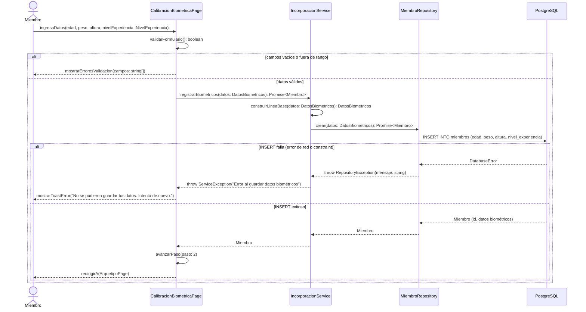
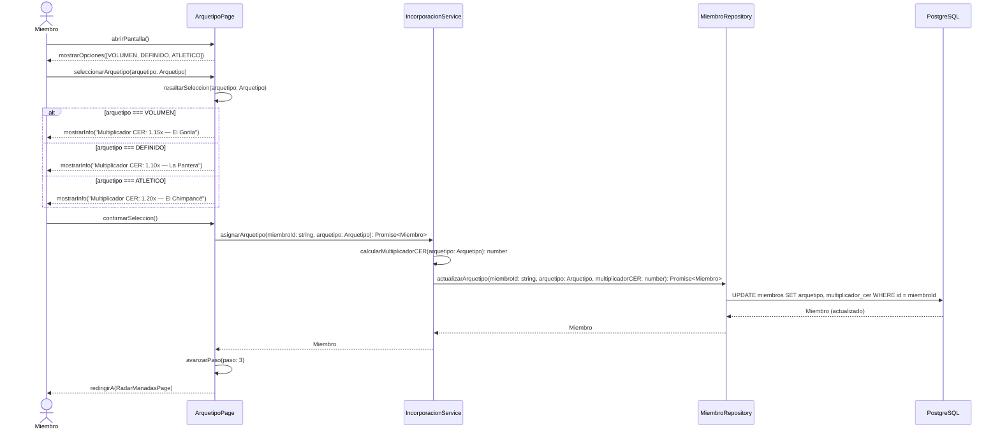
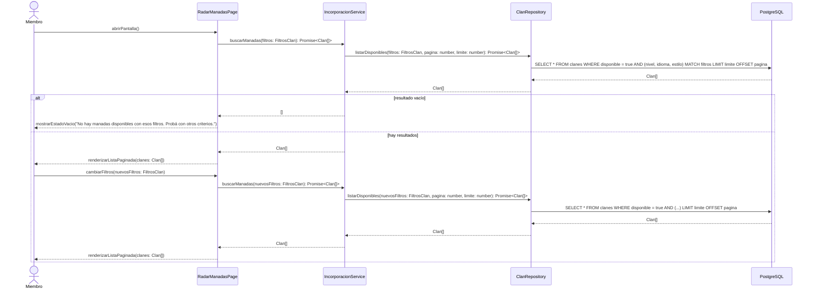
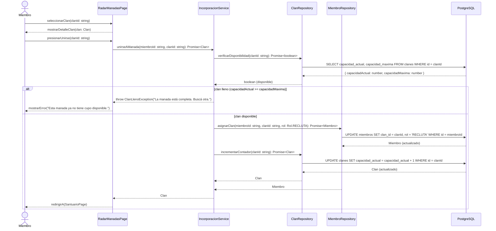
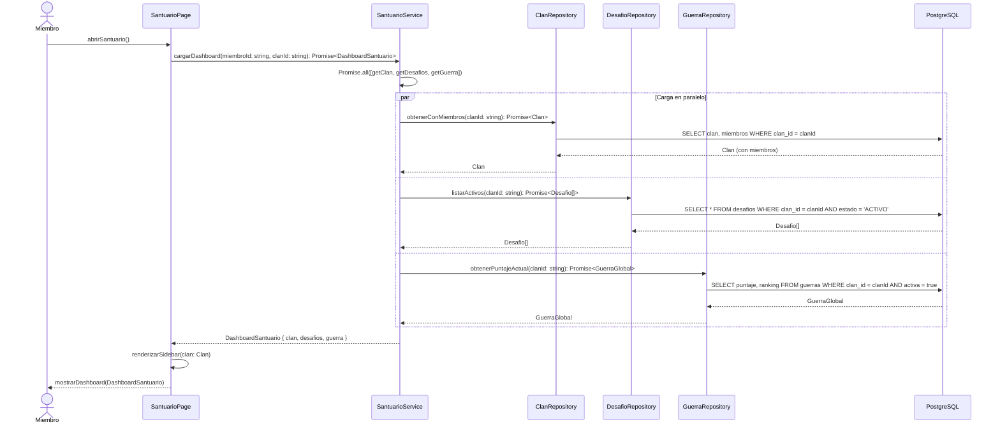
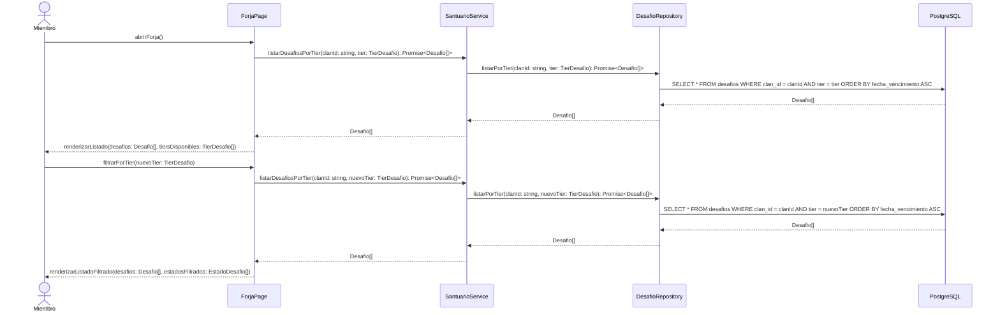
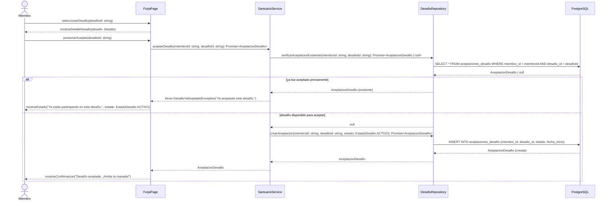
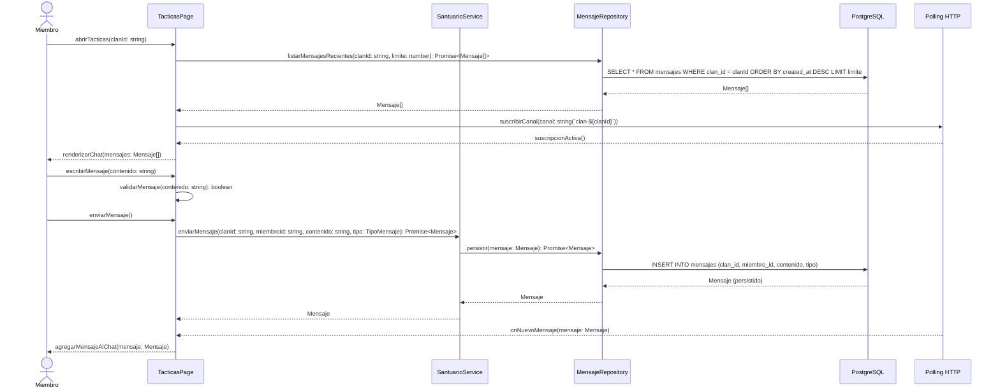
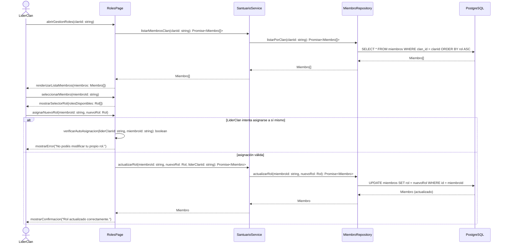
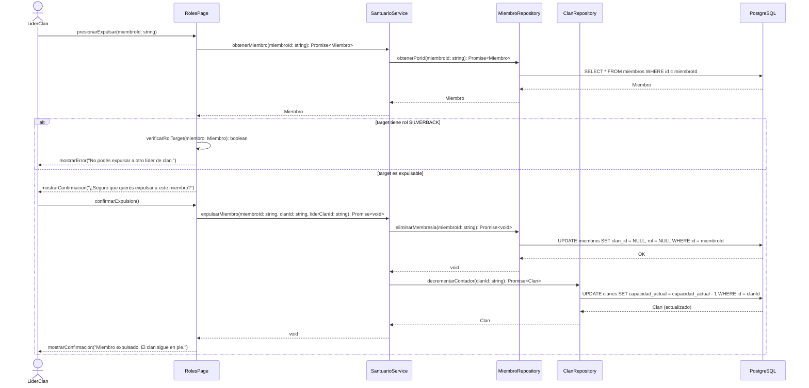

# SILVERBACK — Diagramas de Secuencia de Diseño

**Sección:** 10.5.4 — Diagramas de Secuencia  
**Entrega:** E2  
**Versión:** 1.0  
**Autor:** Sepulveda, Nicolas

---

## CU-001 — INCORPORACIÓN

---

### CU-001-001 — Registrar Datos Biométricos Iniciales

---

### CU-001-002 — Seleccionar Arquetipo de Entrenamiento

---

### CU-001-003 — Buscar Manadas Disponibles

---

### CU-001-004 — Unirse a una Manada

---

## CU-002 — SANTUARIO

---

### CU-002-001 — Visualizar el Panel del Santuario

---

### CU-002-002 — Consultar Desafíos en La Forja

---

### CU-002-003 — Aceptar un Desafío Semanal

---

### CU-002-004 — Comunicarse en la Sala de Tácticas

---

### CU-002-005 — Asignar Rol a un Miembro del Clan

---

### CU-002-006 — Expulsar a un Miembro del Clan

