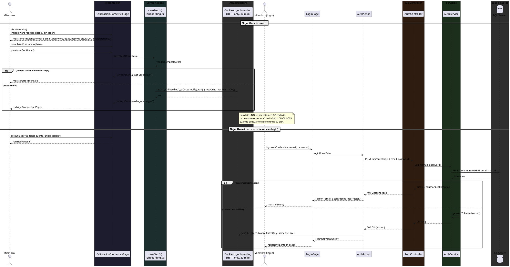
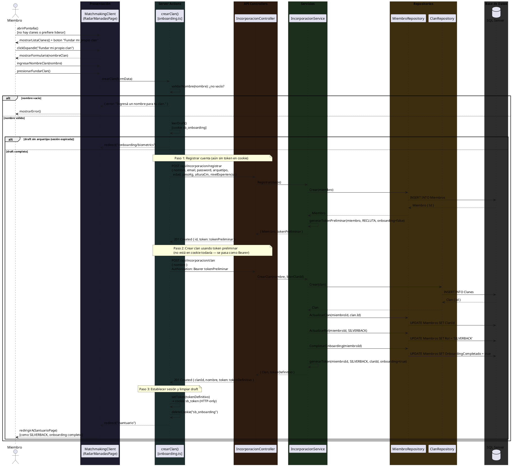
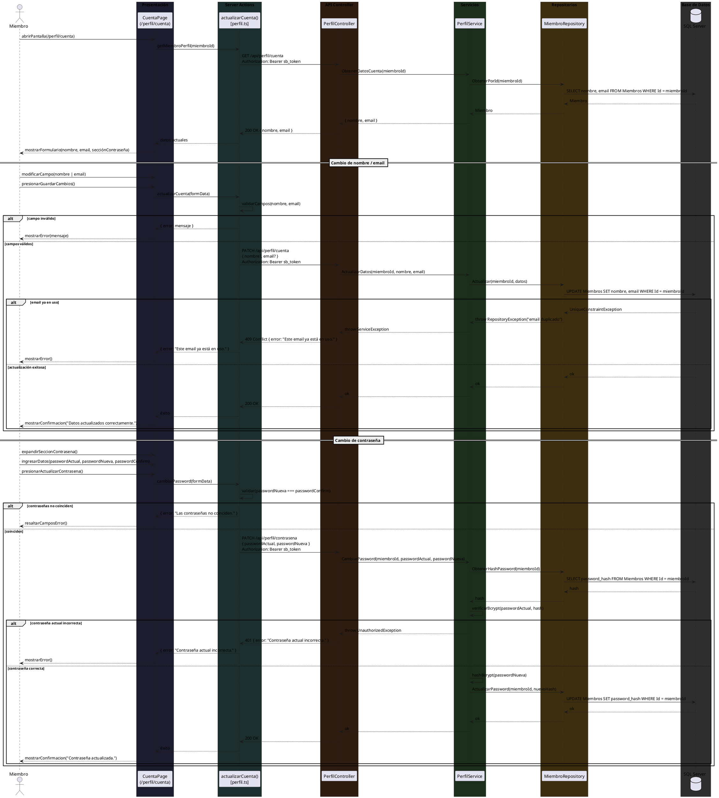

# SILVERBACK — Registro de Modificaciones a la Carpeta

**Proyecto:** SILVERBACK — Plataforma de Gamificación del Entrenamiento Físico  
**Entrega base:** E1 — Especificación Técnica (aprobada)  
**Universidad:** UAI — Seminario de Trabajo Final (SAP 2026)  
**Versión:** 1.0  
**Sprints cubiertos:** S2 (PKG_INCORPORACIÓN end-to-end) + S3 (PKG_SANTUARIO I — Panel del Clan y La Forja)

---

## Propósito del documento

Este documento registra todas las modificaciones realizadas a la carpeta técnica de SILVERBACK **posteriores a la aprobación de E1**. Incluye: casos de uso nuevos (con su numeración secuencial continuada), diagramas modificados y los nuevos diagramas de secuencia requeridos por los CUs agregados.

> **Regla aplicada:** No se renumera ni modifica ningún CU aprobado en E1. Los CUs nuevos continúan la secuencia a partir del último aprobado (C-24 = CU-005-006).

---

## 1. Resumen de cambios por sprint

| Sprint | Módulo | Cambio | Tipo |
|--------|--------|--------|------|
| S2 | PKG_INCORPORACIÓN | CU-001-000 "Crear Cuenta / Iniciar Sesión" agregado como paso 0 del onboarding | CU nuevo — C-25 |
| S2 | PKG_PERFIL | CU-005-007 "Gestionar Datos de Cuenta" agregado como contraparte de CU-001-000 | CU nuevo — C-26 |
| S2 | Diagrama de Paquetes | Se agrega capa `PKG_ACTIONS` (Server Actions de Next.js) | Diagrama modificado |
| S3 | PKG_INCORPORACIÓN | CU-001-005 "Fundar una Manada" agregado para resolver el problema de arranque en frío | CU nuevo — C-27 |
| S3 | Diagrama ER | Se agrega entidad `ACEPTACION_DESAFIO` con PK compuesta | Diagrama modificado |
| S3 | `secuencias-cu001-cu002.md` | Agregar diagramas de secuencia de CU-001-000 y CU-001-005 | Secuencia nueva |
| S3 | `secuencias-cu005.md` | Agregar diagrama de secuencia de CU-005-007 | Secuencia nueva |

---

## 2. Casos de uso nuevos (secuencialidad continuada)

E1 cerró en **C-24 (CU-005-006)**. La tabla a continuación documenta los tres nuevos:

| N.º secuencial | Código CU | Nombre | Sprint | Insertar en carpeta entre... |
|---------------|-----------|--------|--------|------------------------------|
| C-25 | CU-001-000 | Crear Cuenta / Iniciar Sesión | S2 | Antes de CU-001-001 (como paso 0 de incorporación) |
| C-26 | CU-005-007 | Gestionar Datos de Cuenta | S2 | Después de CU-005-006 (al final de la sección CU-005) |
| C-27 | CU-001-005 | Fundar una Manada | S3 | Después de CU-001-004 (al final de la sección CU-001) |

Los textos completos de cada CU están en `casos-de-uso.md`. Lo que sigue es el contenido listo para insertar en la carpeta impresa/digital.

---

### C-25 — CU-001-000: Crear Cuenta / Iniciar Sesión

> *Insertar antes de CU-001-001 en la sección CU-001 — INCORPORACIÓN.*  
> *Nota de modificación consciente: no estaba en E1 porque los CUs de biometría, arquetipo y clan asumían implícitamente la existencia de una cuenta. El flujo aprobado de 3 pasos permanece intacto; este paso se antepone.*

**Descripción:** Este caso de uso describe el proceso mediante el cual el usuario nuevo crea una cuenta en la plataforma SilverBack ingresando sus datos de acceso, o bien el usuario existente inicia sesión con sus credenciales. Es el punto de entrada absoluto del sistema. Para usuarios nuevos, los datos de credenciales (nombre, email, contraseña) se capturan en la pantalla de Calibración Biométrica como parte de un formulario unificado y se almacenan temporalmente hasta que el usuario completa el onboarding. Para usuarios existentes con onboarding completo, el login emite un JWT definitivo y redirige al Santuario.

**Actores:** Miembro (nuevo o existente), Sistema SilverBack

**Precondiciones:** El usuario accede a la plataforma por primera vez o tiene una sesión expirada.

**Escenario Principal de Éxito — Usuario nuevo:**

1. El sistema redirige al usuario a la pantalla de Calibración Biométrica (`/onboarding/biometrics`) al detectar ausencia de sesión.
2. El sistema presenta el formulario unificado con los campos: NOMBRE, EMAIL, CONTRASEÑA, EDAD, PESO (KG), ALTURA (CM) y NIVEL DE EXPERIENCIA.
3. El usuario completa todos los campos del formulario.
4. El usuario presiona "CONTINUAR →".
5. El sistema valida los campos de credenciales (email con formato válido, contraseña no vacía) y los datos biométricos (rangos: edad 14-99, peso 30-300 kg, altura 100-250 cm).
6. El sistema almacena temporalmente todos los datos en una cookie HTTP-only `sb_onboarding` con TTL de 30 minutos.
7. El sistema redirige al usuario a la pantalla de selección de arquetipo (CU-001-002, paso 2 de 3).
8. La cuenta en base de datos se crea en el paso CU-001-004 (Unirse a una Manada) o CU-001-005 (Fundar una Manada), no en este paso.

**Escenario Principal de Éxito — Usuario existente:**

1. El usuario navega a `/login` desde el enlace "¿Ya tenés cuenta? Iniciá sesión" en la pantalla de Calibración Biométrica.
2. El usuario completa los campos EMAIL y CONTRASEÑA.
3. El usuario presiona "INICIAR SESIÓN".
4. El sistema valida las credenciales contra la base de datos.
5. El sistema emite un JWT con `onboarding_completado = true` y los claims del clan y rol del miembro.
6. El sistema almacena el JWT en una cookie HTTP-only `sb_token`.
7. El sistema redirige al usuario al Santuario (`/santuario`).

**Flujos Alternativos:**

- **[FA-1]** Si algún campo biométrico está fuera del rango permitido, el sistema muestra el mensaje de error específico ("La edad debe estar entre 14 y 99 años.") y no avanza.
- **[FA-2]** Si las credenciales de login son incorrectas, el sistema muestra "Email o contraseña incorrectos." sin indicar cuál falló.
- **[FA-3]** Si el usuario existente tiene `onboarding_completado = false`, el middleware lo redirige a `/onboarding/biometrics`.

---

### C-26 — CU-005-007: Gestionar Datos de Cuenta

> *Insertar después de CU-005-006 en la sección CU-005 — PERFIL.*  
> *Nota: Este CU no estaba en E1. Se agrega porque CU-001-000 introdujo credenciales y el usuario necesita un lugar para modificarlas.*

**Descripción:** Este caso de uso describe el proceso mediante el cual el usuario consulta y modifica los datos de su cuenta: nombre de usuario, email y contraseña. Es la contraparte administrativa de CU-001-000: mientras ese CU crea las credenciales, este CU permite mantenerlas actualizadas durante la vida del miembro en la plataforma.

**Actores:** Miembro, Sistema SilverBack

**Precondiciones:** El usuario completó el onboarding y tiene sesión activa.

**Escenario Principal de Éxito:**

1. El usuario accede a `/perfil/cuenta` desde el menú de perfil.
2. El sistema presenta el formulario con los campos actuales del miembro: NOMBRE y EMAIL, más la sección "CAMBIAR CONTRASEÑA".
3. El usuario modifica el campo NOMBRE y presiona "GUARDAR CAMBIOS".
4. El sistema valida que el nombre no esté vacío.
5. El sistema persiste el cambio y muestra confirmación visual "Datos actualizados correctamente."
6. Si el usuario quiere cambiar la contraseña, despliega tres campos: CONTRASEÑA ACTUAL, NUEVA CONTRASEÑA, CONFIRMAR NUEVA CONTRASEÑA.
7. El usuario completa los tres campos y presiona "ACTUALIZAR CONTRASEÑA".
8. El sistema verifica que la contraseña actual es correcta y que las nuevas coinciden.
9. El sistema actualiza el hash de contraseña y confirma el cambio.

**Flujos Alternativos:**

- **[FA-1]** Si el nuevo email ya pertenece a otra cuenta, el sistema rechaza el cambio con "Este email ya está en uso."
- **[FA-2]** Si la contraseña actual es incorrecta, el sistema muestra "Contraseña actual incorrecta." sin revelar información adicional.
- **[FA-3]** Si la nueva contraseña y su confirmación no coinciden, el sistema resalta ambos campos y no procesa el cambio.

---

### C-27 — CU-001-005: Fundar una Manada

> *Insertar después de CU-001-004 en la sección CU-001 — INCORPORACIÓN.*  
> *Motivación: sin clanes existentes ningún usuario podía completar el onboarding (problema de arranque en frío). Este CU introduce la ruta alternativa donde el usuario funda su propio clan y se convierte en Silverback.*

**Descripción:** Este caso de uso describe el proceso mediante el cual un usuario, al no encontrar clanes disponibles o preferir liderar en lugar de seguir, funda su propia manada desde el Radar de Manadas. Al fundar un clan, el usuario se convierte automáticamente en su primer miembro y en el Silverback (líder de la manada), completando así el flujo de incorporación con permisos de administración completos.

**Actores:** Miembro, Sistema SilverBack

**Precondiciones:** El usuario completó los pasos previos de incorporación (CU-001-000 a CU-001-002, incluyendo arquetipo). Puede o no haber clanes disponibles en el sistema.

**Escenario Principal de Éxito:**

1. El usuario accede a la pantalla del Radar de Manadas (paso 3 del onboarding) y visualiza el listado de clanes disponibles (puede estar vacío).
2. El usuario decide no unirse a ningún clan existente y presiona la opción desplegable "Fundar mi propio clan" en la parte inferior de la pantalla.
3. El sistema expande un formulario con un campo de texto para ingresar el nombre del clan.
4. El sistema muestra el mensaje: "Serás el SILVERBACK — líder de tu manada."
5. El usuario ingresa un nombre único para su clan (máximo 50 caracteres).
6. El usuario presiona el botón "FUNDAR CLAN".
7. El sistema registra la cuenta del usuario en la base de datos utilizando los datos acumulados del onboarding (biometría, arquetipo, credenciales).
8. El sistema crea el nuevo clan con el nombre indicado, vincula al usuario como primer miembro y lo designa líder.
9. El sistema promueve automáticamente al usuario al rol de SILVERBACK.
10. El sistema marca el onboarding del usuario como completado.
11. El sistema genera un nuevo token JWT con los claims actualizados: `rol=SILVERBACK`, `clanId` asignado, `onboarding_completado=true`.
12. El sistema establece la cookie de sesión `sb_token` con el token actualizado.
13. El sistema elimina la cookie temporal de onboarding (`sb_onboarding`).
14. El sistema redirige al usuario al Santuario (`/santuario`) con permisos de Silverback activos.
15. El usuario accede por primera vez al hub del clan con capacidad para crear desafíos, gestionar roles y administrar la manada.

**Flujos Alternativos:**

- **[FA-1]** Si el nombre ingresado ya está en uso por otro clan, el sistema muestra "El nombre ya está en uso. Elegí otro." y mantiene el formulario abierto.
- **[FA-2]** Si el usuario deja el campo de nombre vacío y presiona "FUNDAR CLAN", el sistema impide el envío con validación de campo requerido sin comunicarse con el backend.
- **[FA-3]** Si ocurre un error de red o del servidor durante la creación del clan, el sistema muestra "No se pudo crear el clan." y permite al usuario reintentar sin perder los datos del formulario.

---

## 3. Diagramas modificados

### 3.1 Diagrama Entidad-Relación (`diagrama-er.md`)

**Cambio:** Se agregó la entidad `ACEPTACION_DESAFIO` para registrar qué miembros aceptaron cada desafío semanal.

**Qué cambió:**
- Nueva entidad `ACEPTACION_DESAFIO` con PK compuesta (`desafio_id` + `miembro_id`). No tiene campo `id` autoincremental ni campo `estado`; solo `aceptado_en` (timestamp).
- Relaciones: `DESAFIO` ||--o{ `ACEPTACION_DESAFIO` y `MIEMBRO` ||--o{ `ACEPTACION_DESAFIO`.

**Fragmento a insertar en el diagrama ER** (en la sección FILA 4 — SANTUARIO):

```plantuml
entity ACEPTACION_DESAFIO {
  * desafio_id : UUID <<PK,FK>>
  * miembro_id : UUID <<PK,FK>>
  --
  * aceptado_en : TIMESTAMP DEFAULT NOW()
}

DESAFIO ||--o{ ACEPTACION_DESAFIO : "es aceptado en"
MIEMBRO ||--o{ ACEPTACION_DESAFIO : "acepta"
```

---

### 3.2 Diagrama de Paquetes (`diagrama-paquetes.md`)

**Cambio:** Se agrega el paquete `PKG_ACTIONS` al nodo de Next.js para representar la capa de Server Actions, que actúa como puente tipado entre las Pages y la API REST.

**Fragmento a insertar** (dentro del nodo `silverback/ (Next.js 16 — Puerto 3000)`):

```plantuml
package "PKG_ACTIONS\n(Server Actions — src/app/actions/)" as PACT {
  class OnboardingActions
  class SantuarioActions
  class AuthActions
}
```

**Relaciones a agregar:**
```plantuml
PINC ..> PACT : llama
PSAN ..> PACT : llama
PACT ..> PAPI : HTTP REST (Bearer JWT)
```

---

## 4. Diagramas de Secuencia — CUs nuevos

> *Estos diagramas deben insertarse en los archivos de secuencias correspondientes: CU-001-000 y CU-001-005 en `secuencias-cu001-cu002.md`; CU-005-007 en `secuencias-cu005.md`.*  
> *Convención: Page → ServerAction → API Controller → Service → Repository → SQL Server.*

---

### Secuencia C-25 — CU-001-000: Crear Cuenta / Iniciar Sesión



---

### Secuencia C-27 — CU-001-005: Fundar una Manada



---

### Secuencia C-26 — CU-005-007: Gestionar Datos de Cuenta



---

## 5. Mapa de inserción en la carpeta impresa/digital

| Sección de la carpeta | Acción | Artefacto |
|-----------------------|--------|-----------|
| **10.5.3 Casos de Uso** | Insertar antes de CU-001-001 | C-25 — CU-001-000 |
| **10.5.3 Casos de Uso** | Insertar después de CU-001-004 | C-27 — CU-001-005 |
| **10.5.3 Casos de Uso** | Insertar al final de CU-005 | C-26 — CU-005-007 |
| **10.5.4 Diagramas de Secuencia** | Insertar al inicio de la subsección CU-001 | Secuencia CU-001-000 |
| **10.5.4 Diagramas de Secuencia** | Insertar al final de la subsección CU-001 | Secuencia CU-001-005 |
| **10.5.4 Diagramas de Secuencia** | Insertar al final de la subsección CU-005 | Secuencia CU-005-007 |
| **10.5.5 Diagrama de Paquetes** | Agregar paquete PKG_ACTIONS en nodo Next.js | `diagrama-paquetes.md` actualizado |
| **10.5.8 Diagrama ER** | Agregar entidad ACEPTACION_DESAFIO en Fila 4 | `diagrama-er.md` actualizado |

---

## 6. Control de versiones del documento

| Versión | Fecha | Sprint | Descripción |
|---------|-------|--------|-------------|
| 1.0 | Sep 2026 | S3 | Creación inicial — cubre S2 y S3 completos |

---

*Documento de modificaciones SILVERBACK — Generado en base al código fuente en `silverback/` y `silverback-api/`.*
