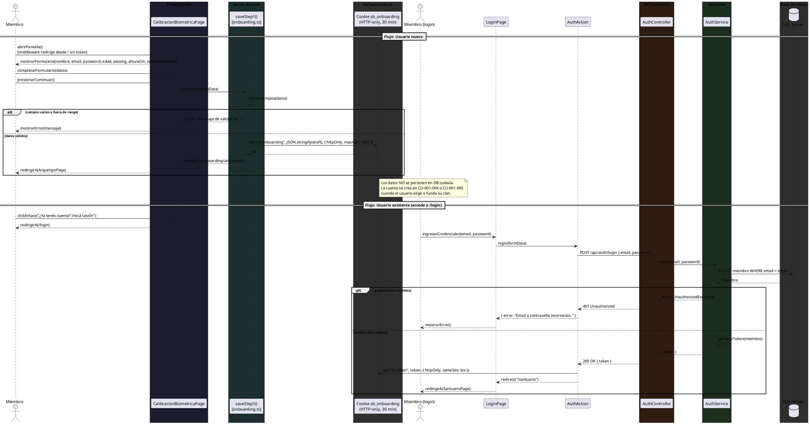
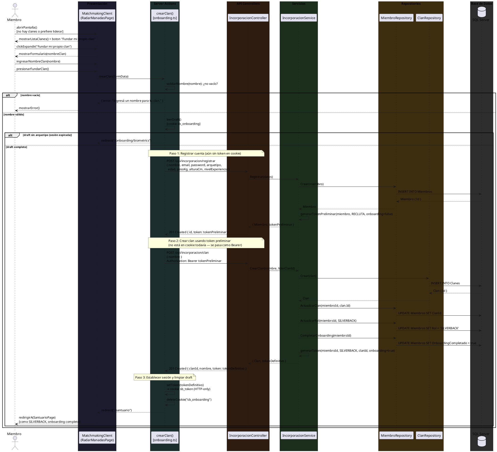
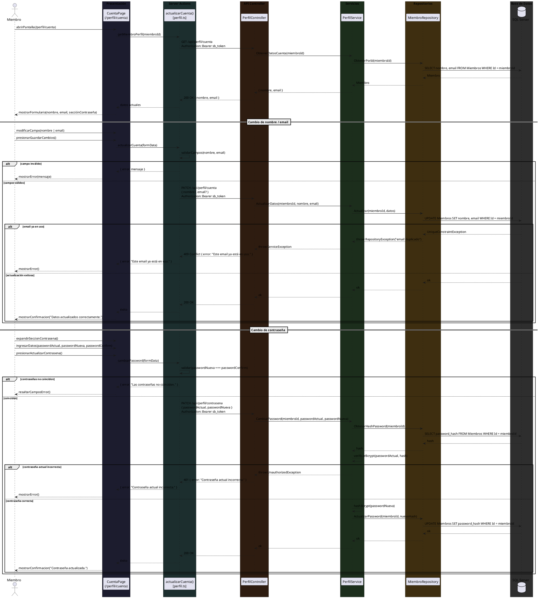
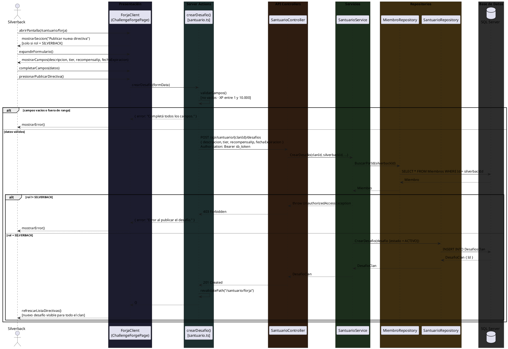

# SILVERBACK — Registro de Modificaciones a la Carpeta

**Proyecto:** SILVERBACK — Plataforma de Gamificación del Entrenamiento Físico  
**Entrega base:** E1 — Especificación Técnica (aprobada)  
**Universidad:** UAI — Seminario de Trabajo Final (SAP 2026)  
**Versión:** 1.3  
**Sprints cubiertos:** S2 (PKG_INCORPORACIÓN end-to-end) + S3 (PKG_SANTUARIO I — Panel del Clan y La Forja) + S4 (PKG_SANTUARIO II — Tácticas y Roles + Arena adelantada) + S5 (Registro por voz) + S6 (Guerra Global e Historial de Batallas) + correcciones del 06/10 (expulsión, cambio de clan, Tácticas)

---

## Propósito del documento

Este documento registra todas las modificaciones realizadas a la carpeta técnica de SILVERBACK **posteriores a la aprobación de E1**. Incluye: casos de uso nuevos (con su numeración secuencial continuada), diagramas modificados y los nuevos diagramas de secuencia requeridos por los CUs agregados.

> **Regla aplicada:** No se renumera ni modifica ningún CU aprobado en E1. Los CUs nuevos continúan la secuencia a partir del último aprobado (C-24 = CU-005-006).

---

## 1. Resumen de cambios por sprint

| Sprint | Módulo | Cambio | Tipo |
|--------|--------|--------|------|
| S2 | PKG_INCORPORACIÓN | CU-001-000 "Crear Cuenta / Iniciar Sesión" agregado como paso 0 del onboarding | CU nuevo — C-25 |
| S2 | PKG_PERFIL | CU-005-007 "Gestionar Datos de Cuenta" agregado como contraparte de CU-001-000 | CU nuevo — C-26 |
| S2 | Diagrama de Paquetes | Se agrega capa `PKG_ACTIONS` (Server Actions de Next.js) | Diagrama modificado |
| S3 | PKG_INCORPORACIÓN | CU-001-005 "Fundar una Manada" agregado para resolver el problema de arranque en frío | CU nuevo — C-27 |
| S3 | Diagrama ER | Se agrega entidad `ACEPTACION_DESAFIO` con PK compuesta | Diagrama modificado |
| S3 | `secuencias-cu001-cu002.md` | Agregar diagramas de secuencia de CU-001-000 y CU-001-005 | Secuencia nueva |
| S3 | `secuencias-cu005.md` | Agregar diagrama de secuencia de CU-005-007 | Secuencia nueva |
| S3 | PKG_SANTUARIO | CU-002-007 "Publicar Desafío en La Forja" agregado para cubrir la creación de desafíos | CU nuevo — C-28 |
| S3 | `secuencias-cu001-cu002.md` | Agregar diagrama de secuencia de CU-002-007 | Secuencia nueva |
| S4 | PKG_SANTUARIO | Modelo de roles definitivo: 4 roles (SILVERBACK/BETA/EXPLORADOR/RECLUTA); "Líder de Clan" del STFI = SILVERBACK | Decisión de diseño |
| S4 | PKG_ARENA | Modificadores CER por arquetipo fijados: VOLUMEN 1.10 · DEFINIDO 1.05 · ATLÉTICO 1.00 | Decisión de diseño |
| S5 | PKG_ARENA | Carga por voz (Web Speech API, es-AR) con confirmación previa; formulario manual siempre visible | Implementación de secuencia aprobada |
| S5 | PKG_ARENA | XP por entrenamiento: 1 XP cada 10 de CER (la secuencia aprobada pedía `actualizarXP` sin fórmula) | Decisión de diseño |
| S6 | PKG_ARENA | Ciclo de la Guerra Global: semanal (lunes 00:00 → lunes 00:00, hora Argentina), apertura y cierre automáticos | Decisión de diseño |
| S6 | PKG_ARENA | Rival = pareja consecutiva del ranking (1º vs 2º, 3º vs 4º…); al cierre gana el mejor posicionado | Decisión de diseño |
| S6 | Diagrama ER | `PARTICIPACION_GUERRA` agrega `posicion : INTEGER` (puesto final de la semana) | Diagrama modificado |
| S6 | `secuencias-cu003-cu004.md` | CU-003-001, CU-003-002 y CU-003-004 reescritos según la implementación | Secuencia modificada |
| S6 | Secuencias (todas) | `database "PostgreSQL"` → `database "SQL Server"` (el stack es SQL Server desde S1) | Corrección |
| S6 | Secuencias | Se insertan en sus archivos las 4 secuencias nuevas (CU-001-000, CU-001-005, CU-002-007, CU-005-007) | Inserción pendiente resuelta |
| 06/10 | PKG_SANTUARIO / PKG_INCORPORACIÓN | El miembro expulsado vuelve al Radar de Manadas y puede unirse o fundar con su misma cuenta (CU-002-006 → CU-001-003/004/005) | Flujo modificado |
| 06/10 | PKG_INCORPORACIÓN | Unirse o fundar rechaza a quien ya tiene clan; unirse valida el cupo (20) | Flujo alternativo nuevo |
| 06/10 | PKG_SANTUARIO | Sala de Tácticas con refresco automático cada 5 s (el CU pide "tiempo real") | Diferencia documentada |
| 06/10 | PKG_SANTUARIO | El SILVERBACK no puede cambiar su propio rol (implementa el FA-2 de CU-002-005) | Implementación de CU aprobado |
| 06/10 | — | Brechas detectadas entre CU aprobados e implementación (sección 4.6) | Pendiente de implementar |
| 06/10 | `diagramas-uml.md` | Notas de arquitectura corregidas: modificadores CER (decían 1.15 / 1.10 / 1.20), autenticación por JWT (decía sesiones en base) y capas con la API .NET | Corrección |

---

## 2. Casos de uso nuevos (secuencialidad continuada)

E1 cerró en **C-24 (CU-005-006)**. La tabla a continuación documenta los tres nuevos:

| N.º secuencial | Código CU | Nombre | Sprint | Insertar en carpeta entre... |
|---------------|-----------|--------|--------|------------------------------|
| C-25 | CU-001-000 | Crear Cuenta / Iniciar Sesión | S2 | Antes de CU-001-001 (como paso 0 de incorporación) |
| C-26 | CU-005-007 | Gestionar Datos de Cuenta | S2 | Después de CU-005-006 (al final de la sección CU-005) |
| C-27 | CU-001-005 | Fundar una Manada | S3 | Después de CU-001-004 (al final de la sección CU-001) |
| C-28 | CU-002-007 | Publicar Desafío en La Forja | S3 | Después de CU-002-006 (al final de la sección CU-002) |

Los textos completos de cada CU están en `casos-de-uso.md`. Lo que sigue es el contenido listo para insertar en la carpeta impresa/digital.

---

### C-25 — CU-001-000: Crear Cuenta / Iniciar Sesión

> *Insertar antes de CU-001-001 en la sección CU-001 — INCORPORACIÓN.*  
> *Nota de modificación consciente: no estaba en E1 porque los CUs de biometría, arquetipo y clan asumían implícitamente la existencia de una cuenta. El flujo aprobado de 3 pasos permanece intacto; este paso se antepone.*

**Descripción:** Este caso de uso describe el proceso mediante el cual el usuario nuevo crea una cuenta en la plataforma SilverBack ingresando sus datos de acceso, o bien el usuario existente inicia sesión con sus credenciales. Es el punto de entrada absoluto del sistema. Para usuarios nuevos, los datos de credenciales (nombre, email, contraseña) se capturan en la pantalla de Calibración Biométrica como parte de un formulario unificado y se almacenan temporalmente hasta que el usuario completa el onboarding. Para usuarios existentes con onboarding completo, el login emite un JWT definitivo y redirige al Santuario.

**Actores:** Miembro (nuevo o existente), Sistema SilverBack

**Precondiciones:** El usuario accede a la plataforma por primera vez o tiene una sesión expirada.

**Escenario Principal de Éxito — Usuario nuevo:**

1. El sistema redirige al usuario a la pantalla de Calibración Biométrica (`/onboarding/biometrics`) al detectar ausencia de sesión.
2. El sistema presenta el formulario unificado con los campos: NOMBRE, EMAIL, CONTRASEÑA, EDAD, PESO (KG), ALTURA (CM) y NIVEL DE EXPERIENCIA.
3. El usuario completa todos los campos del formulario.
4. El usuario presiona "CONTINUAR →".
5. El sistema valida los campos de credenciales (email con formato válido, contraseña no vacía) y los datos biométricos (rangos: edad 14-99, peso 30-300 kg, altura 100-250 cm).
6. El sistema almacena temporalmente todos los datos en una cookie HTTP-only `sb_onboarding` con TTL de 30 minutos.
7. El sistema redirige al usuario a la pantalla de selección de arquetipo (CU-001-002, paso 2 de 3).
8. La cuenta en base de datos se crea en el paso CU-001-004 (Unirse a una Manada) o CU-001-005 (Fundar una Manada), no en este paso.

**Escenario Principal de Éxito — Usuario existente:**

1. El usuario navega a `/login` desde el enlace "¿Ya tenés cuenta? Iniciá sesión" en la pantalla de Calibración Biométrica.
2. El usuario completa los campos EMAIL y CONTRASEÑA.
3. El usuario presiona "INICIAR SESIÓN".
4. El sistema valida las credenciales contra la base de datos.
5. El sistema emite un JWT con `onboarding_completado = true` y los claims del clan y rol del miembro.
6. El sistema almacena el JWT en una cookie HTTP-only `sb_token`.
7. El sistema redirige al usuario al Santuario (`/santuario`).

**Flujos Alternativos:**

- **[FA-1]** Si algún campo biométrico está fuera del rango permitido, el sistema muestra el mensaje de error específico ("La edad debe estar entre 14 y 99 años.") y no avanza.
- **[FA-2]** Si las credenciales de login son incorrectas, el sistema muestra "Email o contraseña incorrectos." sin indicar cuál falló.
- **[FA-3]** Si el usuario existente tiene `onboarding_completado = false`, el middleware lo redirige a `/onboarding/biometrics`.

---

### C-26 — CU-005-007: Gestionar Datos de Cuenta

> *Insertar después de CU-005-006 en la sección CU-005 — PERFIL.*  
> *Nota: Este CU no estaba en E1. Se agrega porque CU-001-000 introdujo credenciales y el usuario necesita un lugar para modificarlas.*

**Descripción:** Este caso de uso describe el proceso mediante el cual el usuario consulta y modifica los datos de su cuenta: nombre de usuario, email y contraseña. Es la contraparte administrativa de CU-001-000: mientras ese CU crea las credenciales, este CU permite mantenerlas actualizadas durante la vida del miembro en la plataforma.

**Actores:** Miembro, Sistema SilverBack

**Precondiciones:** El usuario completó el onboarding y tiene sesión activa.

**Escenario Principal de Éxito:**

1. El usuario accede a `/perfil/cuenta` desde el menú de perfil.
2. El sistema presenta el formulario con los campos actuales del miembro: NOMBRE y EMAIL, más la sección "CAMBIAR CONTRASEÑA".
3. El usuario modifica el campo NOMBRE y presiona "GUARDAR CAMBIOS".
4. El sistema valida que el nombre no esté vacío.
5. El sistema persiste el cambio y muestra confirmación visual "Datos actualizados correctamente."
6. Si el usuario quiere cambiar la contraseña, despliega tres campos: CONTRASEÑA ACTUAL, NUEVA CONTRASEÑA, CONFIRMAR NUEVA CONTRASEÑA.
7. El usuario completa los tres campos y presiona "ACTUALIZAR CONTRASEÑA".
8. El sistema verifica que la contraseña actual es correcta y que las nuevas coinciden.
9. El sistema actualiza el hash de contraseña y confirma el cambio.

**Flujos Alternativos:**

- **[FA-1]** Si el nuevo email ya pertenece a otra cuenta, el sistema rechaza el cambio con "Este email ya está en uso."
- **[FA-2]** Si la contraseña actual es incorrecta, el sistema muestra "Contraseña actual incorrecta." sin revelar información adicional.
- **[FA-3]** Si la nueva contraseña y su confirmación no coinciden, el sistema resalta ambos campos y no procesa el cambio.

---

### C-27 — CU-001-005: Fundar una Manada

> *Insertar después de CU-001-004 en la sección CU-001 — INCORPORACIÓN.*  
> *Motivación: sin clanes existentes ningún usuario podía completar el onboarding (problema de arranque en frío). Este CU introduce la ruta alternativa donde el usuario funda su propio clan y se convierte en Silverback.*

**Descripción:** Este caso de uso describe el proceso mediante el cual un usuario, al no encontrar clanes disponibles o preferir liderar en lugar de seguir, funda su propia manada desde el Radar de Manadas. Al fundar un clan, el usuario se convierte automáticamente en su primer miembro y en el Silverback (líder de la manada), completando así el flujo de incorporación con permisos de administración completos.

**Actores:** Miembro, Sistema SilverBack

**Precondiciones:** El usuario completó los pasos previos de incorporación (CU-001-000 a CU-001-002, incluyendo arquetipo). Puede o no haber clanes disponibles en el sistema.

**Escenario Principal de Éxito:**

1. El usuario accede a la pantalla del Radar de Manadas (paso 3 del onboarding) y visualiza el listado de clanes disponibles (puede estar vacío).
2. El usuario decide no unirse a ningún clan existente y presiona la opción desplegable "Fundar mi propio clan" en la parte inferior de la pantalla.
3. El sistema expande un formulario con un campo de texto para ingresar el nombre del clan.
4. El sistema muestra el mensaje: "Serás el SILVERBACK — líder de tu manada."
5. El usuario ingresa un nombre único para su clan (máximo 50 caracteres).
6. El usuario presiona el botón "FUNDAR CLAN".
7. El sistema registra la cuenta del usuario en la base de datos utilizando los datos acumulados del onboarding (biometría, arquetipo, credenciales).
8. El sistema crea el nuevo clan con el nombre indicado, vincula al usuario como primer miembro y lo designa líder.
9. El sistema promueve automáticamente al usuario al rol de SILVERBACK.
10. El sistema marca el onboarding del usuario como completado.
11. El sistema genera un nuevo token JWT con los claims actualizados: `rol=SILVERBACK`, `clanId` asignado, `onboarding_completado=true`.
12. El sistema establece la cookie de sesión `sb_token` con el token actualizado.
13. El sistema elimina la cookie temporal de onboarding (`sb_onboarding`).
14. El sistema redirige al usuario al Santuario (`/santuario`) con permisos de Silverback activos.
15. El usuario accede por primera vez al hub del clan con capacidad para crear desafíos, gestionar roles y administrar la manada.

**Flujos Alternativos:**

- **[FA-1]** Si el nombre ingresado ya está en uso por otro clan, el sistema muestra "El nombre ya está en uso. Elegí otro." y mantiene el formulario abierto.
- **[FA-2]** Si el usuario deja el campo de nombre vacío y presiona "FUNDAR CLAN", el sistema impide el envío con validación de campo requerido sin comunicarse con el backend.
- **[FA-3]** Si ocurre un error de red o del servidor durante la creación del clan, el sistema muestra "No se pudo crear el clan." y permite al usuario reintentar sin perder los datos del formulario.

---

### C-28 — CU-002-007: Publicar Desafío en La Forja

> *Insertar después de CU-002-006 en la sección CU-002 — SANTUARIO.*  
> *Motivación: CU-002-002 y CU-002-003 asumían que los desafíos ya existían, pero ningún CU describía su creación. Se agrega para completar el ciclo de vida de La Forja.*

**Descripción:** Este caso de uso describe el proceso mediante el cual el Líder de Clan (Silverback) publica una nueva directiva semanal en La Forja. Los desafíos publicados quedan disponibles para que todos los miembros del clan los acepten y completen durante el período indicado. Cada desafío tiene un tier de dificultad (BRONCE, PLATA u ORO), una descripción de objetivo, una recompensa en XP y una fecha de expiración.

**Actores:** Líder de Clan (Silverback), Sistema SilverBack

**Precondiciones:** El usuario autenticado posee el rol SILVERBACK dentro del clan y se encuentra en la pantalla de La Forja.

**Escenario Principal de Éxito:**

1. El Silverback accede a La Forja desde el Santuario (`/santuario/forja`).
2. El sistema muestra, exclusivamente para el Silverback, la sección desplegable "Publicar nueva directiva" en la parte superior de la pantalla.
3. El Silverback presiona la sección para expandir el formulario de creación.
4. El sistema presenta cuatro campos: DESCRIPCIÓN, TIER, XP RECOMPENSA y EXPIRA (fecha).
5. El Silverback ingresa la descripción del objetivo (máximo 200 caracteres).
6. El Silverback selecciona el tier de dificultad: ORO (alta exigencia), PLATA (media) o BRONCE (introductorio).
7. El Silverback define la recompensa en XP que recibirán los miembros al completar el desafío (entre 1 y 10.000 XP).
8. El Silverback selecciona la fecha de expiración del desafío.
9. El Silverback presiona "PUBLICAR DIRECTIVA".
10. El sistema valida que todos los campos estén completos y dentro de los rangos permitidos.
11. El sistema persiste el desafío en la base de datos con estado ACTIVO, vinculado al clan.
12. El sistema refresca la lista de directivas semanales, mostrando el nuevo desafío disponible para todos los miembros.
13. Los miembros del clan ya pueden ver y aceptar la nueva directiva.

**Flujos Alternativos:**

- **[FA-1]** Si algún campo está vacío o fuera de rango, el sistema muestra el error específico sin enviar la solicitud al backend.
- **[FA-2]** Si un miembro sin rol SILVERBACK intenta publicar (por manipulación directa de la solicitud), el backend responde con 403 Forbidden y el sistema muestra un mensaje de error.
- **[FA-3]** Si ocurre un error de red al publicar, el sistema muestra "Error al publicar el desafío." y mantiene el formulario abierto con los datos intactos.

---

## 3. Diagramas modificados

### 3.1 Diagrama Entidad-Relación (`diagrama-er.md`)

**Cambio:** Se agregó la entidad `ACEPTACION_DESAFIO` para registrar qué miembros aceptaron cada desafío semanal.

**Qué cambió:**
- Nueva entidad `ACEPTACION_DESAFIO` con PK compuesta (`desafio_id` + `miembro_id`). No tiene campo `id` autoincremental ni campo `estado`; solo `aceptado_en` (timestamp).
- Relaciones: `DESAFIO` ||--o{ `ACEPTACION_DESAFIO` y `MIEMBRO` ||--o{ `ACEPTACION_DESAFIO`.

**Fragmento a insertar en el diagrama ER** (en la sección FILA 4 — SANTUARIO):

```plantuml
entity ACEPTACION_DESAFIO {
  * desafio_id : UUID <<PK,FK>>
  * miembro_id : UUID <<PK,FK>>
  --
  * aceptado_en : TIMESTAMP DEFAULT NOW()
}

DESAFIO ||--o{ ACEPTACION_DESAFIO : "es aceptado en"
MIEMBRO ||--o{ ACEPTACION_DESAFIO : "acepta"
```

> **Nota S4:** `DESAFIO.tier` **se mantiene** como `ENUM(BRONCE,PLATA,ORO)`, tal como está aprobado en la carpeta. El código se realineó a ese dominio; no hay cambio de diagrama ni de datos.

---

### 3.2 Diagrama de Paquetes (`diagrama-paquetes.md`)

**Cambio:** Se agrega el paquete `PKG_ACTIONS` al nodo de Next.js para representar la capa de Server Actions, que actúa como puente tipado entre las Pages y la API REST.

**Fragmento a insertar** (dentro del nodo `silverback/ (Next.js 16 — Puerto 3000)`):

```plantuml
package "PKG_ACTIONS\n(Server Actions — src/app/actions/)" as PACT {
  class OnboardingActions
  class SantuarioActions
  class AuthActions
}
```

**Relaciones a agregar:**
```plantuml
PINC ..> PACT : llama
PSAN ..> PACT : llama
PACT ..> PAPI : HTTP REST (Bearer JWT)
```

---

### 3.3 Diagrama Entidad-Relación — `PARTICIPACION_GUERRA.posicion` (S6)

**Cambio:** se agrega el atributo `posicion` para guardar el puesto final de cada clan cuando cierra la Guerra Global de la semana. Con él se arma el Historial de Batallas (CU-003-004) sin recalcular rankings viejos.

```plantuml
entity PARTICIPACION_GUERRA {
  * guerra_id : UUID <<PK,FK>>
  * clan_id : UUID <<PK,FK>>
  --
  * puntaje_cer : DECIMAL DEFAULT 0
  * posicion : INTEGER DEFAULT 0
}
```

Aplicado en `diagrama-er.md` y `er-arena-santuario.md`. En código la columna ya existía (`ParticipacionGuerra.Posicion`): no requiere migración.

---

### 3.4 Diagramas de secuencia — corrección de stack (S6)

Todas las secuencias decían `database "PostgreSQL"`. Desde S1 el motor es **SQL Server** (decisión registrada en `PLAN_EJECUCION_TECNOLOGIA.md`). Se corrigió en `secuencias-cu001-cu002.md`, `secuencias-cu003-cu004.md` y `secuencias-cu005.md`, y en la cabecera de `diagrama-er.md` y `diagramas-uml.md`. `Entregas/diagramas-secuencia.md` **no se tocó**: es la copia de lo ya entregado.

---

## 4. Diagramas de Secuencia — CUs nuevos

> *Estos diagramas deben insertarse en los archivos de secuencias correspondientes: CU-001-000, CU-001-005 y CU-002-007 en `secuencias-cu001-cu002.md`; CU-005-007 en `secuencias-cu005.md`.*  
> *Convención: Page → ServerAction → API Controller → Service → Repository → SQL Server.*

---

### Secuencia C-25 — CU-001-000: Crear Cuenta / Iniciar Sesión

```plantuml
@startuml CU-001-000

actor Miembro

box "Presentación" #1C1C2E
  participant "CalibracionBiometricaPage" as Page
end box

box "Server Actions" #1C2E2E
  participant "saveStep1()\n[onboarding.ts]" as Action
end box

box "Infraestructura" #2E2E2E
  participant "Cookie sb_onboarding\n(HTTP-only, 30 min)" as Cookie
end box

== Flujo: Usuario nuevo ==

Miembro -> Page: abrirPantalla()\n[middleware redirige desde / sin token]
Page --> Miembro: mostrarFormulario(nombre, email, password, edad, pesoKg, alturaCm, nivelExperiencia)

Miembro -> Page: completarFormulario(datos)
Miembro -> Page: presionarContinuar()

Page -> Action: saveStep1(formData)
Action -> Action: validarCampos(datos)

alt campos vacíos o fuera de rango
    Action --> Page: { error: "mensaje de validación" }
    Page --> Miembro: mostrarError(mensaje)
else datos válidos
    Action -> Cookie: set("sb_onboarding", JSON.stringify(draft), { httpOnly, maxAge: 1800 })
    Cookie --> Action: ok
    Action --> Page: redirect("/onboarding/archetype")
    Page --> Miembro: redirigirA(ArquetipoPage)
end

note right of Cookie
  Los datos NO se persisten en DB todavía.
  La cuenta se crea en CU-001-004 o CU-001-005
  cuando el usuario elige o funda su clan.
end note

== Flujo: Usuario existente (accede a /login) ==

Miembro -> Page: clickEnlace("¿Ya tenés cuenta? Iniciá sesión")
Page --> Miembro: redirigirA(/login)

actor Miembro2 as "Miembro (login)"
Miembro2 -> LoginPage: ingresarCredenciales(email, password)
LoginPage -> AuthAction: login(formData)

box "API Controller" #2E1C10
  participant "AuthController" as AuthCtrl
end box

box "Servicios" #1C2E1C
  participant "AuthService" as AuthSvc
end box

box "Base de Datos" #2E2E2E
  database "SQL Server" as DB
end box

AuthAction -> AuthCtrl: POST /api/auth/login { email, password }
AuthCtrl -> AuthSvc: Login(email, password)
AuthSvc -> DB: SELECT miembro WHERE email = email
DB --> AuthSvc: Miembro

alt credenciales inválidas
    AuthSvc --> AuthCtrl: throw UnauthorizedException
    AuthCtrl --> AuthAction: 401 Unauthorized
    AuthAction --> LoginPage: { error: "Email o contraseña incorrectos." }
    LoginPage --> Miembro2: mostrarError()
else credenciales válidas
    AuthSvc -> AuthSvc: generarToken(miembro)
    AuthSvc --> AuthCtrl: { token }
    AuthCtrl --> AuthAction: 200 OK { token }
    AuthAction -> Cookie: set("sb_token", token, { httpOnly, sameSite: lax })
    AuthAction --> LoginPage: redirect("/santuario")
    LoginPage --> Miembro2: redirigirA(SantuarioPage)
end

@enduml
```

---

### Secuencia C-27 — CU-001-005: Fundar una Manada

```plantuml
@startuml CU-001-005

actor Miembro

box "Presentación" #1C1C2E
  participant "MatchmakingClient\n(RadarManadasPage)" as Page
end box

box "Server Actions" #1C2E2E
  participant "crearClan()\n[onboarding.ts]" as Action
end box

box "API Controllers" #2E1C10
  participant "IncorporacionController" as Ctrl
end box

box "Servicios" #1C2E1C
  participant "IncorporacionService" as Svc
end box

box "Repositorios" #3E2E10
  participant "MiembroRepository" as MRepo
  participant "ClanRepository" as CRepo
end box

box "Base de Datos" #2E2E2E
  database "SQL Server" as DB
end box

Miembro -> Page: abrirPantalla()\n[no hay clanes o prefiere liderar]
Page --> Miembro: mostrarListaClanes() + boton "Fundar mi propio clan"

Miembro -> Page: clickExpandir("Fundar mi propio clan")
Page --> Miembro: mostrarFormulario(nombreClan)

Miembro -> Page: ingresarNombreClan(nombre)
Miembro -> Page: presionarFundarClan()

Page -> Action: crearClan(formData)
Action -> Action: validarNombre(nombre): ¿no vacío?

alt nombre vacío
    Action --> Page: { error: "Ingresá un nombre para tu clan." }
    Page --> Miembro: mostrarError()
else nombre válido
    Action -> Action: leerDraft()\n[cookie sb_onboarding]

    alt draft sin arquetipo (sesión expirada)
        Action --> Page: redirect("/onboarding/biometrics")
    else draft completo

        note over Action, Ctrl
          Paso 1: Registrar cuenta (aún sin token en cookie)
        end note

        Action -> Ctrl: POST /api/incorporacion/registrar\n{ nombre, email, password, arquetipo,\n  edad, pesoKg, alturaCm, nivelExperiencia }
        Ctrl -> Svc: Registrar(datos)
        Svc -> MRepo: Crear(miembro)
        MRepo -> DB: INSERT INTO Miembros
        DB --> MRepo: Miembro { Id }
        MRepo --> Svc: Miembro
        Svc -> Svc: generarTokenPreliminar(miembro, RECLUTA, onboarding=false)
        Svc --> Ctrl: { Miembro, tokenPreliminar }
        Ctrl --> Action: 201 Created { id, token: tokenPreliminar }

        note over Action, Ctrl
          Paso 2: Crear clan usando token preliminar
          (no está en cookie todavía — se pasa como Bearer)
        end note

        Action -> Ctrl: POST /api/incorporacion/clan\n{ nombre }\nAuthorization: Bearer tokenPreliminar
        Ctrl -> Svc: CrearClan(nombre, liderClanId)
        Svc -> CRepo: Crear(clan)
        CRepo -> DB: INSERT INTO Clanes
        DB --> CRepo: Clan { Id }
        CRepo --> Svc: Clan
        Svc -> MRepo: ActualizarClan(miembroId, clan.Id)
        MRepo -> DB: UPDATE Miembros SET ClanId
        Svc -> MRepo: ActualizarRol(miembroId, SILVERBACK)
        MRepo -> DB: UPDATE Miembros SET Rol = 'SILVERBACK'
        Svc -> MRepo: CompletarOnboarding(miembroId)
        MRepo -> DB: UPDATE Miembros SET OnboardingCompletado = true
        Svc -> Svc: generarToken(miembroId, SILVERBACK, clanId, onboarding=true)
        Svc --> Ctrl: { Clan, tokenDefinitivo }
        Ctrl --> Action: 201 Created { clanId, nombre, token: tokenDefinitivo }

        note over Action
          Paso 3: Establecer sesión y limpiar draft
        end note

        Action -> Action: setToken(tokenDefinitivo)\n→ cookie sb_token (HTTP-only)
        Action -> Action: deleteCookie("sb_onboarding")
        Action --> Page: redirect("/santuario")
        Page --> Miembro: redirigirA(SantuarioPage)\n[como SILVERBACK, onboarding completo]
    end
end

@enduml
```

---

### Secuencia C-26 — CU-005-007: Gestionar Datos de Cuenta

```plantuml
@startuml CU-005-007

actor Miembro

box "Presentación" #1C1C2E
  participant "CuentaPage\n(/perfil/cuenta)" as Page
end box

box "Server Actions" #1C2E2E
  participant "actualizarCuenta()\n[perfil.ts]" as Action
end box

box "API Controller" #2E1C10
  participant "PerfilController" as Ctrl
end box

box "Servicios" #1C2E1C
  participant "PerfilService" as Svc
end box

box "Repositorios" #3E2E10
  participant "MiembroRepository" as Repo
end box

box "Base de Datos" #2E2E2E
  database "SQL Server" as DB
end box

Miembro -> Page: abrirPantalla(/perfil/cuenta)
Page -> Action: getMiembroPerfil(miembroId)
Action -> Ctrl: GET /api/perfil/cuenta\nAuthorization: Bearer sb_token
Ctrl -> Svc: ObtenerDatosCuenta(miembroId)
Svc -> Repo: ObtenerPorId(miembroId)
Repo -> DB: SELECT nombre, email FROM Miembros WHERE Id = miembroId
DB --> Repo: Miembro
Repo --> Svc: Miembro
Svc --> Ctrl: { nombre, email }
Ctrl --> Action: 200 OK { nombre, email }
Action --> Page: datos actuales
Page --> Miembro: mostrarFormulario(nombre, email, secciónContraseña)

== Cambio de nombre / email ==

Miembro -> Page: modificarCampo(nombre | email)
Miembro -> Page: presionarGuardarCambios()
Page -> Action: actualizarCuenta(formData)
Action -> Action: validarCampos(nombre, email)

alt campo inválido
    Action --> Page: { error: mensaje }
    Page --> Miembro: mostrarError(mensaje)
else campos válidos
    Action -> Ctrl: PATCH /api/perfil/cuenta\n{ nombre?, email? }\nAuthorization: Bearer sb_token
    Ctrl -> Svc: ActualizarDatos(miembroId, nombre, email)
    Svc -> Repo: Actualizar(miembroId, datos)
    Repo -> DB: UPDATE Miembros SET nombre, email WHERE Id = miembroId

    alt email ya en uso
        DB --> Repo: UniqueConstraintException
        Repo --> Svc: throw RepositoryException("email duplicado")
        Svc --> Ctrl: throw ServiceException
        Ctrl --> Action: 409 Conflict { error: "Este email ya está en uso." }
        Action --> Page: { error: "Este email ya está en uso." }
        Page --> Miembro: mostrarError()
    else actualización exitosa
        DB --> Repo: ok
        Repo --> Svc: ok
        Svc --> Ctrl: ok
        Ctrl --> Action: 200 OK
        Action --> Page: éxito
        Page --> Miembro: mostrarConfirmacion("Datos actualizados correctamente.")
    end
end

== Cambio de contraseña ==

Miembro -> Page: expandirSeccionContrasena()
Miembro -> Page: ingresarDatos(passwordActual, passwordNueva, passwordConfirm)
Miembro -> Page: presionarActualizarContrasena()

Page -> Action: cambiarPassword(formData)
Action -> Action: validar(passwordNueva === passwordConfirm)

alt contraseñas no coinciden
    Action --> Page: { error: "Las contraseñas no coinciden." }
    Page --> Miembro: resaltarCamposError()
else coinciden
    Action -> Ctrl: PATCH /api/perfil/contrasena\n{ passwordActual, passwordNueva }\nAuthorization: Bearer sb_token
    Ctrl -> Svc: CambiarPassword(miembroId, passwordActual, passwordNueva)
    Svc -> Repo: ObtenerHashPassword(miembroId)
    Repo -> DB: SELECT password_hash FROM Miembros WHERE Id = miembroId
    DB --> Repo: hash
    Repo --> Svc: hash
    Svc -> Svc: verificarBcrypt(passwordActual, hash)

    alt contraseña actual incorrecta
        Svc --> Ctrl: throw UnauthorizedException
        Ctrl --> Action: 401 { error: "Contraseña actual incorrecta." }
        Action --> Page: { error: "Contraseña actual incorrecta." }
        Page --> Miembro: mostrarError()
    else contraseña correcta
        Svc -> Svc: hashBcrypt(passwordNueva)
        Svc -> Repo: ActualizarPassword(miembroId, nuevoHash)
        Repo -> DB: UPDATE Miembros SET password_hash WHERE Id = miembroId
        DB --> Repo: ok
        Repo --> Svc: ok
        Svc --> Ctrl: ok
        Ctrl --> Action: 200 OK
        Action --> Page: éxito
        Page --> Miembro: mostrarConfirmacion("Contraseña actualizada.")
    end
end

@enduml
```

---

### Secuencia C-28 — CU-002-007: Publicar Desafío en La Forja

```plantuml
@startuml CU-002-007

actor "Silverback" as Lider

box "Presentación" #1C1C2E
  participant "ForjaClient\n(ChallengeForgePage)" as Page
end box

box "Server Actions" #1C2E2E
  participant "crearDesafio()\n[santuario.ts]" as Action
end box

box "API Controllers" #2E1C10
  participant "SantuarioController" as Ctrl
end box

box "Servicios" #1C2E1C
  participant "SantuarioService" as Svc
end box

box "Repositorios" #3E2E10
  participant "MiembroRepository" as MRepo
  participant "SantuarioRepository" as SRepo
end box

box "Base de Datos" #2E2E2E
  database "SQL Server" as DB
end box

Lider -> Page: abrirPantalla(/santuario/forja)
Page --> Lider: mostrarSeccion("Publicar nueva directiva")\n[solo si rol = SILVERBACK]

Lider -> Page: expandirFormulario()
Page --> Lider: mostrarCampos(descripcion, tier, recompensaXp, fechaExpiracion)
Lider -> Page: completarCampos(datos)
Lider -> Page: presionarPublicarDirectiva()

Page -> Action: crearDesafio(formData)
Action -> Action: validarCampos()\n[no vacíos · XP entre 1 y 10.000]

alt campos vacíos o fuera de rango
    Action --> Page: { error: "Completá todos los campos." }
    Page --> Lider: mostrarError()
else datos válidos
    Action -> Ctrl: POST /api/santuario/{clanId}/desafios\n{ descripcion, tier, recompensaXp, fechaExpiracion }\nAuthorization: Bearer sb_token
    Ctrl -> Svc: CrearDesafio(clanId, silverbackId, ...)
    Svc -> MRepo: BuscarPorId(silverbackId)
    MRepo -> DB: SELECT * FROM Miembros WHERE Id = silverbackId
    DB --> MRepo: Miembro
    MRepo --> Svc: Miembro

    alt rol != SILVERBACK
        Svc --> Ctrl: throw UnauthorizedAccessException
        Ctrl --> Action: 403 Forbidden
        Action --> Page: { error: "Error al publicar el desafío." }
        Page --> Lider: mostrarError()
    else rol = SILVERBACK
        Svc -> SRepo: CrearDesafio(desafio [estado = ACTIVO])
        SRepo -> DB: INSERT INTO DesafiosClan
        DB --> SRepo: DesafioClan { Id }
        SRepo --> Svc: DesafioClan
        Svc --> Ctrl: DesafioClan
        Ctrl --> Action: 201 Created
        Action -> Action: revalidatePath("/santuario/forja")
        Action --> Page: {}
        Page --> Lider: refrescarListaDirectivas()\n[nuevo desafío visible para todo el clan]
    end
end

@enduml
```

---

## 4.5 Sprints S5–S6 — decisiones de diseño y diferencias con los CU aprobados

> Regla: los textos de los CU aprobados en E1 **no se modifican**. Donde la implementación se aparta del texto, se deja constancia acá. Las secuencias de CU-003-001, CU-003-002 y CU-003-004 se reescribieron en `secuencias-cu003-cu004.md` (marcadas "Modificado S6").

### Decisiones de diseño

| Tema | Decisión | Motivo |
|---|---|---|
| Ciclo de la Guerra Global | Semanal: lunes 00:00 → lunes 00:00, hora Argentina (UTC−3). Clave de semana ISO (`2026-S41`). | El STFI no define duración (riesgo marcado en el plan S6). |
| Apertura y cierre | Perezosos: al entrar a la Arena, al ver el Historial o al registrar un entrenamiento, se cierran las guerras vencidas y se abre la de la semana si no existe. Sin procesos programados. | Evita depender de un servicio en segundo plano en las máquinas de facultad (S9). |
| Participación | Participa todo clan que sume al menos un entrenamiento en la semana. | Coincide con la secuencia aprobada (el CER se acumula por clan). |
| Rival | Pareja consecutiva del ranking: 1º vs 2º, 3º vs 4º… Con cantidad impar, el último queda "SIN RIVAL ASIGNADO". | Concilia el texto del CU (1 vs 1 con rival) con la secuencia y el ER aprobados (ranking global, sin campo de rival). |
| Resultado | Al cierre gana el mejor posicionado de cada pareja (desempate por nombre de clan). | — |
| Barra de progreso | Porcentaje del CER del clan respecto del líder del ranking. | El "objetivo de puntaje" del CU no tiene valor definido. |
| Suma de CER | Incremento atómico en SQL (`UPDATE … SET CerAcumulado = CerAcumulado + @cer`). | Mitigación del riesgo de condición de carrera del plan S6. |
| XP | 1 XP cada 10 de CER, al registrar. | La secuencia aprobada pide `actualizarXP` sin fórmula. |
| Voz | Web Speech API en `es-AR`. Lo dictado se muestra y se confirma antes de completar los campos; el formulario manual está siempre visible; sin soporte (Firefox) se avisa. | Riesgos del plan S5 (soporte desigual entre navegadores, precisión). |

### Diferencias entre el texto de los CU aprobados y la implementación

| CU | El texto aprobado dice | La implementación hace | Motivo |
|---|---|---|---|
| CU-003-001 | "Objetivo de puntaje total" | Progreso relativo al líder del ranking | El objetivo no tiene valor definido en ninguna fuente |
| CU-003-002 | No menciona la voz | Voz como opción, según la secuencia aprobada (`opt entrada por voz`) | La secuencia es más completa que el texto |
| CU-003-003 | "Silverback (1.15x)", peso en libras, CONFIRMAR registra | Modificadores VOLUMEN 1.10 / DEFINIDO 1.05 / ATLÉTICO 1.00, peso en kg, la calculadora es solo vista previa | Decisión S4 (Silverback es un rol, no un arquetipo); el sistema trabaja en kg |
| CU-003-004 | Duración "mm:ss" e intensidad de cada enfrentamiento | No aplica: una batalla es una semana de guerra | Atributos sin sentido para un ciclo semanal |
| CU-003-004 | "INFORME COMPLETO" exportable y filtros por resultado/fecha/rival | Filtro por ejercicio en las sesiones; informe exportable fuera de alcance | Se prioriza el núcleo del CU para la entrega |

---

## 4.6 Correcciones del 06/10 — Incorporación y Santuario

> Surgieron al probar la aplicación de punta a punta (suite E2E). Los textos de los CU aprobados **no se modifican**: se agregan notas y flujos alternativos acá.

### Cambios que impactan en CU aprobados

| CU | El texto aprobado dice | La implementación hace | Motivo |
|---|---|---|---|
| CU-002-006 Expulsar | "Revoca su acceso a las funcionalidades colectivas" (no dice qué pasa después con el expulsado) | El expulsado queda sin clan y con rol RECLUTA. Al entrar a cualquier pantalla del clan va al **Radar de Manadas**, desde donde puede unirse a otro clan o fundar uno con **su misma cuenta**. | Sin esto quedaba trabado: no podía entrar al clan ni elegir otro, porque el Radar solo existía dentro del alta de una cuenta nueva |
| CU-001-003 / CU-001-004 / CU-001-005 | Precondición: "el usuario completó la selección de arquetipo (CU-001-002)" — es decir, solo usuarios nuevos | También los usan **cuentas existentes sin clan** (expulsadas). En ese caso se omiten biometría y arquetipo, y unirse o fundar usa la sesión actual | Consecuencia del cambio anterior |
| CU-001-004 Unirse | FA-1: si el clan se llenó, mensaje de error | Implementado: el servidor valida el cupo (20 miembros) y responde "El clan está lleno." | — |
| CU-001-004 / CU-001-005 | — | **FA nuevo:** si el miembro ya pertenece a un clan, el sistema rechaza la operación con "Ya pertenecés a un clan." Si entra al Radar teniendo clan, se lo redirige al Santuario | Antes un miembro podía pasarse de clan llamando directo a la API y los contadores quedaban mal |
| CU-002-005 Asignar rol | FA-2: el Líder no puede cambiar su propio rol | Implementado en la pantalla (no muestra su selector) **y** en el servidor (responde 400 "No podés cambiar tu propio rol.") | Por la API podía bajarse el rol y dejar el clan sin líder |
| CU-002-004 Tácticas | "Chat en tiempo real", "actualiza automáticamente el historial sin recargar", indicador LIVE | Refresco automático cada 5 segundos (se pausa con la pestaña oculta). No hay indicador LIVE ni cola de mensajes (FA-2) | Decisión del plan S4: polling como versión mínima viable; websockets fuera de alcance |

### Brechas pendientes de implementar

Funcionalidad que el CU aprobado describe y la aplicación **todavía no tiene**. Se planifican para S10 (Integración final y hardening).

| CU | El CU aprobado pide | Estado actual |
|---|---|---|
| CU-001-003 Buscar | Buscador de clanes por nombre (pasos 6–11) y FA-2 "INICIAR VIAJE" con asignación automática por afinidad de arquetipo | Solo se muestra la lista de clanes con cupo, sin buscador ni asignación automática |
| CU-002-005 Asignar rol | Paso 16: "solo puede haber un SILVERBACK activo por clan" | El selector permite asignar SILVERBACK a otro miembro: el clan quedaría con dos líderes |
| CU-002-006 Expulsar | Modal de confirmación antes de expulsar (pasos 7–11, FA-1 "CANCELAR") | La expulsión se ejecuta al presionar el botón, sin confirmación |
| CU-002-006 Expulsar | Paso 15: registrar el evento en el historial de administración del clan | No se registra |
| CU-002-006 Expulsar | FA-2: no se puede expulsar a un miembro con rol SILVERBACK | Solo se impide que el Líder se expulse a sí mismo |

---

## 5. Mapa de inserción en la carpeta impresa/digital

| Sección de la carpeta | Acción | Artefacto |
|-----------------------|--------|-----------|
| **10.5.3 Casos de Uso** | Insertar antes de CU-001-001 | C-25 — CU-001-000 |
| **10.5.3 Casos de Uso** | Insertar después de CU-001-004 | C-27 — CU-001-005 |
| **10.5.3 Casos de Uso** | Insertar al final de CU-005 | C-26 — CU-005-007 |
| **10.5.3 Casos de Uso** | Insertar después de CU-002-006 | C-28 — CU-002-007 |
| **10.5.4 Diagramas de Secuencia** | Insertar al inicio de la subsección CU-001 | Secuencia CU-001-000 |
| **10.5.4 Diagramas de Secuencia** | Insertar al final de la subsección CU-001 | Secuencia CU-001-005 |
| **10.5.4 Diagramas de Secuencia** | Insertar al final de la subsección CU-002 | Secuencia CU-002-007 |
| **10.5.4 Diagramas de Secuencia** | Insertar al final de la subsección CU-005 | Secuencia CU-005-007 |
| **10.5.5 Diagrama de Paquetes** | Agregar paquete PKG_ACTIONS en nodo Next.js | `diagrama-paquetes.md` actualizado |
| **10.5.8 Diagrama ER** | Agregar entidad ACEPTACION_DESAFIO en Fila 4 | `diagrama-er.md` actualizado |
| **10.5.8 Diagrama ER** | Agregar `posicion` a PARTICIPACION_GUERRA | `diagrama-er.md` + `er-arena-santuario.md` actualizados |
| **10.5.4 Diagramas de Secuencia** | Reemplazar CU-003-001, CU-003-002 y CU-003-004 | `secuencias-cu003-cu004.md` (marcados "Modificado S6") |
| **10.5.4 Diagramas de Secuencia** | Cambiar "PostgreSQL" por "SQL Server" en todos los diagramas | `secuencias-*.md` |
| **10.5.3 Casos de Uso** | Agregar nota de diferencias en CU-003-001 a CU-003-004 | Sección 4.5 de este documento |
| **10.5.3 Casos de Uso** | En CU-002-006, agregar nota: el expulsado vuelve al Radar de Manadas | Sección 4.6 de este documento |
| **10.5.3 Casos de Uso** | En CU-001-003, 004 y 005, ampliar la precondición a "cuenta sin clan" y agregar el FA "Ya pertenecés a un clan" | Sección 4.6 de este documento |
| **10.5.3 Casos de Uso** | En CU-002-004, aclarar que el "tiempo real" es un refresco cada 5 s | Sección 4.6 de este documento |

---

## 6. Control de versiones del documento

| Versión | Fecha | Sprint | Descripción |
|---------|-------|--------|-------------|
| 1.0 | Sep 2026 | S3 | Creación inicial — cubre S2 y S3 completos |
| 1.1 | 22/09/2026 | S4 | Se completa C-28 (ficha + secuencia + mapa de inserción). `DESAFIO.tier` se mantiene BRONCE/PLATA/ORO. Decisiones de diseño S4: modelo de 4 roles y modificadores CER. |
| 1.2 | 05/10/2026 | S5–S6 | Decisiones de diseño de la Guerra Global, voz y XP. Diferencias CU-003-001 a 004 vs implementación. ER: `posicion` en PARTICIPACION_GUERRA. Secuencias CU-003 reescritas, PostgreSQL → SQL Server, y las 4 secuencias nuevas insertadas en sus archivos. |
| 1.3 | 06/10/2026 | Correcciones | Sección 4.6: flujo del expulsado hacia el Radar, FA "Ya pertenecés a un clan", cupo de 20, el Líder no cambia su propio rol, Tácticas con refresco cada 5 s. Lista de brechas pendientes entre CU aprobados e implementación (buscador del Radar, un solo SILVERBACK, confirmación e historial al expulsar). |

---

*Documento de modificaciones SILVERBACK — Generado en base al código fuente en `silverback/` y `silverback-api/`.*
