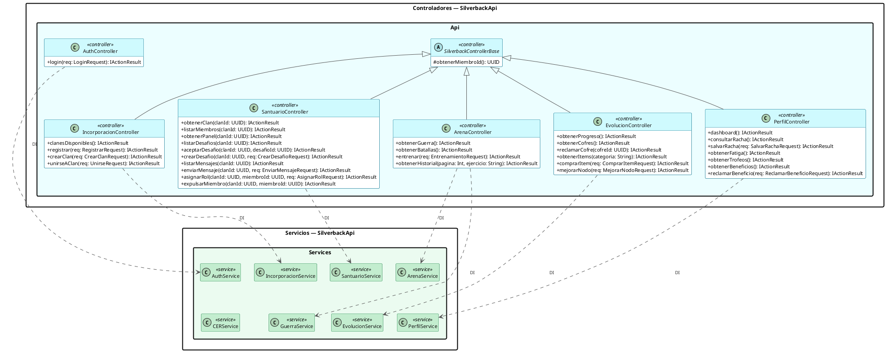

# 10.5.7e — Diagrama de Clases: Capa de Controladores

> **Actualizado 06/10:** arquitectura documentada en **5 capas** (se incorpora Controladores — `SilverbackApi.Api`). Las clases y atributos se alinean con el código: `DesafioClan` y `MensajeClan` (antes `Desafio`/`Mensaje`), `AuthService` y `GuerraService`. Detalle en `Modificacion-Carpeta.md`.

**Capa:** Controladores — SilverbackApi.Api  
**Descripción:** Punto de entrada HTTP de la API. Cada controller expone los endpoints REST de una sección funcional, valida la autenticación (JWT Bearer, `[Authorize]`), obtiene el `miembroId` del token (`SilverbackControllerBase`) y delega en el servicio correspondiente, recibido por inyección de dependencias. No contienen lógica de negocio ni acceden a repositorios. Los servicios se muestran como referencia (detalle en 10.5.7d).

> **Render:** exportar en **SVG** (vectorial, sin límite de tamaño). En PNG, PlantUML recorta a 4096 px (`PLANTUML_LIMIT_SIZE`).

---

---

## Endpoints expuestos

| Controller | Ruta base | Auth | Método → Endpoint |
|---|---|---|---|
| `AuthController` | `/api/auth` | Pública | `login` → `POST /login` |
| `IncorporacionController` | `/api/incorporacion` | Pública (salvo `unirse`) | `clanesDisponibles` → `GET /clanes` · `registrar` → `POST /registrar` · `crearClan` → `POST /clan` · `unirseAClan` → `POST /unirse` 🔒 |
| `SantuarioController` | `/api/santuario` | JWT | `obtenerClan` → `GET /{clanId}` · `listarMiembros` → `GET /{clanId}/miembros` · `obtenerPanel` → `GET /{clanId}/panel` · `listarDesafios` → `GET /{clanId}/desafios` · `aceptarDesafio` → `POST /{clanId}/desafios/{desafioId}/aceptar` · `crearDesafio` → `POST /{clanId}/desafios` · `listarMensajes` → `GET /{clanId}/mensajes` · `enviarMensaje` → `POST /{clanId}/mensajes` · `asignarRol` → `PUT /{clanId}/miembros/{miembroId}/rol` · `expulsarMiembro` → `DELETE /{clanId}/miembros/{miembroId}` |
| `ArenaController` | `/api/arena` | JWT | `obtenerGuerra` → `GET /guerra` · `obtenerBatallas` → `GET /batallas` · `entrenar` → `POST /entrenar` · `obtenerHistorial` → `GET /historial` |
| `EvolucionController` | `/api/evolucion` | JWT | `obtenerProgreso` → `GET /progreso` · `obtenerCofres` → `GET /cofres` · `reclamarCofre` → `POST /cofres/{cofreId}/reclamar` · `obtenerItems` → `GET /items` · `comprarItem` → `POST /items/comprar` · `mejorarNodo` → `POST /nodos/mejorar` |
| `PerfilController` | `/api/perfil` | JWT | `dashboard` → `GET /dashboard` · `consultarRacha` → `GET /racha` · `salvarRacha` → `POST /racha/salvar` · `obtenerFatiga` → `GET /fatiga` · `obtenerTrofeos` → `GET /trofeos` · `obtenerBeneficios` → `GET /beneficios` · `reclamarBeneficio` → `POST /beneficios/reclamar` |
