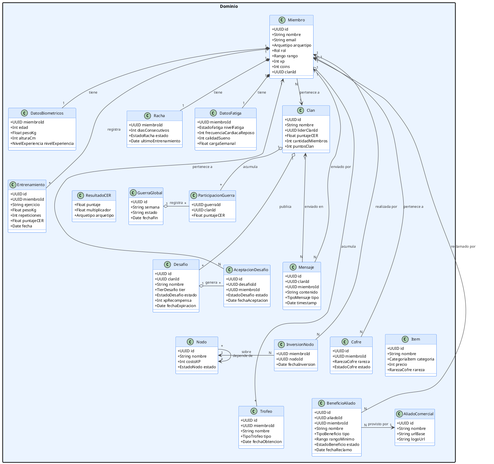

# 10.5.7b — Diagrama de Clases: Capa de Dominio

**Capa:** Dominio — proyecto `SilverbackApi.Domain`  
**Descripción:** Entidades del negocio. Solo atributos y relaciones. Son el modelo persistido en SQL Server vía EF Core 9. Los enums se almacenan como strings (`HasConversion<string>()`).

---

