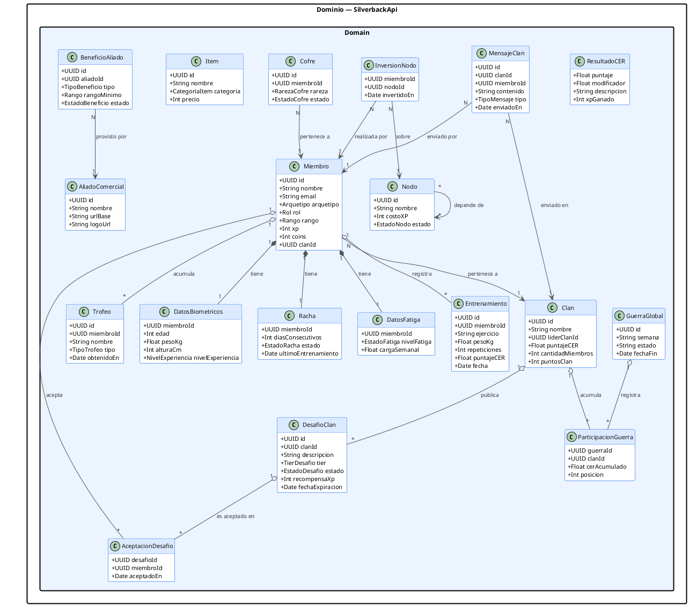

# 10.5.7b — Diagrama de Clases: Capa de Dominio

> **Actualizado 06/10:** arquitectura documentada en **5 capas** (se incorpora Controladores — `SilverbackApi.Api`). Las clases y atributos se alinean con el código: `DesafioClan` y `MensajeClan` (antes `Desafio`/`Mensaje`), `AuthService` y `GuerraService`. Detalle en `Modificacion-Carpeta.md`.

**Capa:** Dominio — SilverbackApi.Domain  
**Descripción:** Entidades del negocio. Solo atributos y relaciones. Son el modelo persistido en SQL Server vía EF Core 9. Los enums se almacenan como strings (`HasConversion<string>()`).

> **Render:** exportar en **SVG** (vectorial, sin límite de tamaño). En PNG, PlantUML recorta a 4096 px (`PLANTUML_LIMIT_SIZE`).

---

```plantuml
@startuml clases-dominio
skinparam classAttributeIconSize 0
skinparam packageStyle rectangle
skinparam defaultFontName Arial
skinparam defaultFontSize 11
skinparam nodesep 30
skinparam ranksep 70
hide empty members

skinparam class {
  BackgroundColor #FFFFFF
  FontColor #111111

  BorderColor #3B82F6
  HeaderBackgroundColor #DBEAFE
}
skinparam arrow {
  Color #555555
  FontColor #333333
  FontSize 10
}
skinparam package {
  BorderThickness 2
  FontStyle bold
  FontSize 12
}
package "Dominio — SilverbackApi.Domain" #EBF4FF {
  class Miembro {
    +UUID id
    +String nombre
    +String email
    +Arquetipo arquetipo
    +Rol rol
    +Rango rango
    +Int xp
    +Int coins
    +UUID clanId
  }
  class Clan {
    +UUID id
    +String nombre
    +UUID liderClanId
    +Float puntajeCER
    +Int cantidadMiembros
    +Int puntosClan
  }
  class DatosBiometricos {
    +UUID miembroId
    +Int edad
    +Float pesoKg
    +Int alturaCm
    +NivelExperiencia nivelExperiencia
  }
  class Racha {
    +UUID miembroId
    +Int diasConsecutivos
    +EstadoRacha estado
    +Date ultimoEntrenamiento
  }
  class DatosFatiga {
    +UUID miembroId
    +EstadoFatiga nivelFatiga
    +Float cargaSemanal
  }
  class Entrenamiento {
    +UUID id
    +UUID miembroId
    +String ejercicio
    +Float pesoKg
    +Int repeticiones
    +Float puntajeCER
    +Date fecha
  }
  class ResultadoCER {
    +Float puntaje
    +Float modificador
    +String descripcion
    +Int xpGanado
  }
  class GuerraGlobal {
    +UUID id
    +String semana
    +String estado
    +Date fechaFin
  }
  class ParticipacionGuerra {
    +UUID guerraId
    +UUID clanId
    +Float cerAcumulado
    +Int posicion
  }
  class DesafioClan {
    +UUID id
    +UUID clanId
    +String descripcion
    +TierDesafio tier
    +EstadoDesafio estado
    +Int recompensaXp
    +Date fechaExpiracion
  }
  class AceptacionDesafio {
    +UUID desafioId
    +UUID miembroId
    +Date aceptadoEn
  }
  class MensajeClan {
    +UUID id
    +UUID clanId
    +UUID miembroId
    +String contenido
    +TipoMensaje tipo
    +Date enviadoEn
  }
  class Nodo {
    +UUID id
    +String nombre
    +Int costoXP
    +EstadoNodo estado
  }
  class InversionNodo {
    +UUID miembroId
    +UUID nodoId
    +Date invertidoEn
  }
  class Cofre {
    +UUID id
    +UUID miembroId
    +RarezaCofre rareza
    +EstadoCofre estado
  }
  class Item {
    +UUID id
    +String nombre
    +CategoriaItem categoria
    +Int precio
  }
  class Trofeo {
    +UUID id
    +UUID miembroId
    +String nombre
    +TipoTrofeo tipo
    +Date obtenidoEn
  }
  class BeneficioAliado {
    +UUID id
    +UUID aliadoId
    +TipoBeneficio tipo
    +Rango rangoMinimo
    +EstadoBeneficio estado
  }
  class AliadoComercial {
    +UUID id
    +String nombre
    +String urlBase
    +String logoUrl
  }
}

Miembro "N" --> "1" Clan : pertenece a
Miembro "1" *-- "1" DatosBiometricos : tiene
Miembro "1" *-- "1" Racha : tiene
Miembro "1" *-- "1" DatosFatiga : tiene
Miembro "1" o-- "*" Trofeo : acumula
Miembro "1" o-- "*" Entrenamiento : registra
Clan "1" o-- "*" DesafioClan : publica
Clan "1" o-- "*" ParticipacionGuerra : acumula
GuerraGlobal "1" o-- "*" ParticipacionGuerra : registra
DesafioClan "1" o-- "*" AceptacionDesafio : es aceptado en
Miembro "1" o-- "*" AceptacionDesafio : acepta
MensajeClan "N" --> "1" Clan : enviado en
MensajeClan "N" --> "1" Miembro : enviado por
InversionNodo "N" --> "1" Miembro : realizada por
InversionNodo "N" --> "1" Nodo : sobre
Nodo "*" --> "*" Nodo : depende de
Cofre "N" --> "1" Miembro : pertenece a
BeneficioAliado "N" --> "1" AliadoComercial : provisto por
@enduml
```
