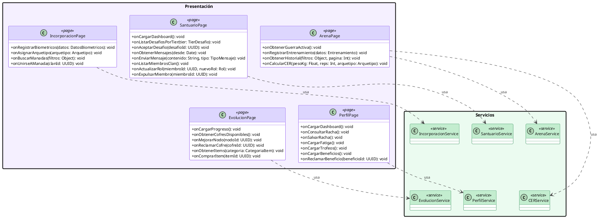

# 10.5.7a — Diagrama de Clases: Capa de Presentación

**Capa:** Presentación (Pages) — proyecto `silverback/` (Next.js 16)  
**Descripción:** Pages de Next.js App Router. Cada clase agrupa los handlers de una sección funcional. Se comunican con la capa de Servicios vía HTTP REST al .NET API (`apiFetch<T>()` desde Server Components, Server Actions para mutaciones). No acceden directamente a servicios ni repositorios.

---

