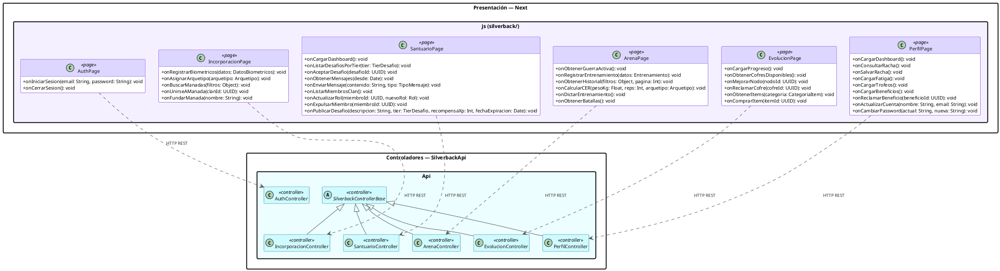

# 10.5.7a — Diagrama de Clases: Capa de Presentación

> **Actualizado 06/10:** arquitectura documentada en **5 capas** (se incorpora Controladores — `SilverbackApi.Api`). Las clases y atributos se alinean con el código: `DesafioClan` y `MensajeClan` (antes `Desafio`/`Mensaje`), `AuthService` y `GuerraService`. Detalle en `Modificacion-Carpeta.md`.

**Capa:** Presentación — Next.js (silverback/)  
**Descripción:** Pages de Next.js App Router. Cada clase agrupa los handlers de una sección funcional. Se comunican con la capa de Controladores vía HTTP REST (`apiFetch<T>()` desde Server Components, Server Actions para mutaciones), enviando el JWT de la cookie `sb_token` como Bearer. No acceden directamente a servicios ni repositorios. Los controladores se muestran como referencia (detalle en 10.5.7b).

> **Render:** exportar en **SVG** (vectorial, sin límite de tamaño). En PNG, PlantUML recorta a 4096 px (`PLANTUML_LIMIT_SIZE`).

---

```plantuml
@startuml clases-presentacion
skinparam classAttributeIconSize 0
skinparam packageStyle rectangle
skinparam defaultFontName Arial
skinparam defaultFontSize 11
skinparam nodesep 30
skinparam ranksep 70
hide empty members

skinparam class {
  BackgroundColor #FFFFFF
  FontColor #111111
  BorderColor<<page>> #7C3AED
  HeaderBackgroundColor<<page>> #DDD6FE
  BorderColor<<controller>> #0E7490
  HeaderBackgroundColor<<controller>> #CFFAFE
  BorderColor #3B82F6
  HeaderBackgroundColor #DBEAFE
}
skinparam arrow {
  Color #555555
  FontColor #333333
  FontSize 10
}
skinparam package {
  BorderThickness 2
  FontStyle bold
  FontSize 12
}
package "Presentación — Next.js (silverback/)" #F5F0FF {
  class AuthPage <<page>> {
    +onIniciarSesion(email: String, password: String): void
    +onCerrarSesion(): void
  }
  class IncorporacionPage <<page>> {
    +onRegistrarBiometricos(datos: DatosBiometricos): void
    +onAsignarArquetipo(arquetipo: Arquetipo): void
    +onBuscarManadas(filtros: Object): void
    +onUnirseAManada(clanId: UUID): void
    +onFundarManada(nombre: String): void
  }
  class SantuarioPage <<page>> {
    +onCargarDashboard(): void
    +onListarDesafiosPorTier(tier: TierDesafio): void
    +onAceptarDesafio(desafioId: UUID): void
    +onObtenerMensajes(desde: Date): void
    +onEnviarMensaje(contenido: String, tipo: TipoMensaje): void
    +onListarMiembrosClan(): void
    +onActualizarRol(miembroId: UUID, nuevoRol: Rol): void
    +onExpulsarMiembro(miembroId: UUID): void
    +onPublicarDesafio(descripcion: String, tier: TierDesafio, recompensaXp: Int, fechaExpiracion: Date): void
  }
  class ArenaPage <<page>> {
    +onObtenerGuerraActiva(): void
    +onRegistrarEntrenamiento(datos: Entrenamiento): void
    +onObtenerHistorial(filtros: Object, pagina: Int): void
    +onCalcularCER(pesoKg: Float, reps: Int, arquetipo: Arquetipo): void
    +onDictarEntrenamiento(): void
    +onObtenerBatallas(): void
  }
  class EvolucionPage <<page>> {
    +onCargarProgreso(): void
    +onObtenerCofresDisponibles(): void
    +onMejorarNodo(nodoId: UUID): void
    +onReclamarCofre(cofreId: UUID): void
    +onObtenerItems(categoria: CategoriaItem): void
    +onComprarItem(itemId: UUID): void
  }
  class PerfilPage <<page>> {
    +onCargarDashboard(): void
    +onConsultarRacha(): void
    +onSalvarRacha(): void
    +onCargarFatiga(): void
    +onCargarTrofeos(): void
    +onCargarBeneficios(): void
    +onReclamarBeneficio(beneficioId: UUID): void
    +onActualizarCuenta(nombre: String, email: String): void
    +onCambiarPassword(actual: String, nueva: String): void
  }
}

package "Controladores — SilverbackApi.Api" #ECFEFF {
  abstract class SilverbackControllerBase <<controller>>
  class AuthController <<controller>>
  class IncorporacionController <<controller>>
  class SantuarioController <<controller>>
  class ArenaController <<controller>>
  class EvolucionController <<controller>>
  class PerfilController <<controller>>

  SilverbackControllerBase <|-- IncorporacionController
  SilverbackControllerBase <|-- SantuarioController
  SilverbackControllerBase <|-- ArenaController
  SilverbackControllerBase <|-- EvolucionController
  SilverbackControllerBase <|-- PerfilController
}

AuthPage ..> AuthController : HTTP REST
IncorporacionPage ..> IncorporacionController : HTTP REST
SantuarioPage ..> SantuarioController : HTTP REST
ArenaPage ..> ArenaController : HTTP REST
EvolucionPage ..> EvolucionController : HTTP REST
PerfilPage ..> PerfilController : HTTP REST
@enduml
```
