# 10.5.7c — Diagrama de Clases: Capa de Repositorios

**Capa:** Repositorios — proyecto `SilverbackApi.Data` (ASP.NET Core 9)  
**Descripción:** Acceso a datos vía EF Core 9. Cada repositorio encapsula las queries sobre una entidad del dominio usando `AppDbContext`. Agrupados por área funcional.

---

```plantuml
@startuml clases-repositorios
skinparam classAttributeIconSize 0
skinparam packageStyle rectangle
skinparam defaultFontName Arial
skinparam defaultFontSize 11

skinparam class {
  BackgroundColor #FFFFFF
  BorderColor #D4620A
  HeaderBackgroundColor #FDDCB5
  FontColor #111111

  BackgroundColor<<domain>> #FFFFFF
  BorderColor<<domain>> #3B82F6
  HeaderBackgroundColor<<domain>> #DBEAFE
  FontColor<<domain>> #111111
}
skinparam arrow {
  Color #444444
  FontColor #333333
  FontSize 10
}
skinparam package {
  BorderThickness 2
  FontStyle bold
  FontSize 12
}

' ─── REPOSITORIOS ─────────────────────────────────────────

package "Repositorios" #FFF3EB {

  ' ── Fila 1: Núcleo
  class MiembroRepository <<repository>> {
    +crear(datos: DatosBiometricos): Miembro
    +buscarPorId(id: UUID): Miembro
    +listarPorClan(clanId: UUID): Miembro[]
    +asignarClan(miembroId: UUID, clanId: UUID, rol: Rol): Miembro
    +actualizarArquetipo(miembroId: UUID, arquetipo: Arquetipo, multiplicadorCER: Float): Miembro
    +actualizarRol(miembroId: UUID, rol: Rol): Miembro
    +actualizarXP(miembroId: UUID, xp: Int): Miembro
    +actualizarCoins(miembroId: UUID, delta: Int): Miembro
    +actualizar(miembroId: UUID, datos: Object): void
    +eliminarMembresia(miembroId: UUID): void
  }
  class ClanRepository <<repository>> {
    +listarDisponibles(filtros: Object, pagina: Int, limite: Int): Clan[]
    +buscarPorId(id: UUID): Clan
    +obtenerConMiembros(id: UUID): Clan
    +verificarDisponibilidad(id: UUID): boolean
    +actualizarContadorMiembros(id: UUID, delta: Int): Clan
    +descontarPuntos(id: UUID, puntos: Int): void
  }
  class RachaRepository <<repository>> {
    +obtenerPorMiembro(miembroId: UUID): Racha
    +actualizar(miembroId: UUID, datos: Object): Racha
    +restaurar(miembroId: UUID): Racha
  }

  ' ── Fila 2: Arena + Santuario
  class EntrenamientoRepository <<repository>> {
    +crear(entrenamiento: Entrenamiento): Entrenamiento
    +listar(miembroId: UUID, filtros: Object, pagina: Int): Entrenamiento[]
    +obtenerEstadisticas(miembroId: UUID): Object
  }
  class GuerraRepository <<repository>> {
    +findGuerraActiva(): GuerraGlobal
    +findRankingClanes(guerraId: UUID, top: Int): Clan[]
    +obtenerPuntajeActual(clanId: UUID): GuerraGlobal
  }
  class DesafioRepository <<repository>> {
    +listarActivos(clanId: UUID): Desafio[]
    +listarPorTier(clanId: UUID, tier: TierDesafio): Desafio[]
    +buscarAceptacion(desafioId: UUID, miembroId: UUID): AceptacionDesafio
    +crearAceptacion(miembroId: UUID, desafioId: UUID, estado: EstadoDesafio): AceptacionDesafio
  }
  class MensajeRepository <<repository>> {
    +crear(mensaje: Mensaje): Mensaje
    +listarPorClan(clanId: UUID, desde: Date): Mensaje[]
  }

  ' ── Fila 3: Evolución
  class SkillTreeRepository <<repository>> {
    +obtenerArbol(miembroId: UUID): Nodo[]
    +crearInversion(inversion: InversionNodo): InversionNodo
  }
  class CofreRepository <<repository>> {
    +listarDisponibles(miembroId: UUID): Cofre[]
    +marcarReclamado(cofreId: UUID): void
  }
  class MarketplaceRepository <<repository>> {
    +listar(categoria: CategoriaItem): Item[]
    +buscarItem(itemId: UUID): Item
    +registrarCompra(miembroId: UUID, itemId: UUID): void
  }

  ' ── Fila 4: Perfil
  class TrofeoRepository <<repository>> {
    +listarPorMiembro(miembroId: UUID): Trofeo[]
    +obtenerProgreso(miembroId: UUID): Object
  }
  class BeneficioRepository <<repository>> {
    +listarElegibles(miembroId: UUID, rango: Rango): BeneficioAliado[]
    +registrarReclamo(beneficioId: UUID, miembroId: UUID): void
    +actualizarEstado(beneficioId: UUID, datos: Object): void
  }
  class FatigaRepository <<repository>> {
    +obtenerPorMiembro(miembroId: UUID): DatosFatiga
  }
  class AdminHistorialRepository <<repository>> {
    +registrar(evento: String): void
  }

  ' ── Hidden links para grilla vertical ──────────────────
  MiembroRepository -[hidden]r- ClanRepository
  ClanRepository -[hidden]r- RachaRepository
  MiembroRepository -[hidden]d- EntrenamientoRepository
  EntrenamientoRepository -[hidden]r- GuerraRepository
  GuerraRepository -[hidden]r- DesafioRepository
  DesafioRepository -[hidden]r- MensajeRepository
  EntrenamientoRepository -[hidden]d- SkillTreeRepository
  SkillTreeRepository -[hidden]r- CofreRepository
  CofreRepository -[hidden]r- MarketplaceRepository
  SkillTreeRepository -[hidden]d- TrofeoRepository
  TrofeoRepository -[hidden]r- BeneficioRepository
  BeneficioRepository -[hidden]r- FatigaRepository
  FatigaRepository -[hidden]r- AdminHistorialRepository
}

' ─── DOMINIO (referencia) ─────────────────────────────────

package "Dominio" #EBF4FF {

  class Miembro <<domain>> {
  }
  class Clan <<domain>> {
  }
  class Entrenamiento <<domain>> {
  }
  class GuerraGlobal <<domain>> {
  }
  class Desafio <<domain>> {
  }
  class AceptacionDesafio <<domain>> {
  }
  class Mensaje <<domain>> {
  }
  class Racha <<domain>> {
  }
  class Nodo <<domain>> {
  }
  class InversionNodo <<domain>> {
  }
  class Cofre <<domain>> {
  }
  class Item <<domain>> {
  }
  class Trofeo <<domain>> {
  }
  class BeneficioAliado <<domain>> {
  }
  class DatosFatiga <<domain>> {
  }

  Miembro -[hidden]r- Clan
  Clan -[hidden]r- Entrenamiento
  Entrenamiento -[hidden]r- GuerraGlobal
  Desafio -[hidden]r- AceptacionDesafio
  AceptacionDesafio -[hidden]r- Mensaje
  Mensaje -[hidden]r- Racha
  Nodo -[hidden]r- InversionNodo
  InversionNodo -[hidden]r- Cofre
  Cofre -[hidden]r- Item
  Trofeo -[hidden]r- BeneficioAliado
  BeneficioAliado -[hidden]r- DatosFatiga
  Miembro -[hidden]d- Desafio
  Desafio -[hidden]d- Nodo
  Nodo -[hidden]d- Trofeo
}

' ─── Forzar Repositorios ARRIBA, Dominio ABAJO ────────────

MiembroRepository -[hidden]d- Miembro
EntrenamientoRepository -[hidden]d- Entrenamiento

@enduml
```

