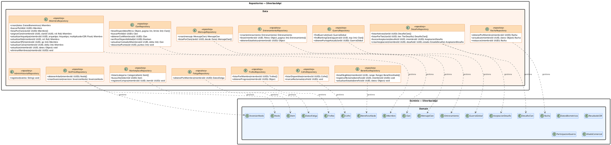

# 10.5.7c — Diagrama de Clases: Capa de Repositorios

> **Actualizado 06/10:** arquitectura documentada en **5 capas** (se incorpora Controladores — `SilverbackApi.Api`). Las clases y atributos se alinean con el código: `DesafioClan` y `MensajeClan` (antes `Desafio`/`Mensaje`), `AuthService` y `GuerraService`. Detalle en `Modificacion-Carpeta.md`.

**Capa:** Repositorios — SilverbackApi.Data  
**Descripción:** Acceso a datos vía EF Core 9 sobre SQL Server. Cada repositorio encapsula las queries sobre una o más entidades del dominio usando `AppDbContext`. Las entidades se muestran como referencia (detalle en 10.5.7b).

> **Render:** exportar en **SVG** (vectorial, sin límite de tamaño). En PNG, PlantUML recorta a 4096 px (`PLANTUML_LIMIT_SIZE`).

---

```plantuml
@startuml clases-repositorios
skinparam classAttributeIconSize 0
skinparam packageStyle rectangle
skinparam defaultFontName Arial
skinparam defaultFontSize 11
skinparam nodesep 30
skinparam ranksep 70
hide empty members

skinparam class {
  BackgroundColor #FFFFFF
  FontColor #111111
  BorderColor<<repository>> #D4620A
  HeaderBackgroundColor<<repository>> #FDDCB5
  BorderColor #3B82F6
  HeaderBackgroundColor #DBEAFE
}
skinparam arrow {
  Color #555555
  FontColor #333333
  FontSize 10
}
skinparam package {
  BorderThickness 2
  FontStyle bold
  FontSize 12
}
package "Repositorios — SilverbackApi.Data" #FFF3EB {
  class MiembroRepository <<repository>> {
    +crear(datos: DatosBiometricos): Miembro
    +buscarPorId(id: UUID): Miembro
    +listarPorClan(clanId: UUID): Miembro[]
    +asignarClan(miembroId: UUID, clanId: UUID, rol: Rol): Miembro
    +actualizarArquetipo(miembroId: UUID, arquetipo: Arquetipo, multiplicadorCER: Float): Miembro
    +actualizarRol(miembroId: UUID, rol: Rol): Miembro
    +actualizarXP(miembroId: UUID, xp: Int): Miembro
    +actualizarCoins(miembroId: UUID, delta: Int): Miembro
    +actualizar(miembroId: UUID, datos: Object): void
    +eliminarMembresia(miembroId: UUID): void
  }
  class ClanRepository <<repository>> {
    +listarDisponibles(filtros: Object, pagina: Int, limite: Int): Clan[]
    +buscarPorId(id: UUID): Clan
    +obtenerConMiembros(id: UUID): Clan
    +verificarDisponibilidad(id: UUID): Boolean
    +actualizarContadorMiembros(id: UUID, delta: Int): Clan
    +descontarPuntos(id: UUID, puntos: Int): void
  }
  class DesafioRepository <<repository>> {
    +listarActivos(clanId: UUID): DesafioClan[]
    +listarPorTier(clanId: UUID, tier: TierDesafio): DesafioClan[]
    +buscarAceptacion(desafioId: UUID, miembroId: UUID): AceptacionDesafio
    +crearAceptacion(miembroId: UUID, desafioId: UUID, estado: EstadoDesafio): AceptacionDesafio
  }
  class MensajeRepository <<repository>> {
    +crear(mensaje: MensajeClan): MensajeClan
    +listarPorClan(clanId: UUID, desde: Date): MensajeClan[]
  }
  class EntrenamientoRepository <<repository>> {
    +crear(entrenamiento: Entrenamiento): Entrenamiento
    +listar(miembroId: UUID, filtros: Object, pagina: Int): Entrenamiento[]
    +obtenerEstadisticas(miembroId: UUID): Object
  }
  class GuerraRepository <<repository>> {
    +findGuerraActiva(): GuerraGlobal
    +findRankingClanes(guerraId: UUID, top: Int): Clan[]
    +obtenerPuntajeActual(clanId: UUID): GuerraGlobal
  }
  class RachaRepository <<repository>> {
    +obtenerPorMiembro(miembroId: UUID): Racha
    +actualizar(miembroId: UUID, datos: Object): Racha
    +restaurar(miembroId: UUID): Racha
  }
  class AdminHistorialRepository <<repository>> {
    +registrar(evento: String): void
  }
  class SkillTreeRepository <<repository>> {
    +obtenerArbol(miembroId: UUID): Nodo[]
    +crearInversion(inversion: InversionNodo): InversionNodo
  }
  class CofreRepository <<repository>> {
    +listarDisponibles(miembroId: UUID): Cofre[]
    +marcarReclamado(cofreId: UUID): void
  }
  class MarketplaceRepository <<repository>> {
    +listar(categoria: CategoriaItem): Item[]
    +buscarItem(itemId: UUID): Item
    +registrarCompra(miembroId: UUID, itemId: UUID): void
  }
  class FatigaRepository <<repository>> {
    +obtenerPorMiembro(miembroId: UUID): DatosFatiga
  }
  class TrofeoRepository <<repository>> {
    +listarPorMiembro(miembroId: UUID): Trofeo[]
    +obtenerProgreso(miembroId: UUID): Object
  }
  class BeneficioRepository <<repository>> {
    +listarElegibles(miembroId: UUID, rango: Rango): BeneficioAliado[]
    +registrarReclamo(beneficioId: UUID, miembroId: UUID): void
    +actualizarEstado(beneficioId: UUID, datos: Object): void
  }

  ' Dos filas para que la capa no quede demasiado ancha
  MiembroRepository -[hidden]d- AdminHistorialRepository
  ClanRepository -[hidden]d- SkillTreeRepository
  DesafioRepository -[hidden]d- CofreRepository
  MensajeRepository -[hidden]d- MarketplaceRepository
  EntrenamientoRepository -[hidden]d- FatigaRepository
  GuerraRepository -[hidden]d- TrofeoRepository
  RachaRepository -[hidden]d- BeneficioRepository
}

package "Dominio — SilverbackApi.Domain" #EBF4FF {
  class Miembro
  class Clan
  class DatosBiometricos
  class Racha
  class DatosFatiga
  class Entrenamiento
  class ResultadoCER
  class GuerraGlobal
  class ParticipacionGuerra
  class DesafioClan
  class AceptacionDesafio
  class MensajeClan
  class Nodo
  class InversionNodo
  class Cofre
  class Item
  class Trofeo
  class BeneficioAliado
  class AliadoComercial
}

MiembroRepository ..> Miembro : gestiona
ClanRepository ..> Clan : gestiona
DesafioRepository ..> DesafioClan : gestiona
DesafioRepository ..> AceptacionDesafio : gestiona
MensajeRepository ..> MensajeClan : gestiona
EntrenamientoRepository ..> Entrenamiento : gestiona
GuerraRepository ..> GuerraGlobal : gestiona
RachaRepository ..> Racha : gestiona
SkillTreeRepository ..> Nodo : gestiona
SkillTreeRepository ..> InversionNodo : gestiona
CofreRepository ..> Cofre : gestiona
MarketplaceRepository ..> Item : gestiona
FatigaRepository ..> DatosFatiga : gestiona
TrofeoRepository ..> Trofeo : gestiona
BeneficioRepository ..> BeneficioAliado : gestiona
@enduml
```
