# 10.5.7d — Diagrama de Clases: Capa de Servicios

**Capa:** Servicios — proyecto `SilverbackApi.Services` (ASP.NET Core 9)  
**Descripción:** Lógica de negocio. Cada servicio coordina repositorios para ejecutar un caso de uso. Los métodos públicos (+) son llamados por los Controllers del proyecto Api vía inyección de dependencias (DI); los privados (-) son internos del servicio.

---

```plantuml
@startuml clases-servicios
skinparam classAttributeIconSize 0
skinparam packageStyle rectangle
skinparam defaultFontName Arial
skinparam defaultFontSize 11

skinparam class {
  BackgroundColor #FFFFFF
  BorderColor #2E8B57
  HeaderBackgroundColor #C3EDCF
  FontColor #111111

  BackgroundColor<<repository>> #FFFFFF
  BorderColor<<repository>> #D4620A
  HeaderBackgroundColor<<repository>> #FDDCB5
  FontColor<<repository>> #111111
}
skinparam arrow {
  Color #444444
  FontColor #333333
  FontSize 10
}
skinparam package {
  BorderThickness 2
  FontStyle bold
  FontSize 12
}

' ─── SERVICIOS ────────────────────────────────────────────

package "Servicios" #EBFBF0 {

  class IncorporacionService <<service>> {
    +registrarBiometricos(datos: DatosBiometricos): Miembro
    +asignarArquetipo(miembroId: UUID, arquetipo: Arquetipo): Miembro
    +buscarManadas(filtros: Object): Clan[]
    +unirseAManada(miembroId: UUID, clanId: UUID): Clan
    -construirLineaBase(datos: DatosBiometricos): DatosBiometricos
    -calcularMultiplicadorCER(arquetipo: Arquetipo): Float
  }

  class SantuarioService <<service>> {
    +cargarDashboard(miembroId: UUID, clanId: UUID): Object
    +listarDesafiosPorTier(clanId: UUID, tier: TierDesafio): Desafio[]
    +aceptarDesafio(miembroId: UUID, desafioId: UUID): AceptacionDesafio
    +obtenerMensajes(clanId: UUID, desde: Date): Mensaje[]
    +enviarMensaje(clanId: UUID, miembroId: UUID, contenido: String, tipo: TipoMensaje): Mensaje
    +listarMiembrosClan(clanId: UUID): Miembro[]
    +actualizarRol(miembroId: UUID, nuevoRol: Rol, liderClanId: UUID): Miembro
    +obtenerMiembro(miembroId: UUID): Miembro
    +expulsarMiembro(miembroId: UUID, clanId: UUID, liderClanId: UUID): void
  }

  class ArenaService <<service>> {
    +obtenerGuerraActiva(): GuerraGlobal
    +registrarEntrenamiento(datos: Entrenamiento): ResultadoCER
    +obtenerHistorial(miembroId: UUID, filtros: Object, pagina: Int): Entrenamiento[]
  }

  class CERService <<service>> {
    +calcular(pesoKg: Float, reps: Int, arquetipo: Arquetipo): ResultadoCER
    +obtenerMultiplicador(arquetipo: Arquetipo): Float
    -calcularPuntaje(pesoKg: Float, reps: Int, multiplicador: Float): Float
  }

  class EvolucionService <<service>> {
    +cargarProgreso(miembroId: UUID): Object
    +obtenerCofresDisponibles(miembroId: UUID): Cofre[]
    +mejorarNodo(nodoId: UUID, miembroId: UUID): Object
    +reclamarCofre(cofreId: UUID, miembroId: UUID): Object
    +obtenerItems(categoria: CategoriaItem): Item[]
    +comprarItem(itemId: UUID, miembroId: UUID): Object
    -determinarLoot(rareza: RarezaCofre): Item
    -calcularXPParaSiguienteRango(rango: Rango, xpActual: Int): Int
  }

  class PerfilService <<service>> {
    +cargarDashboard(miembroId: UUID): Object
    +consultarRacha(miembroId: UUID): Racha
    +salvarRacha(miembroId: UUID, clanId: UUID): void
    +cargarFatiga(miembroId: UUID): DatosFatiga
    +cargarTrofeos(miembroId: UUID): Trofeo[]
    +cargarBeneficios(miembroId: UUID): BeneficioAliado[]
    +reclamarBeneficio(beneficioId: UUID, miembroId: UUID): Object
    -construirDashboard(miembro: Miembro, entrenamientos: Entrenamiento[], racha: Racha): Object
    -evaluarFatiga(datos: DatosFatiga, cargaSemanal: Float): EstadoFatiga
    -calcularProgresoHaciaProximo(miembroId: UUID, proximo: Trofeo): Float
    -generarCupon(beneficioId: UUID, miembroId: UUID): String
  }

  ' Forzar layout 2 columnas dentro del paquete
  IncorporacionService -[hidden]r- SantuarioService
  ArenaService -[hidden]r- CERService
  EvolucionService -[hidden]r- PerfilService
  IncorporacionService -[hidden]d- ArenaService
  ArenaService -[hidden]d- EvolucionService
}

' ─── REPOSITORIOS (referencia) ────────────────────────────

package "Repositorios" #FFF3EB {

  class MiembroRepository <<repository>> {
  }
  class ClanRepository <<repository>> {
  }
  class EntrenamientoRepository <<repository>> {
  }
  class GuerraRepository <<repository>> {
  }
  class RachaRepository <<repository>> {
  }
  class FatigaRepository <<repository>> {
  }
  class DesafioRepository <<repository>> {
  }
  class MensajeRepository <<repository>> {
  }
  class AdminHistorialRepository <<repository>> {
  }
  class SkillTreeRepository <<repository>> {
  }
  class CofreRepository <<repository>> {
  }
  class MarketplaceRepository <<repository>> {
  }
  class TrofeoRepository <<repository>> {
  }
  class BeneficioRepository <<repository>> {
  }

  ' Forzar layout 3 columnas
  MiembroRepository -[hidden]r- ClanRepository
  ClanRepository -[hidden]r- EntrenamientoRepository
  EntrenamientoRepository -[hidden]r- GuerraRepository
  RachaRepository -[hidden]r- FatigaRepository
  FatigaRepository -[hidden]r- DesafioRepository
  DesafioRepository -[hidden]r- MensajeRepository
  SkillTreeRepository -[hidden]r- CofreRepository
  CofreRepository -[hidden]r- MarketplaceRepository
  MarketplaceRepository -[hidden]r- TrofeoRepository
  MiembroRepository -[hidden]d- RachaRepository
  RachaRepository -[hidden]d- SkillTreeRepository
  SkillTreeRepository -[hidden]d- AdminHistorialRepository
  BeneficioRepository -[hidden]r- AdminHistorialRepository
}

' ─── Forzar Servicios ARRIBA, Repositorios ABAJO ──────────

IncorporacionService -[hidden]d- MiembroRepository
SantuarioService -[hidden]d- ClanRepository

' ─── Dependencias ─────────────────────────────────────────

IncorporacionService ..> MiembroRepository : usa
IncorporacionService ..> ClanRepository : usa

SantuarioService ..> ClanRepository : usa
SantuarioService ..> DesafioRepository : usa
SantuarioService ..> MensajeRepository : usa
SantuarioService ..> MiembroRepository : usa

ArenaService ..> EntrenamientoRepository : usa
ArenaService ..> GuerraRepository : usa
ArenaService ..> RachaRepository : usa
ArenaService ..> MiembroRepository : usa
ArenaService ..> AdminHistorialRepository : usa
ArenaService ..> CERService : compone

EvolucionService ..> SkillTreeRepository : usa
EvolucionService ..> CofreRepository : usa
EvolucionService ..> MarketplaceRepository : usa
EvolucionService ..> MiembroRepository : usa

PerfilService ..> MiembroRepository : usa
PerfilService ..> RachaRepository : usa
PerfilService ..> FatigaRepository : usa
PerfilService ..> TrofeoRepository : usa
PerfilService ..> BeneficioRepository : usa
PerfilService ..> EntrenamientoRepository : usa
PerfilService ..> ClanRepository : usa

@enduml
```

