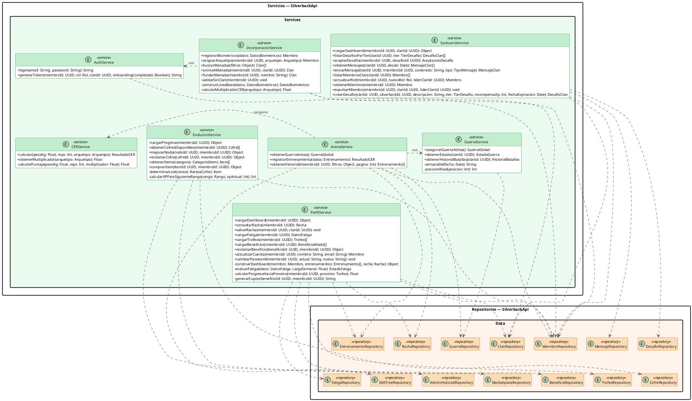

# 10.5.7d — Diagrama de Clases: Capa de Servicios

> **Actualizado 06/10:** arquitectura documentada en **5 capas** (se incorpora Controladores — `SilverbackApi.Api`). Las clases y atributos se alinean con el código: `DesafioClan` y `MensajeClan` (antes `Desafio`/`Mensaje`), `AuthService` y `GuerraService`. Detalle en `Modificacion-Carpeta.md`.

**Capa:** Servicios — SilverbackApi.Services  
**Descripción:** Lógica de negocio. Cada servicio coordina repositorios para ejecutar un caso de uso. Los métodos públicos (+) son llamados por los Controllers vía inyección de dependencias; los privados (-) son internos del servicio. Los repositorios se muestran como referencia (detalle en 10.5.7c).

> **Render:** exportar en **SVG** (vectorial, sin límite de tamaño). En PNG, PlantUML recorta a 4096 px (`PLANTUML_LIMIT_SIZE`).

---

```plantuml
@startuml clases-servicios
skinparam classAttributeIconSize 0
skinparam packageStyle rectangle
skinparam defaultFontName Arial
skinparam defaultFontSize 11
skinparam nodesep 30
skinparam ranksep 70
hide empty members

skinparam class {
  BackgroundColor #FFFFFF
  FontColor #111111
  BorderColor<<service>> #2E8B57
  HeaderBackgroundColor<<service>> #C3EDCF
  BorderColor<<repository>> #D4620A
  HeaderBackgroundColor<<repository>> #FDDCB5
  BorderColor #3B82F6
  HeaderBackgroundColor #DBEAFE
}
skinparam arrow {
  Color #555555
  FontColor #333333
  FontSize 10
}
skinparam package {
  BorderThickness 2
  FontStyle bold
  FontSize 12
}
package "Servicios — SilverbackApi.Services" #EBFBF0 {
  class AuthService <<service>> {
    +login(email: String, password: String): String
    +generarToken(miembroId: UUID, rol: Rol, clanId: UUID, onboardingCompletado: Boolean): String
  }
  class IncorporacionService <<service>> {
    +registrarBiometricos(datos: DatosBiometricos): Miembro
    +asignarArquetipo(miembroId: UUID, arquetipo: Arquetipo): Miembro
    +buscarManadas(filtros: Object): Clan[]
    +unirseAManada(miembroId: UUID, clanId: UUID): Clan
    +fundarManada(miembroId: UUID, nombre: String): Clan
    -validarSinClan(miembroId: UUID): void
    -construirLineaBase(datos: DatosBiometricos): DatosBiometricos
    -calcularMultiplicadorCER(arquetipo: Arquetipo): Float
  }
  class SantuarioService <<service>> {
    +cargarDashboard(miembroId: UUID, clanId: UUID): Object
    +listarDesafiosPorTier(clanId: UUID, tier: TierDesafio): DesafioClan[]
    +aceptarDesafio(miembroId: UUID, desafioId: UUID): AceptacionDesafio
    +obtenerMensajes(clanId: UUID, desde: Date): MensajeClan[]
    +enviarMensaje(clanId: UUID, miembroId: UUID, contenido: String, tipo: TipoMensaje): MensajeClan
    +listarMiembrosClan(clanId: UUID): Miembro[]
    +actualizarRol(miembroId: UUID, nuevoRol: Rol, liderClanId: UUID): Miembro
    +obtenerMiembro(miembroId: UUID): Miembro
    +expulsarMiembro(miembroId: UUID, clanId: UUID, liderClanId: UUID): void
    +crearDesafio(clanId: UUID, silverbackId: UUID, descripcion: String, tier: TierDesafio, recompensaXp: Int, fechaExpiracion: Date): DesafioClan
  }
  class ArenaService <<service>> {
    +obtenerGuerraActiva(): GuerraGlobal
    +registrarEntrenamiento(datos: Entrenamiento): ResultadoCER
    +obtenerHistorial(miembroId: UUID, filtros: Object, pagina: Int): Entrenamiento[]
  }
  class CERService <<service>> {
    +calcular(pesoKg: Float, reps: Int, arquetipo: Arquetipo): ResultadoCER
    +obtenerMultiplicador(arquetipo: Arquetipo): Float
    -calcularPuntaje(pesoKg: Float, reps: Int, multiplicador: Float): Float
  }
  class GuerraService <<service>> {
    +asegurarGuerraActiva(): GuerraGlobal
    +obtenerEstado(clanId: UUID): EstadoGuerra
    +obtenerHistorialBatallas(clanId: UUID): HistorialBatallas
    -semanaDe(fecha: Date): String
    -posicionRival(posicion: Int): Int
  }
  class EvolucionService <<service>> {
    +cargarProgreso(miembroId: UUID): Object
    +obtenerCofresDisponibles(miembroId: UUID): Cofre[]
    +mejorarNodo(nodoId: UUID, miembroId: UUID): Object
    +reclamarCofre(cofreId: UUID, miembroId: UUID): Object
    +obtenerItems(categoria: CategoriaItem): Item[]
    +comprarItem(itemId: UUID, miembroId: UUID): Object
    -determinarLoot(rareza: RarezaCofre): Item
    -calcularXPParaSiguienteRango(rango: Rango, xpActual: Int): Int
  }
  class PerfilService <<service>> {
    +cargarDashboard(miembroId: UUID): Object
    +consultarRacha(miembroId: UUID): Racha
    +salvarRacha(miembroId: UUID, clanId: UUID): void
    +cargarFatiga(miembroId: UUID): DatosFatiga
    +cargarTrofeos(miembroId: UUID): Trofeo[]
    +cargarBeneficios(miembroId: UUID): BeneficioAliado[]
    +reclamarBeneficio(beneficioId: UUID, miembroId: UUID): Object
    +actualizarCuenta(miembroId: UUID, nombre: String, email: String): Miembro
    +cambiarPassword(miembroId: UUID, actual: String, nueva: String): void
    -construirDashboard(miembro: Miembro, entrenamientos: Entrenamiento[], racha: Racha): Object
    -evaluarFatiga(datos: DatosFatiga, cargaSemanal: Float): EstadoFatiga
    -calcularProgresoHaciaProximo(miembroId: UUID, proximo: Trofeo): Float
    -generarCupon(beneficioId: UUID, miembroId: UUID): String
  }

  ' Dos filas para que la capa no quede demasiado ancha
  AuthService -[hidden]d- CERService
  IncorporacionService -[hidden]d- GuerraService
  SantuarioService -[hidden]d- EvolucionService
  ArenaService -[hidden]d- PerfilService
}

package "Repositorios — SilverbackApi.Data" #FFF3EB {
  class MiembroRepository <<repository>>
  class ClanRepository <<repository>>
  class DesafioRepository <<repository>>
  class MensajeRepository <<repository>>
  class EntrenamientoRepository <<repository>>
  class GuerraRepository <<repository>>
  class RachaRepository <<repository>>
  class AdminHistorialRepository <<repository>>
  class SkillTreeRepository <<repository>>
  class CofreRepository <<repository>>
  class MarketplaceRepository <<repository>>
  class FatigaRepository <<repository>>
  class TrofeoRepository <<repository>>
  class BeneficioRepository <<repository>>

  ' Dos filas para que la capa no quede demasiado ancha
  MiembroRepository -[hidden]d- AdminHistorialRepository
  ClanRepository -[hidden]d- SkillTreeRepository
  DesafioRepository -[hidden]d- CofreRepository
  MensajeRepository -[hidden]d- MarketplaceRepository
  EntrenamientoRepository -[hidden]d- FatigaRepository
  GuerraRepository -[hidden]d- TrofeoRepository
  RachaRepository -[hidden]d- BeneficioRepository
}

IncorporacionService .l.> AuthService : usa
ArenaService .r.> CERService : compone
ArenaService .r.> GuerraService : usa

AuthService ..> MiembroRepository
IncorporacionService ..> MiembroRepository
IncorporacionService ..> ClanRepository
SantuarioService ..> ClanRepository
SantuarioService ..> DesafioRepository
SantuarioService ..> MensajeRepository
SantuarioService ..> MiembroRepository
ArenaService ..> EntrenamientoRepository
ArenaService ..> GuerraRepository
ArenaService ..> RachaRepository
ArenaService ..> MiembroRepository
ArenaService ..> AdminHistorialRepository
GuerraService ..> GuerraRepository
EvolucionService ..> SkillTreeRepository
EvolucionService ..> CofreRepository
EvolucionService ..> MarketplaceRepository
EvolucionService ..> MiembroRepository
PerfilService ..> MiembroRepository
PerfilService ..> RachaRepository
PerfilService ..> FatigaRepository
PerfilService ..> TrofeoRepository
PerfilService ..> BeneficioRepository
PerfilService ..> EntrenamientoRepository
PerfilService ..> ClanRepository
@enduml
```
