# 10.5.7 — Diagrama de Clases

**Proyecto:** SILVERBACK  
**Tipo:** Diagrama de clases UML — Arquitectura en 4 capas  
**Descripción:** Métodos 100% derivados de los diagramas de secuencia.  
**Distribución física:** La capa de Presentación reside en **Next.js 16** (proyecto `silverback/`). Las capas de Servicios, Repositorios y Dominio residen en **ASP.NET Core 9 Web API** (proyecto `silverback-api/`), implementadas como proyectos separados (`SilverbackApi.Services`, `SilverbackApi.Data`, `SilverbackApi.Domain`). La comunicación entre Presentación y Servicios ocurre por HTTP REST con autenticación JWT Bearer.

---

```plantuml
@startuml class-diagram
skinparam classAttributeIconSize 0
skinparam packageStyle rectangle
skinparam defaultFontName Arial
skinparam defaultFontSize 11

skinparam class {
  BackgroundColor #FFFFFF
  FontColor #111111

  BorderColor<<page>> #7C3AED
  HeaderBackgroundColor<<page>> #DDD6FE

  BorderColor<<service>> #2E8B57
  HeaderBackgroundColor<<service>> #C3EDCF

  BorderColor<<repository>> #D4620A
  HeaderBackgroundColor<<repository>> #FDDCB5

  BorderColor #3B82F6
  HeaderBackgroundColor #DBEAFE
}
skinparam arrow {
  Color #444444
  FontColor #333333
  FontSize 10
}
skinparam package {
  BorderThickness 2
  FontStyle bold
  FontSize 12
}

' ═══════════════════════════════════════════════════════════
' CAPA 1 — PRESENTACIÓN (Next.js 16 — proyecto silverback/)
' ═══════════════════════════════════════════════════════════

package "Presentación — Next.js" #F5F0FF {

  class IncorporacionPage <<page>> {
    +onRegistrarBiometricos(datos: DatosBiometricos): void
    +onAsignarArquetipo(arquetipo: Arquetipo): void
    +onBuscarManadas(filtros: Object): void
    +onUnirseAManada(clanId: UUID): void
  }
  class SantuarioPage <<page>> {
    +onCargarDashboard(): void
    +onListarDesafiosPorTier(tier: TierDesafio): void
    +onAceptarDesafio(desafioId: UUID): void
    +onObtenerMensajes(desde: Date): void
    +onEnviarMensaje(contenido: String, tipo: TipoMensaje): void
    +onListarMiembrosClan(): void
    +onActualizarRol(miembroId: UUID, nuevoRol: Rol): void
    +onExpulsarMiembro(miembroId: UUID): void
  }
  class ArenaPage <<page>> {
    +onObtenerGuerraActiva(): void
    +onRegistrarEntrenamiento(datos: Entrenamiento): void
    +onObtenerHistorial(filtros: Object, pagina: Int): void
    +onCalcularCER(pesoKg: Float, reps: Int, arquetipo: Arquetipo): void
  }
  class EvolucionPage <<page>> {
    +onCargarProgreso(): void
    +onObtenerCofresDisponibles(): void
    +onMejorarNodo(nodoId: UUID): void
    +onReclamarCofre(cofreId: UUID): void
    +onObtenerItems(categoria: CategoriaItem): void
    +onComprarItem(itemId: UUID): void
  }
  class PerfilPage <<page>> {
    +onCargarDashboard(): void
    +onConsultarRacha(): void
    +onSalvarRacha(): void
    +onCargarFatiga(): void
    +onCargarTrofeos(): void
    +onCargarBeneficios(): void
    +onReclamarBeneficio(beneficioId: UUID): void
  }

  IncorporacionPage -[hidden]r- SantuarioPage
  SantuarioPage -[hidden]r- ArenaPage
  IncorporacionPage -[hidden]d- EvolucionPage
  EvolucionPage -[hidden]r- PerfilPage
}

' ═══════════════════════════════════════════════════════════
' CAPA 2 — SERVICIOS (ASP.NET Core — SilverbackApi.Services)
' ═══════════════════════════════════════════════════════════

package "Servicios — ASP.NET Core" #EBFBF0 {

  class IncorporacionService <<service>> {
    +registrarBiometricos(datos: DatosBiometricos): Miembro
    +asignarArquetipo(miembroId: UUID, arquetipo: Arquetipo): Miembro
    +buscarManadas(filtros: Object): Clan[]
    +unirseAManada(miembroId: UUID, clanId: UUID): Clan
    -construirLineaBase(datos: DatosBiometricos): DatosBiometricos
    -calcularMultiplicadorCER(arquetipo: Arquetipo): Float
  }
  class SantuarioService <<service>> {
    +cargarDashboard(miembroId: UUID, clanId: UUID): Object
    +listarDesafiosPorTier(clanId: UUID, tier: TierDesafio): Desafio[]
    +aceptarDesafio(miembroId: UUID, desafioId: UUID): AceptacionDesafio
    +obtenerMensajes(clanId: UUID, desde: Date): Mensaje[]
    +enviarMensaje(clanId: UUID, miembroId: UUID, contenido: String, tipo: TipoMensaje): Mensaje
    +listarMiembrosClan(clanId: UUID): Miembro[]
    +actualizarRol(miembroId: UUID, nuevoRol: Rol, liderClanId: UUID): Miembro
    +obtenerMiembro(miembroId: UUID): Miembro
    +expulsarMiembro(miembroId: UUID, clanId: UUID, liderClanId: UUID): void
  }
  class ArenaService <<service>> {
    +obtenerGuerraActiva(): GuerraGlobal
    +registrarEntrenamiento(datos: Entrenamiento): ResultadoCER
    +obtenerHistorial(miembroId: UUID, filtros: Object, pagina: Int): Entrenamiento[]
  }
  class CERService <<service>> {
    +calcular(pesoKg: Float, reps: Int, arquetipo: Arquetipo): ResultadoCER
    +obtenerMultiplicador(arquetipo: Arquetipo): Float
    -calcularPuntaje(pesoKg: Float, reps: Int, multiplicador: Float): Float
  }
  class EvolucionService <<service>> {
    +cargarProgreso(miembroId: UUID): Object
    +obtenerCofresDisponibles(miembroId: UUID): Cofre[]
    +mejorarNodo(nodoId: UUID, miembroId: UUID): Object
    +reclamarCofre(cofreId: UUID, miembroId: UUID): Object
    +obtenerItems(categoria: CategoriaItem): Item[]
    +comprarItem(itemId: UUID, miembroId: UUID): Object
    -determinarLoot(rareza: RarezaCofre): Item
    -calcularXPParaSiguienteRango(rango: Rango, xpActual: Int): Int
  }
  class PerfilService <<service>> {
    +cargarDashboard(miembroId: UUID): Object
    +consultarRacha(miembroId: UUID): Racha
    +salvarRacha(miembroId: UUID, clanId: UUID): void
    +cargarFatiga(miembroId: UUID): DatosFatiga
    +cargarTrofeos(miembroId: UUID): Trofeo[]
    +cargarBeneficios(miembroId: UUID): BeneficioAliado[]
    +reclamarBeneficio(beneficioId: UUID, miembroId: UUID): Object
    -construirDashboard(miembro: Miembro, entrenamientos: Entrenamiento[], racha: Racha): Object
    -evaluarFatiga(datos: DatosFatiga, cargaSemanal: Float): EstadoFatiga
    -calcularProgresoHaciaProximo(miembroId: UUID, proximo: Trofeo): Float
    -generarCupon(beneficioId: UUID, miembroId: UUID): String
  }

  IncorporacionService -[hidden]r- SantuarioService
  ArenaService -[hidden]r- CERService
  EvolucionService -[hidden]r- PerfilService
  IncorporacionService -[hidden]d- ArenaService
  ArenaService -[hidden]d- EvolucionService
}

' ═══════════════════════════════════════════════════════════
' CAPA 3 — REPOSITORIOS (ASP.NET Core — SilverbackApi.Data)
' ═══════════════════════════════════════════════════════════

package "Repositorios — ASP.NET Core" #FFF3EB {

  class MiembroRepository <<repository>> {
    +crear(datos: DatosBiometricos): Miembro
    +buscarPorId(id: UUID): Miembro
    +listarPorClan(clanId: UUID): Miembro[]
    +asignarClan(miembroId: UUID, clanId: UUID, rol: Rol): Miembro
    +actualizarArquetipo(miembroId: UUID, arquetipo: Arquetipo, multiplicadorCER: Float): Miembro
    +actualizarRol(miembroId: UUID, rol: Rol): Miembro
    +actualizarXP(miembroId: UUID, xp: Int): Miembro
    +actualizarCoins(miembroId: UUID, delta: Int): Miembro
    +actualizar(miembroId: UUID, datos: Object): void
    +eliminarMembresia(miembroId: UUID): void
  }
  class ClanRepository <<repository>> {
    +listarDisponibles(filtros: Object, pagina: Int, limite: Int): Clan[]
    +buscarPorId(id: UUID): Clan
    +obtenerConMiembros(id: UUID): Clan
    +verificarDisponibilidad(id: UUID): boolean
    +actualizarContadorMiembros(id: UUID, delta: Int): Clan
    +descontarPuntos(id: UUID, puntos: Int): void
  }
  class RachaRepository <<repository>> {
    +obtenerPorMiembro(miembroId: UUID): Racha
    +actualizar(miembroId: UUID, datos: Object): Racha
    +restaurar(miembroId: UUID): Racha
  }
  class FatigaRepository <<repository>> {
    +obtenerPorMiembro(miembroId: UUID): DatosFatiga
  }
  class EntrenamientoRepository <<repository>> {
    +crear(entrenamiento: Entrenamiento): Entrenamiento
    +listar(miembroId: UUID, filtros: Object, pagina: Int): Entrenamiento[]
    +obtenerEstadisticas(miembroId: UUID): Object
  }
  class GuerraRepository <<repository>> {
    +findGuerraActiva(): GuerraGlobal
    +findRankingClanes(guerraId: UUID, top: Int): Clan[]
    +obtenerPuntajeActual(clanId: UUID): GuerraGlobal
  }
  class DesafioRepository <<repository>> {
    +listarActivos(clanId: UUID): Desafio[]
    +listarPorTier(clanId: UUID, tier: TierDesafio): Desafio[]
    +buscarAceptacion(desafioId: UUID, miembroId: UUID): AceptacionDesafio
    +crearAceptacion(miembroId: UUID, desafioId: UUID, estado: EstadoDesafio): AceptacionDesafio
  }
  class MensajeRepository <<repository>> {
    +crear(mensaje: Mensaje): Mensaje
    +listarPorClan(clanId: UUID, desde: Date): Mensaje[]
  }
  class SkillTreeRepository <<repository>> {
    +obtenerArbol(miembroId: UUID): Nodo[]
    +crearInversion(inversion: InversionNodo): InversionNodo
  }
  class CofreRepository <<repository>> {
    +listarDisponibles(miembroId: UUID): Cofre[]
    +marcarReclamado(cofreId: UUID): void
  }
  class MarketplaceRepository <<repository>> {
    +listar(categoria: CategoriaItem): Item[]
    +buscarItem(itemId: UUID): Item
    +registrarCompra(miembroId: UUID, itemId: UUID): void
  }
  class TrofeoRepository <<repository>> {
    +listarPorMiembro(miembroId: UUID): Trofeo[]
    +obtenerProgreso(miembroId: UUID): Object
  }
  class BeneficioRepository <<repository>> {
    +listarElegibles(miembroId: UUID, rango: Rango): BeneficioAliado[]
    +registrarReclamo(beneficioId: UUID, miembroId: UUID): void
    +actualizarEstado(beneficioId: UUID, datos: Object): void
  }
  class AdminHistorialRepository <<repository>> {
    +registrar(evento: String): void
  }

  MiembroRepository -[hidden]r- ClanRepository
  ClanRepository -[hidden]r- RachaRepository
  RachaRepository -[hidden]r- FatigaRepository
  MiembroRepository -[hidden]d- EntrenamientoRepository
  EntrenamientoRepository -[hidden]r- GuerraRepository
  GuerraRepository -[hidden]r- DesafioRepository
  DesafioRepository -[hidden]r- MensajeRepository
  EntrenamientoRepository -[hidden]d- SkillTreeRepository
  SkillTreeRepository -[hidden]r- CofreRepository
  CofreRepository -[hidden]r- MarketplaceRepository
  SkillTreeRepository -[hidden]d- TrofeoRepository
  TrofeoRepository -[hidden]r- BeneficioRepository
  BeneficioRepository -[hidden]r- AdminHistorialRepository
}

' ═══════════════════════════════════════════════════════════
' CAPA 4 — DOMINIO (ASP.NET Core — SilverbackApi.Domain)
' ═══════════════════════════════════════════════════════════

package "Dominio — ASP.NET Core" #EBF4FF {

  class Miembro {
    +UUID id
    +String nombre
    +String email
    +Arquetipo arquetipo
    +Rol rol
    +Rango rango
    +Int xp
    +Int coins
    +UUID clanId
  }
  class Clan {
    +UUID id
    +String nombre
    +UUID liderClanId
    +Float puntajeCER
    +Int cantidadMiembros
    +Int puntosClan
  }
  class DatosBiometricos {
    +UUID miembroId
    +Int edad
    +Float pesoKg
    +Int alturaCm
    +NivelExperiencia nivelExperiencia
  }
  class Racha {
    +UUID miembroId
    +Int diasConsecutivos
    +EstadoRacha estado
    +Date ultimoEntrenamiento
  }
  class DatosFatiga {
    +UUID miembroId
    +EstadoFatiga nivelFatiga
    +Float cargaSemanal
  }
  class Entrenamiento {
    +UUID id
    +UUID miembroId
    +String ejercicio
    +Float pesoKg
    +Int repeticiones
    +Float puntajeCER
    +Date fecha
  }
  class ResultadoCER {
    +Float puntaje
    +Float modificador
    +String descripcion
  }
  class GuerraGlobal {
    +UUID id
    +String semana
    +String estado
    +Date fechaFin
  }
  class ParticipacionGuerra {
    +UUID guerraId
    +UUID clanId
    +Float cerAcumulado
  }
  class DesafioClan {
    +UUID id
    +UUID clanId
    +String descripcion
    +TierDesafio tier
    +EstadoDesafio estado
    +Int recompensaXp
    +Date fechaExpiracion
  }
  class MensajeClan {
    +UUID id
    +UUID clanId
    +UUID miembroId
    +String contenido
    +TipoMensaje tipo
    +Date enviadoEn
  }
  class Nodo {
    +UUID id
    +String nombre
    +Int costoXP
    +EstadoNodo estado
  }
  class InversionNodo {
    +UUID miembroId
    +UUID nodoId
    +Date invertidoEn
  }
  class Cofre {
    +UUID id
    +UUID miembroId
    +RarezaCofre rareza
    +EstadoCofre estado
  }
  class Item {
    +UUID id
    +String nombre
    +CategoriaItem categoria
    +Int precio
  }
  class Trofeo {
    +UUID id
    +UUID miembroId
    +String nombre
    +TipoTrofeo tipo
    +Date obtenidoEn
  }
  class BeneficioAliado {
    +UUID id
    +UUID aliadoId
    +TipoBeneficio tipo
    +Rango rangoMinimo
    +EstadoBeneficio estado
  }
  class AliadoComercial {
    +UUID id
    +String nombre
    +String urlBase
    +String logoUrl
  }

  Miembro -[hidden]r- Clan
  Miembro -[hidden]d- DatosBiometricos
  DatosBiometricos -[hidden]r- Racha
  Racha -[hidden]r- DatosFatiga
  DatosBiometricos -[hidden]d- Entrenamiento
  Entrenamiento -[hidden]r- ResultadoCER
  ResultadoCER -[hidden]r- GuerraGlobal
  GuerraGlobal -[hidden]r- ParticipacionGuerra
  Entrenamiento -[hidden]d- DesafioClan
  DesafioClan -[hidden]r- MensajeClan
  DesafioClan -[hidden]d- Nodo
  Nodo -[hidden]r- InversionNodo
  InversionNodo -[hidden]r- Cofre
  Cofre -[hidden]r- Item
  Nodo -[hidden]d- Trofeo
  Trofeo -[hidden]r- BeneficioAliado
  BeneficioAliado -[hidden]r- AliadoComercial
}

' ═══════════════════════════════════════════════════════════
' FORZAR ORDEN VERTICAL ENTRE CAPAS
' ═══════════════════════════════════════════════════════════

IncorporacionPage -[hidden]d- IncorporacionService
IncorporacionService -[hidden]d- MiembroRepository
MiembroRepository -[hidden]d- Miembro

' ═══════════════════════════════════════════════════════════
' DEPENDENCIAS: PAGES → API REST → SERVICIOS
' ═══════════════════════════════════════════════════════════

IncorporacionPage ..> IncorporacionService : HTTP REST — Bearer JWT
SantuarioPage ..> SantuarioService : HTTP REST — Bearer JWT
ArenaPage ..> ArenaService : HTTP REST — Bearer JWT
ArenaPage ..> CERService : HTTP REST — Bearer JWT
EvolucionPage ..> EvolucionService : HTTP REST — Bearer JWT
PerfilPage ..> PerfilService : HTTP REST — Bearer JWT

' ═══════════════════════════════════════════════════════════
' DEPENDENCIAS: SERVICIOS → REPOSITORIOS (in-process)
' ═══════════════════════════════════════════════════════════

IncorporacionService ..> MiembroRepository : usa
IncorporacionService ..> ClanRepository : usa

SantuarioService ..> ClanRepository : usa
SantuarioService ..> DesafioRepository : usa
SantuarioService ..> MensajeRepository : usa
SantuarioService ..> MiembroRepository : usa

ArenaService ..> EntrenamientoRepository : usa
ArenaService ..> GuerraRepository : usa
ArenaService ..> RachaRepository : usa
ArenaService ..> MiembroRepository : usa
ArenaService ..> AdminHistorialRepository : usa
ArenaService ..> CERService : compone

EvolucionService ..> SkillTreeRepository : usa
EvolucionService ..> CofreRepository : usa
EvolucionService ..> MarketplaceRepository : usa
EvolucionService ..> MiembroRepository : usa

PerfilService ..> MiembroRepository : usa
PerfilService ..> RachaRepository : usa
PerfilService ..> FatigaRepository : usa
PerfilService ..> TrofeoRepository : usa
PerfilService ..> BeneficioRepository : usa
PerfilService ..> EntrenamientoRepository : usa
PerfilService ..> ClanRepository : usa

' ═══════════════════════════════════════════════════════════
' RELACIONES: DOMINIO
' ═══════════════════════════════════════════════════════════

Miembro "N" --> "1" Clan : pertenece a
Miembro "1" *-- "1" DatosBiometricos : tiene
Miembro "1" *-- "1" Racha : tiene
Miembro "1" *-- "1" DatosFatiga : tiene
Miembro "1" o-- "*" Trofeo : acumula
Miembro "1" o-- "*" Entrenamiento : registra
Clan "1" o-- "*" DesafioClan : publica
Clan "1" o-- "*" ParticipacionGuerra : acumula
GuerraGlobal "1" o-- "*" ParticipacionGuerra : registra
MensajeClan "N" --> "1" Clan : enviado en
MensajeClan "N" --> "1" Miembro : enviado por
InversionNodo "N" --> "1" Miembro : realizada por
InversionNodo "N" --> "1" Nodo : sobre
Nodo "*" --> "*" Nodo : depende de
Cofre "N" --> "1" Miembro : pertenece a
BeneficioAliado "N" --> "1" AliadoComercial : provisto por

@enduml
```

