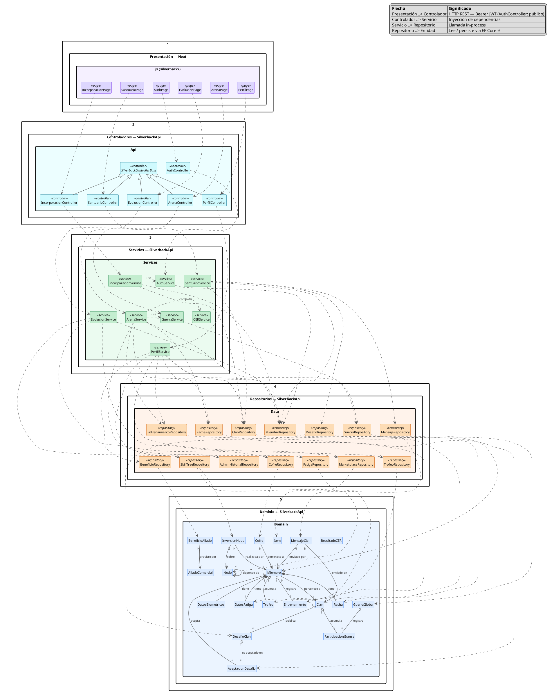

# 10.5.7 — Diagrama de Clases (vista general)

> **Actualizado 06/10:** arquitectura documentada en **5 capas** (se incorpora Controladores — `SilverbackApi.Api`). Las clases y atributos se alinean con el código: `DesafioClan` y `MensajeClan` (antes `Desafio`/`Mensaje`), `AuthService` y `GuerraService`. Detalle en `Modificacion-Carpeta.md`.

**Proyecto:** SILVERBACK  
**Tipo:** Diagrama de clases UML — Arquitectura en 5 capas  
**Descripción:** Vista general: todas las clases del sistema agrupadas por capa y sus dependencias. Los atributos y métodos se detallan en el diagrama de cada capa (10.5.7a a 10.5.7e). Métodos 100% derivados de los diagramas de secuencia.

| Capa | Proyecto | Detalle | Comunicación con la capa siguiente |
|---|---|---|---|
| 1. Presentación | `silverback/` (Next.js 16) | 10.5.7a — `clases-presentacion.md` | HTTP REST + JWT Bearer (cookie `sb_token`) |
| 2. Controladores | `SilverbackApi.Api` | 10.5.7e — `clases-controladores.md` | Inyección de dependencias |
| 3. Servicios | `SilverbackApi.Services` | 10.5.7d — `clases-servicios.md` | In-process |
| 4. Repositorios | `SilverbackApi.Data` (EF Core 9) | 10.5.7c — `clases-repositorios.md` | EF Core 9 → SQL Server |
| 5. Dominio | `SilverbackApi.Domain` | 10.5.7b — `clases-dominio.md` | — |

> **Render:** exportar en **SVG** (vectorial, sin límite de tamaño). En PNG, PlantUML recorta a 4096 px (`PLANTUML_LIMIT_SIZE`).

---

```plantuml
@startuml clases-general
skinparam classAttributeIconSize 0
skinparam packageStyle rectangle
skinparam defaultFontName Arial
skinparam defaultFontSize 11
skinparam nodesep 30
skinparam ranksep 70
hide empty members

skinparam class {
  BackgroundColor #FFFFFF
  FontColor #111111
  BorderColor<<page>> #7C3AED
  HeaderBackgroundColor<<page>> #DDD6FE
  BorderColor<<controller>> #0E7490
  HeaderBackgroundColor<<controller>> #CFFAFE
  BorderColor<<service>> #2E8B57
  HeaderBackgroundColor<<service>> #C3EDCF
  BorderColor<<repository>> #D4620A
  HeaderBackgroundColor<<repository>> #FDDCB5
  BorderColor #3B82F6
  HeaderBackgroundColor #DBEAFE
}
skinparam arrow {
  Color #555555
  FontColor #333333
  FontSize 10
}
skinparam package {
  BorderThickness 2
  FontStyle bold
  FontSize 12
}
hide members
hide circle

legend top right
  |= Flecha |= Significado |
  | Presentación ..> Controlador | HTTP REST — Bearer JWT (AuthController: público) |
  | Controlador ..> Servicio | Inyección de dependencias |
  | Servicio ..> Repositorio | Llamada in-process |
  | Repositorio ..> Entidad | Lee / persiste vía EF Core 9 |
endlegend

package "1. Presentación — Next.js (silverback/)" #F5F0FF {
  class AuthPage <<page>>
  class IncorporacionPage <<page>>
  class SantuarioPage <<page>>
  class ArenaPage <<page>>
  class EvolucionPage <<page>>
  class PerfilPage <<page>>
}

package "2. Controladores — SilverbackApi.Api" #ECFEFF {
  abstract class SilverbackControllerBase <<controller>>
  class AuthController <<controller>>
  class IncorporacionController <<controller>>
  class SantuarioController <<controller>>
  class ArenaController <<controller>>
  class EvolucionController <<controller>>
  class PerfilController <<controller>>

  SilverbackControllerBase <|-- IncorporacionController
  SilverbackControllerBase <|-- SantuarioController
  SilverbackControllerBase <|-- ArenaController
  SilverbackControllerBase <|-- EvolucionController
  SilverbackControllerBase <|-- PerfilController
}

package "3. Servicios — SilverbackApi.Services" #EBFBF0 {
  class AuthService <<service>>
  class IncorporacionService <<service>>
  class SantuarioService <<service>>
  class ArenaService <<service>>
  class CERService <<service>>
  class GuerraService <<service>>
  class EvolucionService <<service>>
  class PerfilService <<service>>

  ' Dos filas para que la capa no quede demasiado ancha
  AuthService -[hidden]d- CERService
  IncorporacionService -[hidden]d- GuerraService
  SantuarioService -[hidden]d- EvolucionService
  ArenaService -[hidden]d- PerfilService
}

package "4. Repositorios — SilverbackApi.Data" #FFF3EB {
  class MiembroRepository <<repository>>
  class ClanRepository <<repository>>
  class DesafioRepository <<repository>>
  class MensajeRepository <<repository>>
  class EntrenamientoRepository <<repository>>
  class GuerraRepository <<repository>>
  class RachaRepository <<repository>>
  class AdminHistorialRepository <<repository>>
  class SkillTreeRepository <<repository>>
  class CofreRepository <<repository>>
  class MarketplaceRepository <<repository>>
  class FatigaRepository <<repository>>
  class TrofeoRepository <<repository>>
  class BeneficioRepository <<repository>>

  ' Dos filas para que la capa no quede demasiado ancha
  MiembroRepository -[hidden]d- AdminHistorialRepository
  ClanRepository -[hidden]d- SkillTreeRepository
  DesafioRepository -[hidden]d- CofreRepository
  MensajeRepository -[hidden]d- MarketplaceRepository
  EntrenamientoRepository -[hidden]d- FatigaRepository
  GuerraRepository -[hidden]d- TrofeoRepository
  RachaRepository -[hidden]d- BeneficioRepository
}

package "5. Dominio — SilverbackApi.Domain" #EBF4FF {
  class Miembro
  class Clan
  class DatosBiometricos
  class Racha
  class DatosFatiga
  class Entrenamiento
  class ResultadoCER
  class GuerraGlobal
  class ParticipacionGuerra
  class DesafioClan
  class AceptacionDesafio
  class MensajeClan
  class Nodo
  class InversionNodo
  class Cofre
  class Item
  class Trofeo
  class BeneficioAliado
  class AliadoComercial
}

' 1 → 2
AuthPage ..> AuthController
IncorporacionPage ..> IncorporacionController
SantuarioPage ..> SantuarioController
ArenaPage ..> ArenaController
EvolucionPage ..> EvolucionController
PerfilPage ..> PerfilController

' 2 → 3
AuthController ..> AuthService
IncorporacionController ..> IncorporacionService
SantuarioController ..> SantuarioService
ArenaController ..> ArenaService
ArenaController ..> GuerraService
EvolucionController ..> EvolucionService
PerfilController ..> PerfilService

' 3 → 3
IncorporacionService .l.> AuthService : usa
ArenaService .r.> CERService : compone
ArenaService .r.> GuerraService : usa

' 3 → 4
AuthService ..> MiembroRepository
IncorporacionService ..> MiembroRepository
IncorporacionService ..> ClanRepository
SantuarioService ..> ClanRepository
SantuarioService ..> DesafioRepository
SantuarioService ..> MensajeRepository
SantuarioService ..> MiembroRepository
ArenaService ..> EntrenamientoRepository
ArenaService ..> GuerraRepository
ArenaService ..> RachaRepository
ArenaService ..> MiembroRepository
ArenaService ..> AdminHistorialRepository
GuerraService ..> GuerraRepository
EvolucionService ..> SkillTreeRepository
EvolucionService ..> CofreRepository
EvolucionService ..> MarketplaceRepository
EvolucionService ..> MiembroRepository
PerfilService ..> MiembroRepository
PerfilService ..> RachaRepository
PerfilService ..> FatigaRepository
PerfilService ..> TrofeoRepository
PerfilService ..> BeneficioRepository
PerfilService ..> EntrenamientoRepository
PerfilService ..> ClanRepository

' 4 → 5
MiembroRepository ..> Miembro
ClanRepository ..> Clan
DesafioRepository ..> DesafioClan
DesafioRepository ..> AceptacionDesafio
MensajeRepository ..> MensajeClan
EntrenamientoRepository ..> Entrenamiento
GuerraRepository ..> GuerraGlobal
RachaRepository ..> Racha
SkillTreeRepository ..> Nodo
SkillTreeRepository ..> InversionNodo
CofreRepository ..> Cofre
MarketplaceRepository ..> Item
FatigaRepository ..> DatosFatiga
TrofeoRepository ..> Trofeo
BeneficioRepository ..> BeneficioAliado

' 5 ↔ 5
Miembro "N" --> "1" Clan : pertenece a
Miembro "1" *-- "1" DatosBiometricos : tiene
Miembro "1" *-- "1" Racha : tiene
Miembro "1" *-- "1" DatosFatiga : tiene
Miembro "1" o-- "*" Trofeo : acumula
Miembro "1" o-- "*" Entrenamiento : registra
Clan "1" o-- "*" DesafioClan : publica
Clan "1" o-- "*" ParticipacionGuerra : acumula
GuerraGlobal "1" o-- "*" ParticipacionGuerra : registra
DesafioClan "1" o-- "*" AceptacionDesafio : es aceptado en
Miembro "1" o-- "*" AceptacionDesafio : acepta
MensajeClan "N" --> "1" Clan : enviado en
MensajeClan "N" --> "1" Miembro : enviado por
InversionNodo "N" --> "1" Miembro : realizada por
InversionNodo "N" --> "1" Nodo : sobre
Nodo "*" --> "*" Nodo : depende de
Cofre "N" --> "1" Miembro : pertenece a
BeneficioAliado "N" --> "1" AliadoComercial : provisto por
@enduml
```
