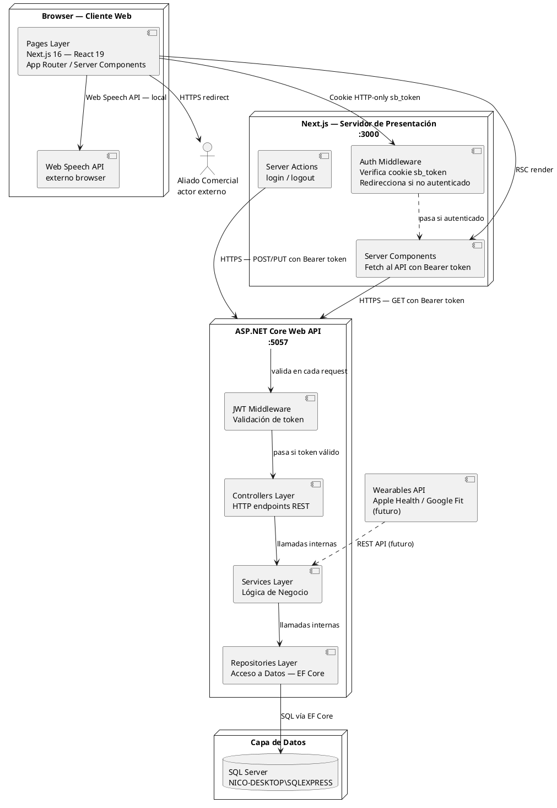

# 10.5.6 — Diagrama de Componentes

**Proyecto:** SILVERBACK  
**Tipo:** Diagrama de componentes UML  
**Descripción:** Vista de comunicación entre los componentes físicos del sistema. Las flechas muestran el protocolo de cada interacción.  
**Decisión de arquitectura:** Se adoptó separación de servidores — Next.js actúa como frontend puro (Capa de Presentación) y ASP.NET Core Web API encapsula la lógica de negocio y acceso a datos. Esto permite depuración independiente de cada capa, Swagger integrado en la API, y contratos HTTP explícitos como interfaz entre frontend y backend.

---

