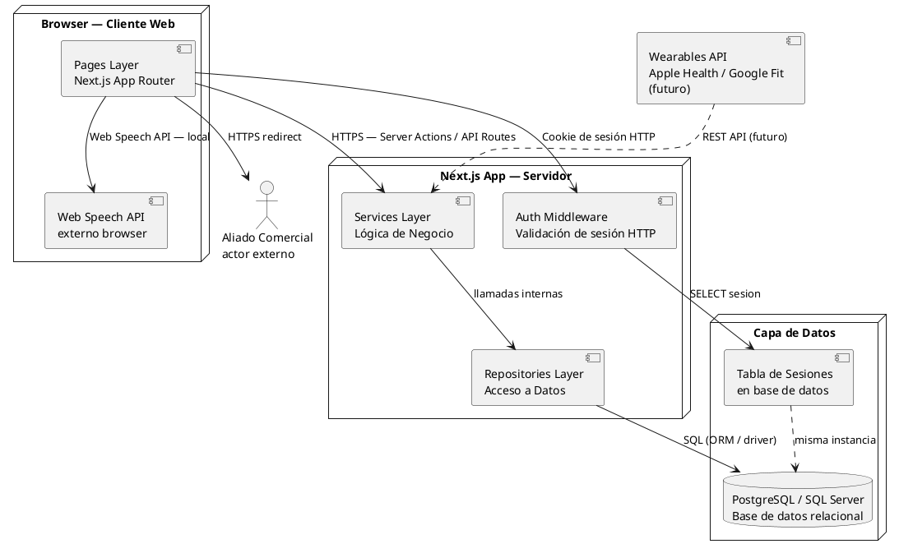

# 10.5.6 — Diagrama de Componentes

**Proyecto:** SILVERBACK  
**Tipo:** Diagrama de componentes UML  
**Descripción:** Vista de comunicación entre los componentes físicos del sistema. Las flechas muestran el protocolo de cada interacción.

---

