# 10.5.8 — Diagrama Entidad-Relación

**Proyecto:** SILVERBACK  
**Tipo:** Diagrama ER — Notación pata de gallo (Information Engineering)  
**Base de datos:** PostgreSQL / SQL Server  
**Descripción:** Modelo relacional completo. Cardinalidades en notación crow's foot.

---

```plantuml
@startuml er-silverback
hide circle
skinparam linetype ortho
skinparam entity {
  BackgroundColor #242424
  BorderColor #F97316
  FontColor #FFFFFF
  AttributeFontColor #CCCCCC
}
skinparam arrow {
  Color #F97316
}

' ════════════════════════════════════════
' FILA 1 — NÚCLEO
' ════════════════════════════════════════

entity CLAN {
  * id : UUID <<PK>>
  --
  * nombre : VARCHAR(100)
  * lider_clan_id : UUID <<FK>>
  * puntaje_cer : DECIMAL DEFAULT 0
  * cantidad_miembros : INTEGER DEFAULT 0
  * puntos_clan : INTEGER DEFAULT 0
}

entity MIEMBRO {
  * id : UUID <<PK>>
  --
  * nombre : VARCHAR(100)
  * email : VARCHAR(100)
  * arquetipo : ENUM(VOLUMEN,DEFINIDO,ATLETICO)
  * rol : ENUM(SILVERBACK,BETA,EXPLORADOR,RECLUTA)
  * rango : ENUM(BRONCE,PLATA,ORO,RANGO_S)
  * xp : INTEGER DEFAULT 0
  * coins : INTEGER DEFAULT 0
  clan_id : UUID <<FK>>
}

' ════════════════════════════════════════
' FILA 2 — PERFIL BIOMÉTRICO
' ════════════════════════════════════════

entity DATOS_BIOMETRICOS {
  * miembro_id : UUID <<PK,FK>>
  --
  * edad : INTEGER
  * peso_kg : DECIMAL
  * altura_cm : INTEGER
  * nivel_experiencia : ENUM
}

entity DATOS_FATIGA {
  * miembro_id : UUID <<PK,FK>>
  --
  * nivel_fatiga : ENUM(OPTIMA,MODERADA,ELEVADA,CRITICA)
  * fc_reposo : INTEGER
  * calidad_sueno : INTEGER
  * carga_semanal : DECIMAL DEFAULT 0
}

entity RACHA {
  * miembro_id : UUID <<PK,FK>>
  --
  * dias_consecutivos : INTEGER DEFAULT 0
  * estado : ENUM(ACTIVA,EN_RIESGO,ROTA)
  * ultimo_entrenamiento : TIMESTAMP
}

' ════════════════════════════════════════
' FILA 3 — ARENA
' ════════════════════════════════════════

entity ENTRENAMIENTO {
  * id : UUID <<PK>>
  --
  * miembro_id : UUID <<FK>>
  * ejercicio : VARCHAR(100)
  * peso_kg : DECIMAL
  * repeticiones : INTEGER
  * puntaje_cer : DECIMAL
  * fecha : TIMESTAMP DEFAULT NOW()
}

entity GUERRA_GLOBAL {
  * id : UUID <<PK>>
  --
  * semana : VARCHAR(20)
  * estado : ENUM(ACTIVA,FINALIZADA)
  * fecha_fin : TIMESTAMP
}

entity PARTICIPACION_GUERRA {
  * guerra_id : UUID <<PK,FK>>
  * clan_id : UUID <<PK,FK>>
  --
  * puntaje_cer : DECIMAL DEFAULT 0
}

' ════════════════════════════════════════
' FILA 4 — SANTUARIO
' ════════════════════════════════════════

entity DESAFIO {
  * id : UUID <<PK>>
  --
  * clan_id : UUID <<FK>>
  * nombre : VARCHAR(150)
  * tier : ENUM(BRONCE,PLATA,ORO)
  * estado : ENUM(PENDIENTE,ACTIVO,COMPLETADO,EXPIRADO)
  * xp_recompensa : INTEGER
  * fecha_expiracion : TIMESTAMP
}

entity ACEPTACION_DESAFIO {
  * id : UUID <<PK>>
  --
  * desafio_id : UUID <<FK>>
  * miembro_id : UUID <<FK>>
  * estado : ENUM(ACTIVO,COMPLETADO,EXPIRADO)
  * fecha_aceptacion : TIMESTAMP DEFAULT NOW()
}

entity MENSAJE {
  * id : UUID <<PK>>
  --
  * clan_id : UUID <<FK>>
  * miembro_id : UUID <<FK>>
  * contenido : TEXT
  * tipo : ENUM(TEXTO,SISTEMA,DESAFIO)
  * timestamp : TIMESTAMP DEFAULT NOW()
}

' ════════════════════════════════════════
' FILA 5 — EVOLUCIÓN: SKILL TREE + BÓVEDA
' ════════════════════════════════════════

entity NODO {
  * id : UUID <<PK>>
  --
  * nombre : VARCHAR(100)
  * costo_xp : INTEGER
  * estado : ENUM(BLOQUEADO,DISPONIBLE,DESBLOQUEADO)
}

entity INVERSION_NODO {
  * miembro_id : UUID <<PK,FK>>
  * nodo_id : UUID <<PK,FK>>
  --
  * fecha_inversion : TIMESTAMP DEFAULT NOW()
}

entity COFRE {
  * id : UUID <<PK>>
  --
  * miembro_id : UUID <<FK>>
  * rareza : ENUM(COMUN,RARO,EPICO,LEGENDARIO)
  * estado : ENUM(DISPONIBLE,RECLAMADO)
}

' ════════════════════════════════════════
' FILA 6 — EVOLUCIÓN: MARKETPLACE
' ════════════════════════════════════════

entity ITEM {
  * id : UUID <<PK>>
  --
  * nombre : VARCHAR(100)
  * categoria : ENUM(SKIN,HABITAT,ACCESORIO,AURA)
  * precio : INTEGER
  * rareza : ENUM(COMUN,RARO,EPICO,LEGENDARIO)
}

entity INVENTARIO_ITEMS {
  * miembro_id : UUID <<PK,FK>>
  * item_id : UUID <<PK,FK>>
  --
  * fecha_obtencion : TIMESTAMP DEFAULT NOW()
}

entity TRANSACCION_MARKETPLACE {
  * id : UUID <<PK>>
  --
  * miembro_id : UUID <<FK>>
  * item_id : UUID <<FK>>
  * fecha : TIMESTAMP DEFAULT NOW()
}

' ════════════════════════════════════════
' FILA 7 — PERFIL: TROFEOS + BENEFICIOS
' ════════════════════════════════════════

entity TROFEO {
  * id : UUID <<PK>>
  --
  * miembro_id : UUID <<FK>>
  * nombre : VARCHAR(100)
  * tipo : ENUM(RACHA,CER,CLAN,EVENTO)
  * fecha_obtencion : TIMESTAMP DEFAULT NOW()
}

entity ALIADO_COMERCIAL {
  * id : UUID <<PK>>
  --
  * nombre : VARCHAR(100)
  * url_base : VARCHAR(255)
  * logo_url : VARCHAR(255)
}

entity BENEFICIO_ALIADO {
  * id : UUID <<PK>>
  --
  * aliado_id : UUID <<FK>>
  * nombre : VARCHAR(150)
  * tipo : ENUM(CODIGO,REDIRECCION,CUPON,SUSCRIPCION)
  * rango_minimo : ENUM(BRONCE,PLATA,ORO,RANGO_S)
  * estado : ENUM(DISPONIBLE,RECLAMADO,EXPIRADO)
  fecha_reclamo : TIMESTAMP
  miembro_id : UUID <<FK>>
}

entity SUSCRIPCION_ACTIVA {
  * id : UUID <<PK>>
  --
  * miembro_id : UUID <<FK>>
  * aliado_id : UUID <<FK>>
  * fecha_inicio : TIMESTAMP DEFAULT NOW()
  * fecha_fin : TIMESTAMP
}

entity ADMIN_HISTORIAL {
  * id : UUID <<PK>>
  --
  * miembro_id : UUID <<FK>>
  * tipo : VARCHAR(50)
  * descripcion : TEXT
  * timestamp : TIMESTAMP DEFAULT NOW()
}

' ════════════════════════════════════════
' HIDDEN LINKS — FORZAR APILAMIENTO VERTICAL
' ════════════════════════════════════════

CLAN -[hidden]d- DATOS_BIOMETRICOS
MIEMBRO -[hidden]d- RACHA
DATOS_BIOMETRICOS -[hidden]d- ENTRENAMIENTO
RACHA -[hidden]d- GUERRA_GLOBAL
ENTRENAMIENTO -[hidden]d- DESAFIO
GUERRA_GLOBAL -[hidden]d- ACEPTACION_DESAFIO
DESAFIO -[hidden]d- NODO
ACEPTACION_DESAFIO -[hidden]d- COFRE
NODO -[hidden]d- ITEM
COFRE -[hidden]d- INVENTARIO_ITEMS
ITEM -[hidden]d- TROFEO
INVENTARIO_ITEMS -[hidden]d- ALIADO_COMERCIAL
TROFEO -[hidden]d- BENEFICIO_ALIADO
ALIADO_COMERCIAL -[hidden]d- ADMIN_HISTORIAL

' ════════════════════════════════════════
' RELACIONES
' ════════════════════════════════════════

MIEMBRO }o--|| CLAN : "pertenece a"
CLAN ||--|| MIEMBRO : "liderado por"

DATOS_BIOMETRICOS ||-|| MIEMBRO : "corresponde a"
DATOS_FATIGA ||-|| MIEMBRO : "corresponde a"
RACHA ||-|| MIEMBRO : "corresponde a"

ENTRENAMIENTO }|--|| MIEMBRO : "registrado por"
PARTICIPACION_GUERRA }|--|| GUERRA_GLOBAL : "de"
PARTICIPACION_GUERRA }|--|| CLAN : "de"

DESAFIO }o--|| CLAN : "propuesto por"
ACEPTACION_DESAFIO }|--|| DESAFIO : "sobre"
ACEPTACION_DESAFIO }|--|| MIEMBRO : "aceptado por"
MENSAJE }|--|| CLAN : "en"
MENSAJE }|--|| MIEMBRO : "enviado por"

INVERSION_NODO }|--|| MIEMBRO : "realizada por"
INVERSION_NODO }|--|| NODO : "sobre"
NODO }o--o{ NODO : "depende de"
COFRE }o--|| MIEMBRO : "pertenece a"

INVENTARIO_ITEMS }|--|| MIEMBRO : "de"
INVENTARIO_ITEMS }|--|| ITEM : "contiene"
TRANSACCION_MARKETPLACE }|--|| MIEMBRO : "realizada por"
TRANSACCION_MARKETPLACE }|--|| ITEM : "sobre"

TROFEO }o--|| MIEMBRO : "obtenido por"
BENEFICIO_ALIADO }|--|| ALIADO_COMERCIAL : "provisto por"
BENEFICIO_ALIADO }o--o| MIEMBRO : "reclamado por"
SUSCRIPCION_ACTIVA }|--|| MIEMBRO : "de"
SUSCRIPCION_ACTIVA }|--|| ALIADO_COMERCIAL : "con"
ADMIN_HISTORIAL }|--|| MIEMBRO : "registra acciones de"

@enduml
```

