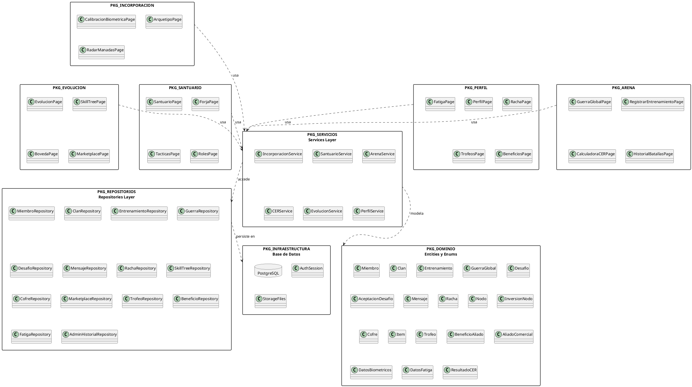

# 10.5.5 — Diagrama de Paquetes

**Proyecto:** SILVERBACK  
**Tipo:** Diagrama de paquetes UML  
**Descripción:** Organización en paquetes funcionales. Las dependencias fluyen hacia abajo: Pages → Services → Repositories → Infraestructura.

---

