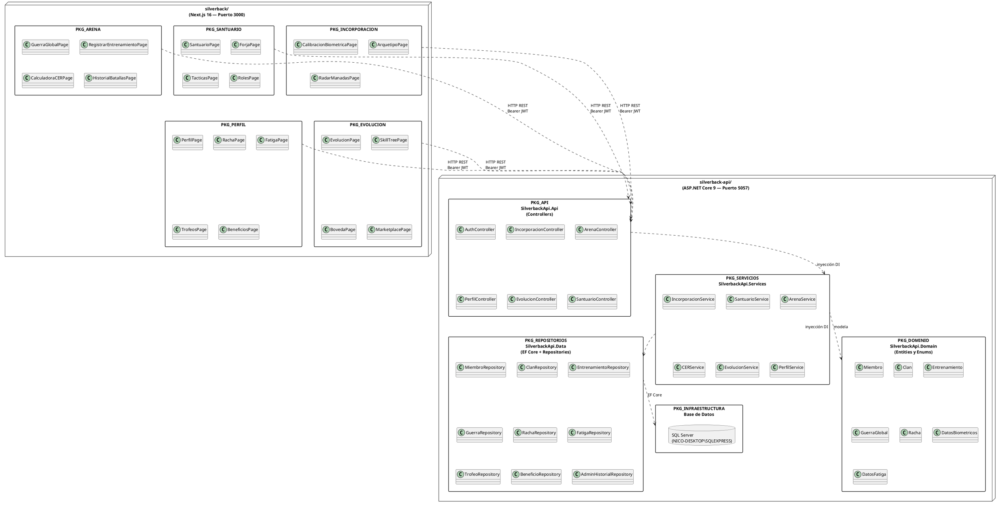

# 10.5.5 — Diagrama de Paquetes

**Proyecto:** SILVERBACK  
**Tipo:** Diagrama de paquetes UML  
**Descripción:** Organización en paquetes funcionales distribuidos en dos servidores. El frontend (Next.js) se comunica con el backend (ASP.NET Core) vía HTTP REST con JWT. Las dependencias fluyen hacia abajo dentro de cada servidor.

> **Cambio arquitectónico (S1):** Se migró de Next.js full-stack a Clean Architecture con dos proyectos separados. Los paquetes de presentación viven en `silverback/` (Next.js 16); los paquetes de servicios, repositorios y dominio viven en `silverback-api/` (ASP.NET Core 9 — 4 proyectos: Domain, Data, Services, Api).

---

