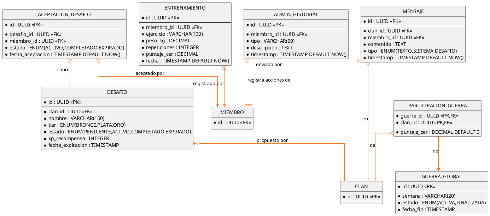

# 10.5.8b — DER: Arena y Santuario

**Área:** Mecánicas de gameplay — Entrenamientos, guerra global, desafíos y mensajes.  
**Nota:** MIEMBRO y CLAN aparecen simplificados como referencia cruzada.

---

