# 10.5.8c — DER: Evolución y Perfil

**Área:** Progresión del miembro — Árbol de habilidades, bóveda, marketplace, trofeos y beneficios.  
**Nota:** MIEMBRO aparece simplificado como referencia cruzada.

---

```plantuml
@startuml er-evolucion-perfil
hide circle
skinparam linetype ortho
skinparam entity {
  BackgroundColor #242424
  BorderColor #F97316
  FontColor #FFFFFF
  AttributeFontColor #CCCCCC
}
skinparam arrow {
  Color #F97316
}

' ─── Referencia cruzada (simplificada) ────────────────────

entity MIEMBRO {
  * id : UUID <<PK>>
}

' ─── EVOLUCIÓN: SKILL TREE ────────────────────────────────

entity NODO {
  * id : UUID <<PK>>
  --
  * nombre : VARCHAR(100)
  * costo_xp : INTEGER
  * estado : ENUM(BLOQUEADO,DISPONIBLE,DESBLOQUEADO)
}

entity INVERSION_NODO {
  * miembro_id : UUID <<PK,FK>>
  * nodo_id : UUID <<PK,FK>>
  --
  * fecha_inversion : TIMESTAMP DEFAULT NOW()
}

' ─── EVOLUCIÓN: BÓVEDA ────────────────────────────────────

entity COFRE {
  * id : UUID <<PK>>
  --
  * miembro_id : UUID <<FK>>
  * rareza : ENUM(COMUN,RARO,EPICO,LEGENDARIO)
  * estado : ENUM(DISPONIBLE,RECLAMADO)
}

' ─── EVOLUCIÓN: MARKETPLACE ───────────────────────────────

entity ITEM {
  * id : UUID <<PK>>
  --
  * nombre : VARCHAR(100)
  * categoria : ENUM(SKIN,HABITAT,ACCESORIO,AURA)
  * precio : INTEGER
  * rareza : ENUM(COMUN,RARO,EPICO,LEGENDARIO)
}

entity INVENTARIO_ITEMS {
  * miembro_id : UUID <<PK,FK>>
  * item_id : UUID <<PK,FK>>
  --
  * fecha_obtencion : TIMESTAMP DEFAULT NOW()
}

entity TRANSACCION_MARKETPLACE {
  * id : UUID <<PK>>
  --
  * miembro_id : UUID <<FK>>
  * item_id : UUID <<FK>>
  * fecha : TIMESTAMP DEFAULT NOW()
}

' ─── PERFIL: TROFEOS ──────────────────────────────────────

entity TROFEO {
  * id : UUID <<PK>>
  --
  * miembro_id : UUID <<FK>>
  * nombre : VARCHAR(100)
  * tipo : ENUM(RACHA,CER,CLAN,EVENTO)
  * fecha_obtencion : TIMESTAMP DEFAULT NOW()
}

' ─── PERFIL: BENEFICIOS ───────────────────────────────────

entity ALIADO_COMERCIAL {
  * id : UUID <<PK>>
  --
  * nombre : VARCHAR(100)
  * url_base : VARCHAR(255)
  * logo_url : VARCHAR(255)
}

entity BENEFICIO_ALIADO {
  * id : UUID <<PK>>
  --
  * aliado_id : UUID <<FK>>
  * nombre : VARCHAR(150)
  * tipo : ENUM(CODIGO,REDIRECCION,CUPON,SUSCRIPCION)
  * rango_minimo : ENUM(BRONCE,PLATA,ORO,RANGO_S)
  * estado : ENUM(DISPONIBLE,RECLAMADO,EXPIRADO)
  fecha_reclamo : TIMESTAMP
  miembro_id : UUID <<FK>>
}

entity SUSCRIPCION_ACTIVA {
  * id : UUID <<PK>>
  --
  * miembro_id : UUID <<FK>>
  * aliado_id : UUID <<FK>>
  * fecha_inicio : TIMESTAMP DEFAULT NOW()
  * fecha_fin : TIMESTAMP
}

' ─── Relaciones ───────────────────────────────────────────

INVERSION_NODO }|--|| MIEMBRO : "realizada por"
INVERSION_NODO }|--|| NODO : "sobre"
NODO }o--o{ NODO : "depende de"

COFRE }o--|| MIEMBRO : "pertenece a"

INVENTARIO_ITEMS }|--|| MIEMBRO : "de"
INVENTARIO_ITEMS }|--|| ITEM : "contiene"
TRANSACCION_MARKETPLACE }|--|| MIEMBRO : "realizada por"
TRANSACCION_MARKETPLACE }|--|| ITEM : "sobre"

TROFEO }o--|| MIEMBRO : "obtenido por"

BENEFICIO_ALIADO }|--|| ALIADO_COMERCIAL : "provisto por"
BENEFICIO_ALIADO }o--o| MIEMBRO : "reclamado por"
SUSCRIPCION_ACTIVA }|--|| MIEMBRO : "de"
SUSCRIPCION_ACTIVA }|--|| ALIADO_COMERCIAL : "con"

@enduml
```

