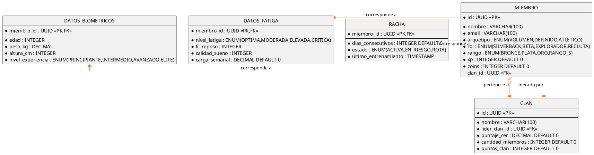

# 10.5.8a — DER: Núcleo — Miembro y Perfil

**Área:** Núcleo del sistema — Identidad, biometría y estado del miembro.

---

```plantuml
@startuml er-nucleo
hide circle
skinparam linetype ortho
skinparam entity {
  BackgroundColor #242424
  BorderColor #F97316
  FontColor #FFFFFF
  AttributeFontColor #CCCCCC
}
skinparam arrow {
  Color #F97316
}

entity CLAN {
  * id : UUID <<PK>>
  --
  * nombre : VARCHAR(100)
  * lider_clan_id : UUID <<FK>>
  * puntaje_cer : DECIMAL DEFAULT 0
  * cantidad_miembros : INTEGER DEFAULT 0
  * puntos_clan : INTEGER DEFAULT 0
}

entity MIEMBRO {
  * id : UUID <<PK>>
  --
  * nombre : VARCHAR(100)
  * email : VARCHAR(100)
  * arquetipo : ENUM(VOLUMEN,DEFINIDO,ATLETICO)
  * rol : ENUM(SILVERBACK,BETA,EXPLORADOR,RECLUTA)
  * rango : ENUM(BRONCE,PLATA,ORO,RANGO_S)
  * xp : INTEGER DEFAULT 0
  * coins : INTEGER DEFAULT 0
  clan_id : UUID <<FK>>
}

entity DATOS_BIOMETRICOS {
  * miembro_id : UUID <<PK,FK>>
  --
  * edad : INTEGER
  * peso_kg : DECIMAL
  * altura_cm : INTEGER
  * nivel_experiencia : ENUM(PRINCIPIANTE,INTERMEDIO,AVANZADO,ELITE)
}

entity DATOS_FATIGA {
  * miembro_id : UUID <<PK,FK>>
  --
  * nivel_fatiga : ENUM(OPTIMA,MODERADA,ELEVADA,CRITICA)
  * fc_reposo : INTEGER
  * calidad_sueno : INTEGER
  * carga_semanal : DECIMAL DEFAULT 0
}

entity RACHA {
  * miembro_id : UUID <<PK,FK>>
  --
  * dias_consecutivos : INTEGER DEFAULT 0
  * estado : ENUM(ACTIVA,EN_RIESGO,ROTA)
  * ultimo_entrenamiento : TIMESTAMP
}

' ─── Relaciones ───────────────────────────────────────────

MIEMBRO }o--|| CLAN : "pertenece a"
CLAN ||--|| MIEMBRO : "liderado por"
DATOS_BIOMETRICOS ||-|| MIEMBRO : "corresponde a"
DATOS_FATIGA ||-|| MIEMBRO : "corresponde a"
RACHA ||-|| MIEMBRO : "corresponde a"

@enduml
```
