# 10.5.1.1 Mapa de Navegación — SILVERBACK

**Descripción:** Diagrama que representa la navegabilidad de la plataforma SilverBack, las pantallas que componen la solución y su relación jerárquica. La aplicación está compuesta por dos zonas diferenciadas: el flujo de **Incorporación (Onboarding)**, que opera sin barra de navegación y conduce al usuario en tres pasos lineales hasta unirse a un clan; y la **Aplicación Principal**, que presenta un layout fijo con Topbar y Sidebar desde el cual el usuario accede a todas las secciones del sistema.

---

## Diagrama

```mermaid
flowchart TB
    ROOT(["● Raíz\n/"])

    subgraph OB["INCORPORACIÓN  ·  layout centrado, sin nav"]
        direction TB
        P1["**P1** · Calibración Biométrica\n/onboarding/biometrics"]
        P2["**P2** · Selector de Arquetipo\n/onboarding/archetype"]
        P3["**P3** · Radar de Manadas\n/onboarding/matchmaking"]
    end

    subgraph APP["APLICACIÓN PRINCIPAL  ·  Topbar + Sidebar fijos"]
        direction TB

        subgraph SAN["SANTUARIO"]
            P4["**P4** · El Santuario\n/santuario"]
            P5["**P5** · La Forja\n/santuario/forja"]
            P6["**P6** · Sala de Tácticas\n/santuario/tacticas"]
            P7["**P7** · Gestión de Roles\n/santuario/roles"]
        end

        subgraph ARE["ARENA"]
            P8["**P8** · Guerra Global\n/arena"]
            P9["**P9** · Registrar Esfuerzo\n/arena/registrar"]
            P10["**P10** · Algoritmo CER\n/arena/calculadora"]
            P11["**P11** · Historial de Batalla\n/arena/historial"]
        end

        subgraph EVO["EVOLUCIÓN / BÓVEDA"]
            P12["**P12** · Cámara de Evolución\n/evolucion"]
            P13["**P13** · Árbol de Habilidades\n/evolucion/habilidades"]
            P14["**P14** · Bóveda de Botines\n/evolucion/botin"]
            P15["**P15** · Marketplace\n/evolucion/tienda"]
        end

        subgraph PER["PERFIL"]
            P16["**P16** · Dashboard de Rendimiento\n/perfil"]
            P17["**P17** · Racha de Entrenamiento\n/perfil/racha"]
            P18["**P18** · Monitor de Fatiga\n/perfil/fatiga"]
            P19["**P19** · Vitrina de Trofeos\n/perfil/trofeos"]
            P20["**P20** · Beneficios Aliados\n/perfil/beneficios"]
        end
    end

    %% Flujo de incorporación (lineal)
    ROOT -->|redirect| P1
    P1 -->|CONTINUAR| P2
    P2 -->|CONFIRMAR ARQUETIPO| P3
    P3 -->|UNIRSE / INICIAR VIAJE| P4

    %% Santuario → sub-páginas
    P4 -->|RANGO DE 7 DÍAS| P17
    P4 -->|IR A LA ARENA| P8
    P4 -->|CHAT| P6
    P4 --- P5
    P4 --- P7

    %% Arena → sub-páginas
    P8 -->|REGISTRAR ENTRENAMIENTO| P9
    P9 -->|CALCULAR CER| P10
    P10 -->|CONFIRMAR| P8
    P8 --- P11

    %% Evolución → sub-páginas
    P12 --- P13
    P12 --- P14
    P12 --- P15
    P12 -->|RENDIMIENTO| P16

    %% Perfil → sub-páginas
    P16 --- P17
    P16 --- P18
    P16 --- P19
    P16 --- P20

    %% Estilos
    style ROOT fill:#F97316,color:#fff,stroke:#EA6800
    style OB  fill:#1a1a1a,stroke:#F97316,color:#fff
    style APP fill:#181818,stroke:#333,color:#fff
    style SAN fill:#242424,stroke:#F97316,color:#fff
    style ARE fill:#242424,stroke:#F97316,color:#fff
    style EVO fill:#242424,stroke:#F97316,color:#fff
    style PER fill:#242424,stroke:#F97316,color:#fff

    style P1  fill:#2e2e2e,stroke:#555,color:#fff
    style P2  fill:#2e2e2e,stroke:#555,color:#fff
    style P3  fill:#2e2e2e,stroke:#555,color:#fff
    style P4  fill:#F97316,stroke:#EA6800,color:#fff
    style P5  fill:#2e2e2e,stroke:#555,color:#fff
    style P6  fill:#2e2e2e,stroke:#555,color:#fff
    style P7  fill:#2e2e2e,stroke:#555,color:#fff
    style P8  fill:#F97316,stroke:#EA6800,color:#fff
    style P9  fill:#2e2e2e,stroke:#555,color:#fff
    style P10 fill:#2e2e2e,stroke:#555,color:#fff
    style P11 fill:#2e2e2e,stroke:#555,color:#fff
    style P12 fill:#F97316,stroke:#EA6800,color:#fff
    style P13 fill:#2e2e2e,stroke:#555,color:#fff
    style P14 fill:#2e2e2e,stroke:#555,color:#fff
    style P15 fill:#2e2e2e,stroke:#555,color:#fff
    style P16 fill:#F97316,stroke:#EA6800,color:#fff
    style P17 fill:#2e2e2e,stroke:#555,color:#fff
    style P18 fill:#2e2e2e,stroke:#555,color:#fff
    style P19 fill:#2e2e2e,stroke:#555,color:#fff
    style P20 fill:#2e2e2e,stroke:#555,color:#fff
```

---

## Descripción de la estructura de navegación

### Zona 1 — Incorporación (Onboarding)

Flujo **lineal de 3 pasos** sin barra de navegación. El usuario no puede saltar pasos ni acceder a la aplicación principal hasta completarlo.

| Paso | Pantalla | Ruta | Acción de avance |
|------|----------|------|-----------------|
| 1/3 | Calibración Biométrica | `/onboarding/biometrics` | Botón **CONTINUAR →** |
| 2/3 | Selector de Arquetipo | `/onboarding/archetype` | Botón **CONFIRMAR ARQUETIPO →** |
| 3/3 | Radar de Manadas | `/onboarding/matchmaking` | Botón **UNIRSE** + **INICIAR VIAJE →** |

### Zona 2 — Aplicación Principal

Layout persistente con **Topbar** (navegación entre secciones) y **Sidebar** (acceso rápido a sub-páginas específicas). Ambas barras permanecen visibles en todo momento dentro de la aplicación.

#### Acceso vía Topbar

| Tab del Topbar | Sección | Pantalla de entrada |
|---------------|---------|-------------------|
| Santuario | SANTUARIO | P4 · `/santuario` |
| Arena | ARENA | P8 · `/arena` |
| Desafíos | SANTUARIO | P5 · `/santuario/forja` |
| Bóveda | EVOLUCIÓN | P12 · `/evolucion` |
| Perfil | PERFIL | P16 · `/perfil` |

#### Acceso vía Sidebar

| Ítem del Sidebar | Pantalla destino |
|----------------|----------------|
| Sala de Tácticas | P6 · `/santuario/tacticas` |
| Árbol de Habilidades | P13 · `/evolucion/habilidades` |
| Historial | P11 · `/arena/historial` |
| Mercado | P15 · `/evolucion/tienda` |
| Radar | P3 · `/onboarding/matchmaking` |
| Beneficios | P20 · `/perfil/beneficios` |
| Trofeos | P19 · `/perfil/trofeos` |

---

## Referencia de pantallas

| Código | Nombre | Ruta | Zona |
|--------|--------|------|------|
| P1 | Calibración Biométrica | `/onboarding/biometrics` | Onboarding |
| P2 | Selector de Arquetipo | `/onboarding/archetype` | Onboarding |
| P3 | Radar de Manadas | `/onboarding/matchmaking` | Onboarding |
| P4 | El Santuario | `/santuario` | App — Santuario |
| P5 | La Forja (Desafíos) | `/santuario/forja` | App — Santuario |
| P6 | Sala de Tácticas | `/santuario/tacticas` | App — Santuario |
| P7 | Gestión de Roles | `/santuario/roles` | App — Santuario |
| P8 | Guerra Global | `/arena` | App — Arena |
| P9 | Registrar Esfuerzo | `/arena/registrar` | App — Arena |
| P10 | Algoritmo CER | `/arena/calculadora` | App — Arena |
| P11 | Historial de Batalla | `/arena/historial` | App — Arena |
| P12 | Cámara de Evolución | `/evolucion` | App — Evolución |
| P13 | Árbol de Habilidades | `/evolucion/habilidades` | App — Evolución |
| P14 | Bóveda de Botines | `/evolucion/botin` | App — Evolución |
| P15 | Marketplace | `/evolucion/tienda` | App — Evolución |
| P16 | Dashboard de Rendimiento | `/perfil` | App — Perfil |
| P17 | Racha de Entrenamiento | `/perfil/racha` | App — Perfil |
| P18 | Monitor de Fatiga | `/perfil/fatiga` | App — Perfil |
| P19 | Vitrina de Trofeos | `/perfil/trofeos` | App — Perfil |
| P20 | Beneficios Aliados | `/perfil/beneficios` | App — Perfil |

---

*Generado a partir del código fuente en `silverback/src/app/` — versión 1.0, mayo 2026.*
