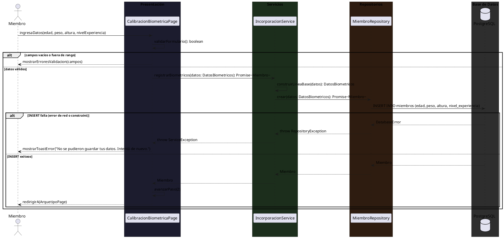
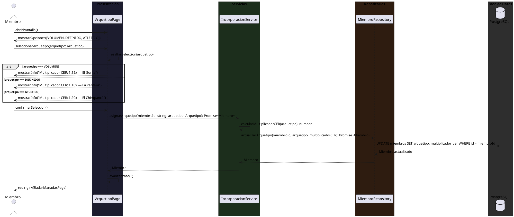
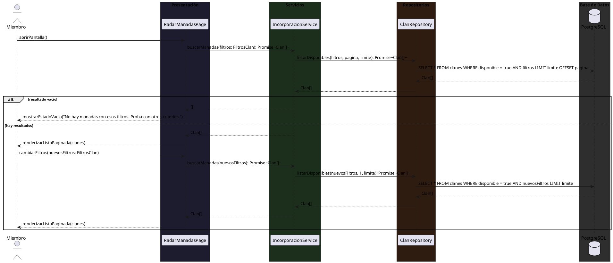
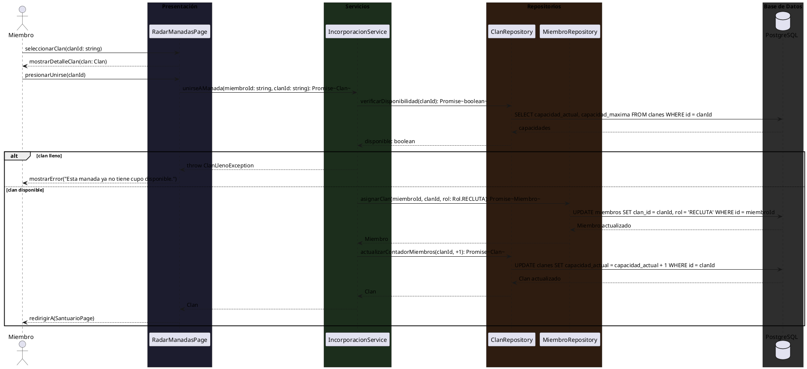
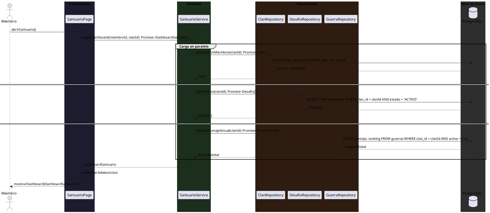
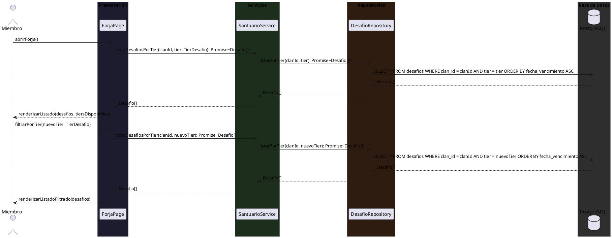
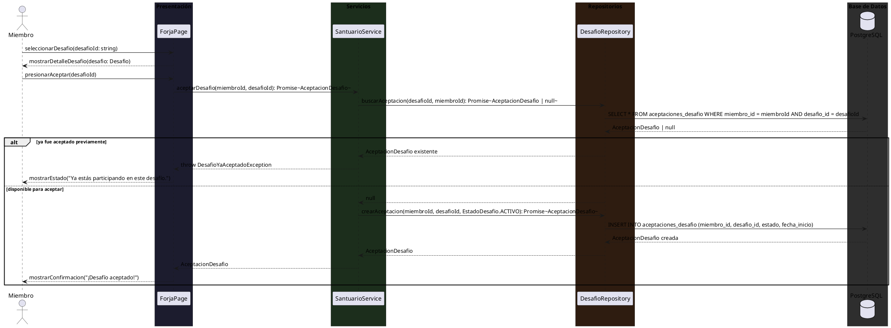
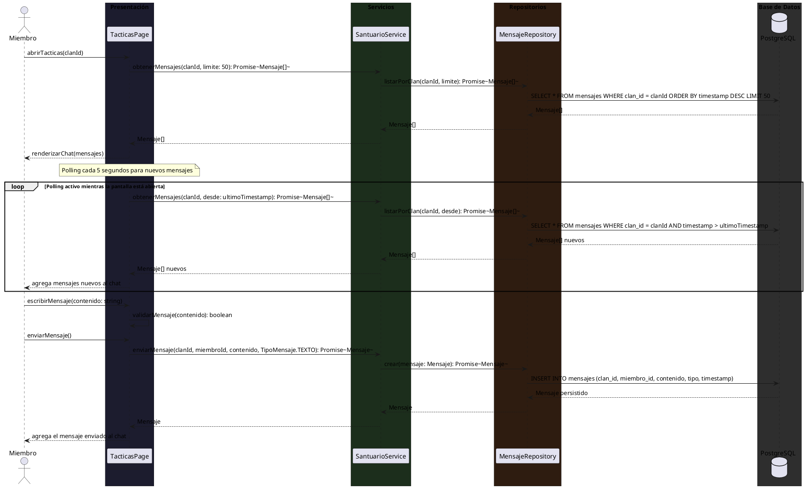
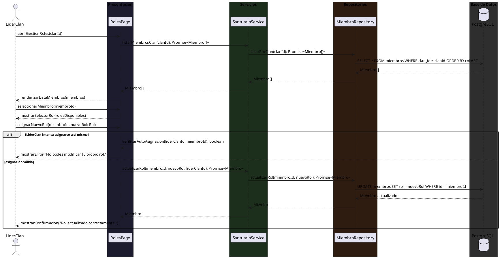
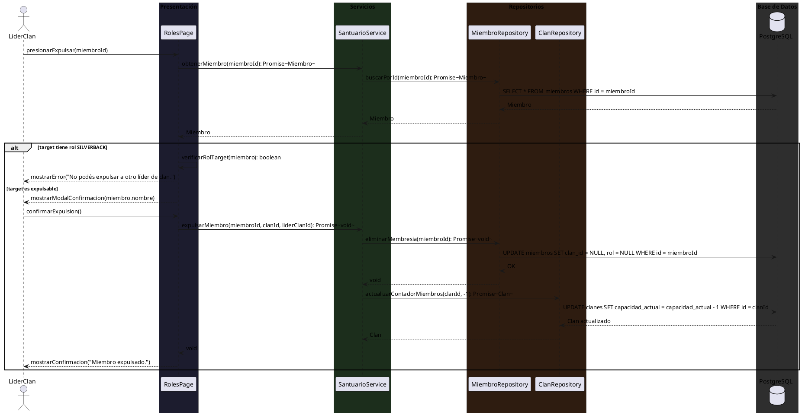

# 10.5.4 — Diagramas de Secuencia: CU-001 INCORPORACIÓN + CU-002 SANTUARIO

**Tipo:** Diagramas de secuencia de diseño (no de sistema)
**Convención:** Page → Service → Repository → PostgreSQL (DB)
**Actores:** Miembro, LiderClan

---

## CU-001 — INCORPORACIÓN

*Flujo lineal de onboarding. El Miembro completa los 4 CUs en secuencia antes de acceder a la app principal. Layout centrado, sin Topbar ni Sidebar.*

---

### CU-001-001 — Registrar Datos Biométricos Iniciales

---

### CU-001-002 — Seleccionar Arquetipo de Entrenamiento

---

### CU-001-003 — Buscar Manadas Disponibles

---

### CU-001-004 — Unirse a una Manada

---

## CU-002 — SANTUARIO

*Panel principal del clan. Accesible desde el Topbar. Layout completo con Sidebar.*

---

### CU-002-001 — Visualizar el Panel del Santuario

---

### CU-002-002 — Consultar Desafíos en La Forja

---

### CU-002-003 — Aceptar un Desafío Semanal

---

### CU-002-004 — Comunicarse en la Sala de Tácticas

---

### CU-002-005 — Asignar Rol a un Miembro del Clan

---

### CU-002-006 — Expulsar a un Miembro del Clan

