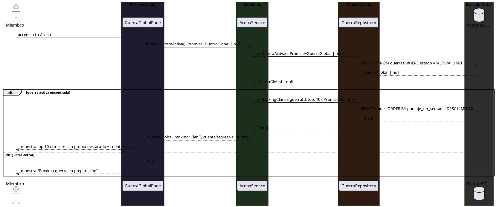
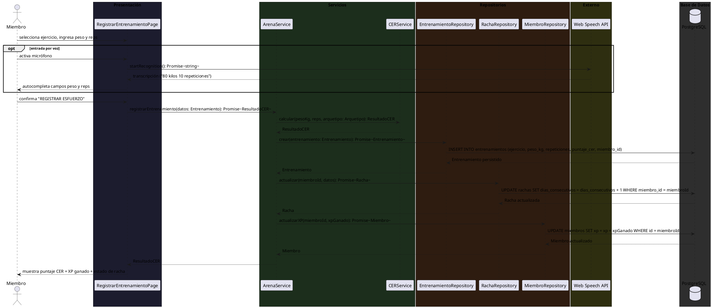
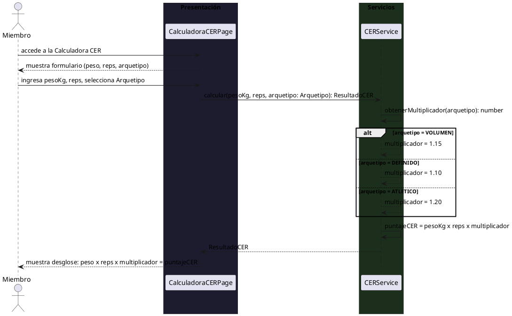
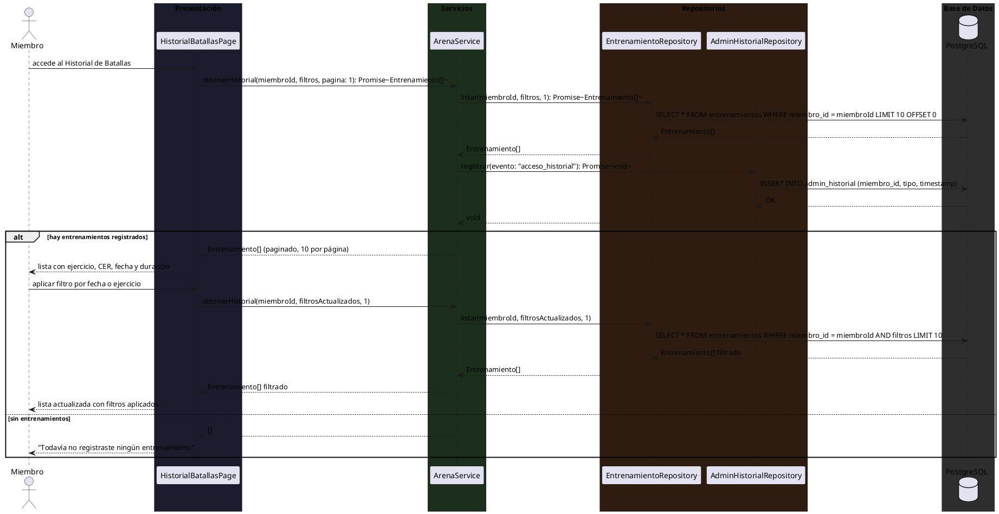
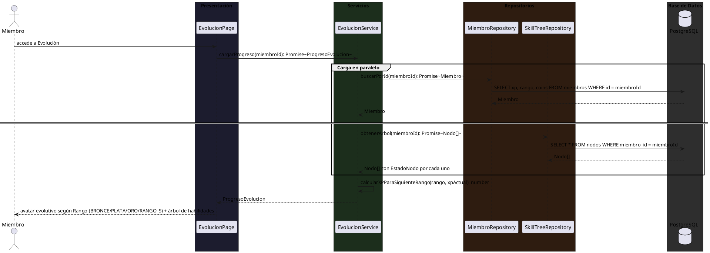
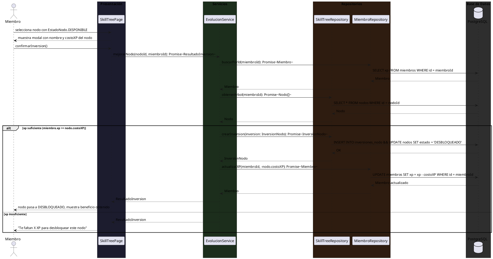
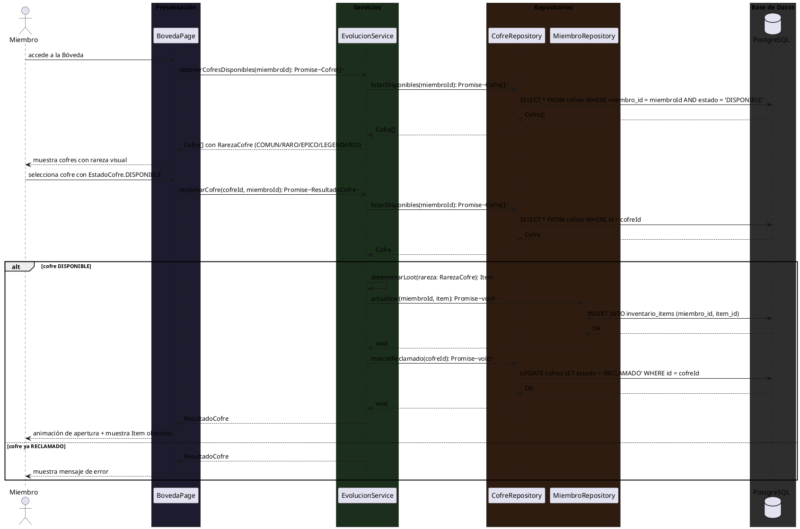
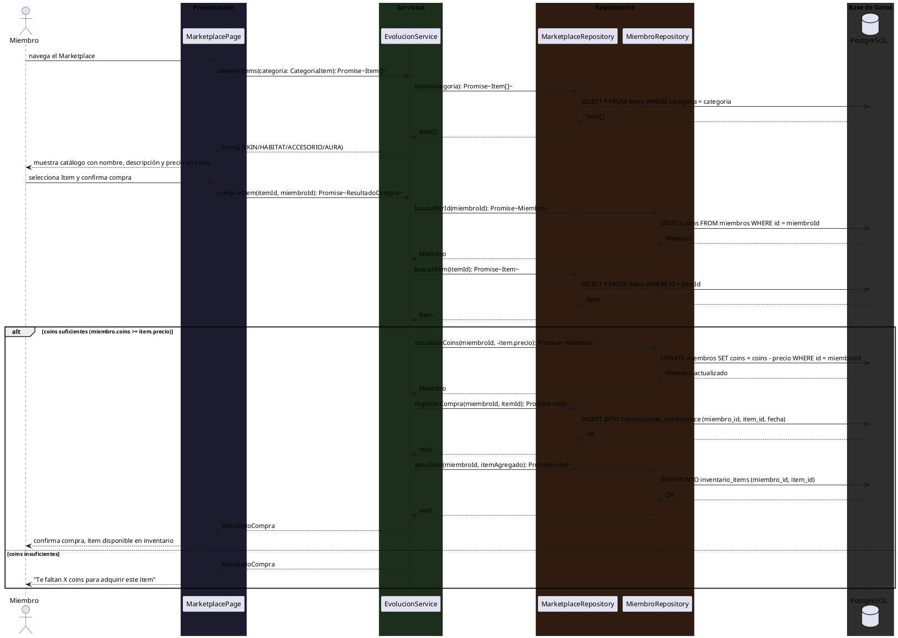

# 10.5.4 — Diagramas de Secuencia: CU-003 ARENA + CU-004 EVOLUCIÓN/BÓVEDA

**Tipo:** Diagramas de secuencia de diseño (no de sistema)
**Convención:** Page → Service → Repository → PostgreSQL (DB)
**Nota CER:** `puntajeCER = pesoKg × repeticiones × multiplicadorArquetipo`

---

## CU-003 — ARENA

---

### CU-003-001 — Consultar el Estado de la Guerra Global

---

### CU-003-002 — Registrar un Entrenamiento

---

### CU-003-003 — Calcular el Puntaje CER

---

### CU-003-004 — Consultar el Historial de Batallas

---

## CU-004 — EVOLUCIÓN / BÓVEDA

---

### CU-004-001 — Visualizar Progreso de Evolución

---

### CU-004-002 — Mejorar Nodo del Árbol de Habilidades

---

### CU-004-003 — Reclamar Recompensa de la Bóveda

---

### CU-004-004 — Adquirir Ítem en el Marketplace

