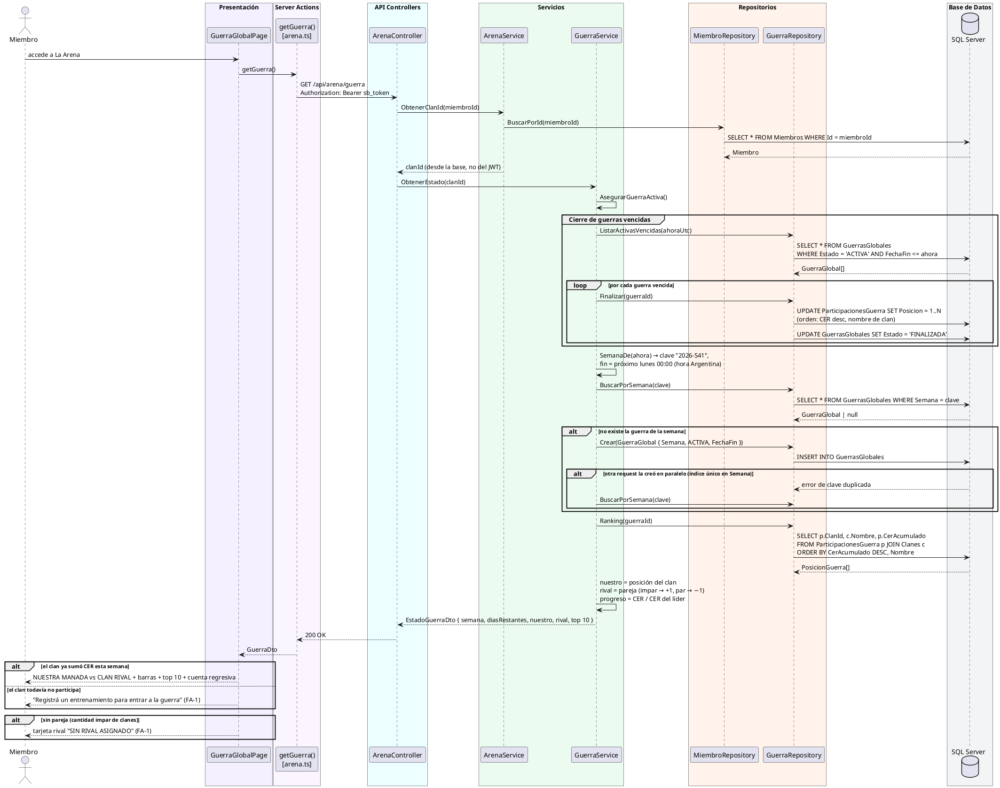
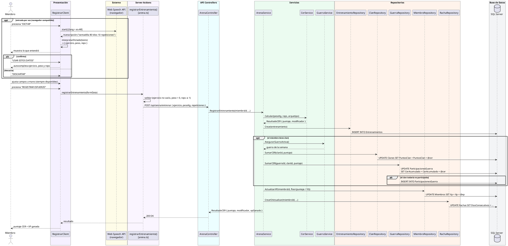
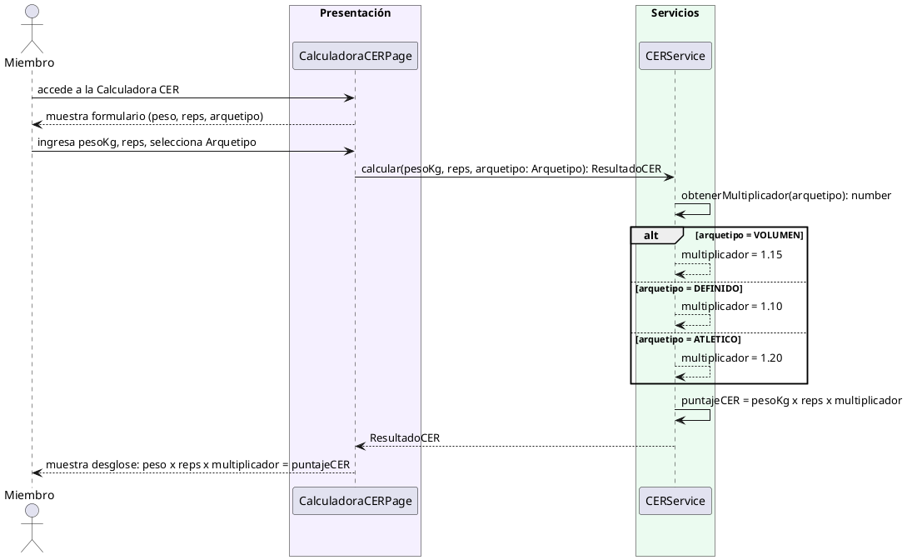
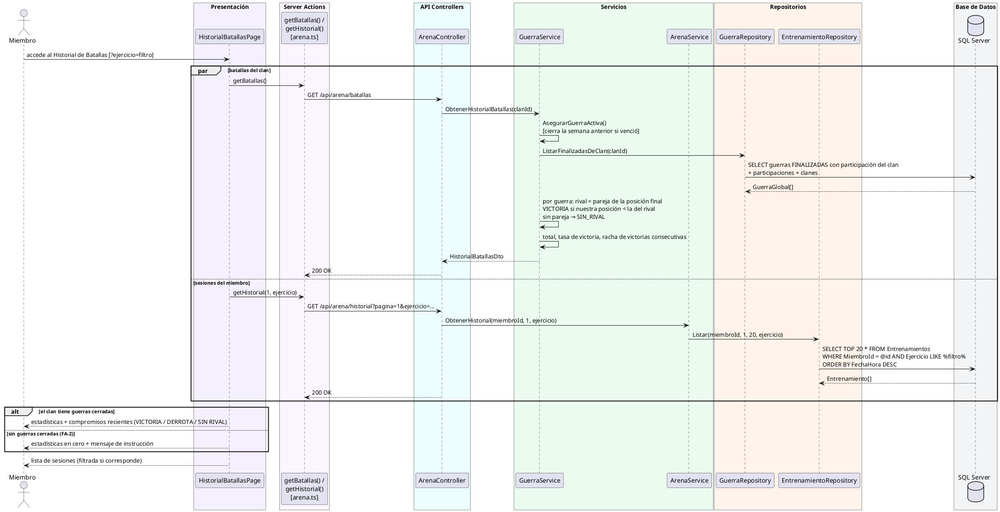
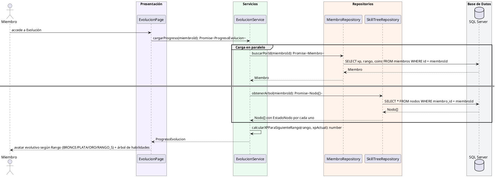
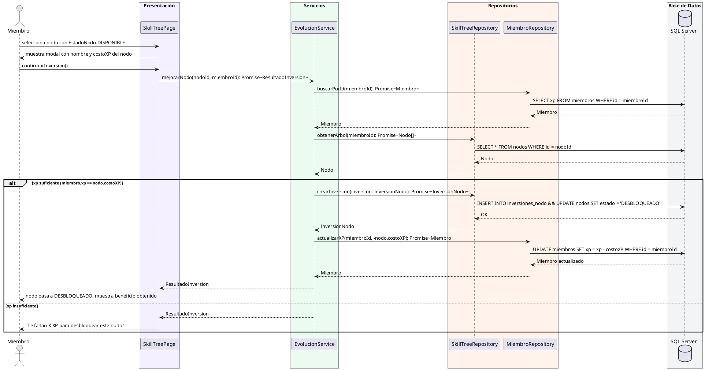
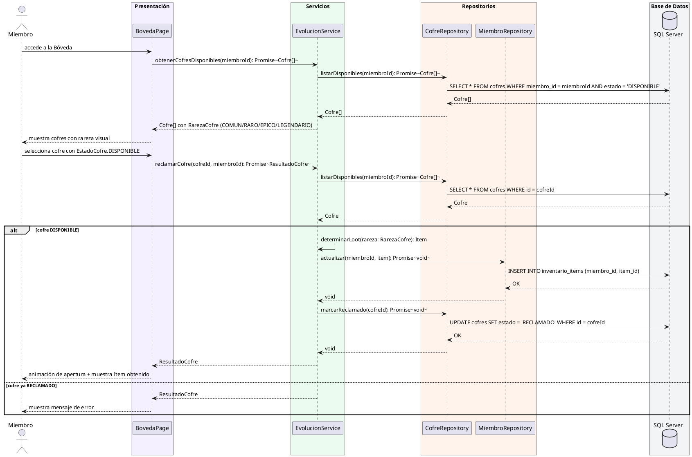
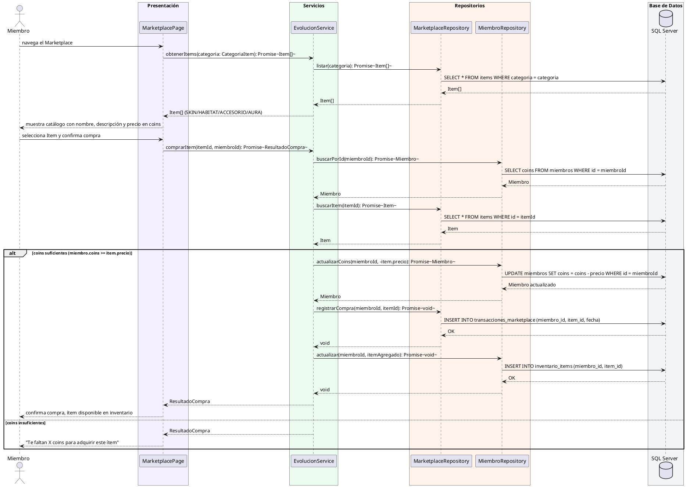

# 10.5.4 — Diagramas de Secuencia: CU-003 ARENA + CU-004 EVOLUCIÓN/BÓVEDA

**Tipo:** Diagramas de secuencia de diseño (no de sistema)
**Convención:** Page → Service → Repository → SQL Server (DB)
**Nota CER:** `puntajeCER = pesoKg × repeticiones × multiplicadorArquetipo`

---

## CU-003 — ARENA

---

### CU-003-001 — Consultar el Estado de la Guerra Global

> **Modificado S6:** ciclo semanal real. La guerra de la semana se abre sola y la anterior se cierra al vencer (sin procesos programados). El rival es la pareja consecutiva del ranking (1º vs 2º, 3º vs 4º…).

```plantuml
@startuml CU-003-001

actor Miembro

box "Presentación" #F5F0FF
  participant "GuerraGlobalPage" as Page
end box

box "Server Actions" #FAF5FF
  participant "getGuerra()\n[arena.ts]" as Action
end box

box "API Controllers" #ECFEFF
  participant "ArenaController" as Ctrl
end box

box "Servicios" #EBFBF0
  participant "ArenaService" as Arena
  participant "GuerraService" as Svc
end box

box "Repositorios" #FFF3EB
  participant "MiembroRepository" as MRepo
  participant "GuerraRepository" as Repo
end box

box "Base de Datos" #F3F4F6
  database "SQL Server" as DB
end box

Miembro -> Page: accede a La Arena
Page -> Action: getGuerra()
Action -> Ctrl: GET /api/arena/guerra\nAuthorization: Bearer sb_token
Ctrl -> Arena: ObtenerClanId(miembroId)
Arena -> MRepo: BuscarPorId(miembroId)
MRepo -> DB: SELECT * FROM Miembros WHERE Id = miembroId
DB --> MRepo: Miembro
Arena --> Ctrl: clanId (desde la base, no del JWT)

Ctrl -> Svc: ObtenerEstado(clanId)
Svc -> Svc: AsegurarGuerraActiva()

group Cierre de guerras vencidas
    Svc -> Repo: ListarActivasVencidas(ahoraUtc)
    Repo -> DB: SELECT * FROM GuerrasGlobales\nWHERE Estado = 'ACTIVA' AND FechaFin <= ahora
    DB --> Repo: GuerraGlobal[]
    loop por cada guerra vencida
        Svc -> Repo: Finalizar(guerraId)
        Repo -> DB: UPDATE ParticipacionesGuerra SET Posicion = 1..N\n(orden: CER desc, nombre de clan)
        Repo -> DB: UPDATE GuerrasGlobales SET Estado = 'FINALIZADA'
    end
end

Svc -> Svc: SemanaDe(ahora) → clave "2026-S41",\nfin = próximo lunes 00:00 (hora Argentina)
Svc -> Repo: BuscarPorSemana(clave)
Repo -> DB: SELECT * FROM GuerrasGlobales WHERE Semana = clave
DB --> Repo: GuerraGlobal | null

alt no existe la guerra de la semana
    Svc -> Repo: Crear(GuerraGlobal { Semana, ACTIVA, FechaFin })
    Repo -> DB: INSERT INTO GuerrasGlobales
    alt otra request la creó en paralelo (índice único en Semana)
        DB --> Repo: error de clave duplicada
        Svc -> Repo: BuscarPorSemana(clave)
    end
end

Svc -> Repo: Ranking(guerraId)
Repo -> DB: SELECT p.ClanId, c.Nombre, p.CerAcumulado\nFROM ParticipacionesGuerra p JOIN Clanes c\nORDER BY CerAcumulado DESC, Nombre
DB --> Repo: PosicionGuerra[]
Svc -> Svc: nuestro = posición del clan\nrival = pareja (impar → +1, par → −1)\nprogreso = CER / CER del líder

Svc --> Ctrl: EstadoGuerraDto { semana, diasRestantes, nuestro, rival, top 10 }
Ctrl --> Action: 200 OK
Action --> Page: GuerraDto

alt el clan ya sumó CER esta semana
    Page --> Miembro: NUESTRA MANADA vs CLAN RIVAL + barras + top 10 + cuenta regresiva
else el clan todavía no participa
    Page --> Miembro: "Registrá un entrenamiento para entrar a la guerra" (FA-1)
end
alt sin pareja (cantidad impar de clanes)
    Page --> Miembro: tarjeta rival "SIN RIVAL ASIGNADO" (FA-1)
end

@enduml
```

---

### CU-003-002 — Registrar un Entrenamiento

> **Modificado S6:** la entrada por voz muestra lo que entendió y pide confirmación antes de completar los campos. El CER se acredita a la guerra de la semana con un incremento atómico y se suma XP al miembro (1 XP cada 10 de CER).

```plantuml
@startuml CU-003-002

actor Miembro

box "Presentación" #F5F0FF
  participant "RegistrarClient" as Page
end box

box "Externo" #FEFCE8
  participant "Web Speech API\n(navegador)" as Voice
end box

box "Server Actions" #FAF5FF
  participant "registrarEntrenamiento()\n[arena.ts]" as Action
end box

box "API Controllers" #ECFEFF
  participant "ArenaController" as Ctrl
end box

box "Servicios" #EBFBF0
  participant "ArenaService" as Svc
  participant "CerService" as CER
  participant "GuerraService" as GSvc
end box

box "Repositorios" #FFF3EB
  participant "EntrenamientoRepository" as EntreRepo
  participant "ClanRepository" as ClanRepo
  participant "GuerraRepository" as GRepo
  participant "MiembroRepository" as MiembroRepo
  participant "RachaRepository" as RachaRepo
end box

box "Base de Datos" #F3F4F6
  database "SQL Server" as DB
end box

opt entrada por voz (navegador compatible)
    Miembro -> Page: presiona "DICTAR"
    Page -> Voice: start() [lang = es-AR]
    Voice --> Page: transcripción ("sentadilla 80 kilos 10 repeticiones")
    Page -> Page: interpretarDictado(texto)\n→ { ejercicio, peso, reps }
    Page --> Miembro: muestra lo que entendió
    alt confirma
        Miembro -> Page: "USAR ESTOS DATOS"
        Page --> Miembro: autocompleta ejercicio, peso y reps
    else descarta
        Miembro -> Page: "DESCARTAR"
    end
end

Miembro -> Page: ajusta campos a mano (siempre disponibles)
Miembro -> Page: presiona "REGISTRAR ESFUERZO"
Page -> Action: registrarEntrenamiento(formData)
Action -> Action: validar (ejercicio no vacío, peso > 0, reps ≥ 1)
Action -> Ctrl: POST /api/arena/entrenar { ejercicio, pesoKg, repeticiones }
Ctrl -> Svc: RegistrarEntrenamiento(miembroId, ...)
Svc -> CER: Calcular(pesoKg, reps, arquetipo)
CER --> Svc: ResultadoCER { puntaje, modificador }
Svc -> EntreRepo: Crear(entrenamiento)
EntreRepo -> DB: INSERT INTO Entrenamientos

opt el miembro tiene clan
    Svc -> GSvc: AsegurarGuerraActiva()
    GSvc --> Svc: guerra de la semana
    Svc -> ClanRepo: SumarCER(clanId, puntaje)
    ClanRepo -> DB: UPDATE Clanes SET PuntosClan = PuntosClan + @cer
    Svc -> GRepo: SumarCER(guerraId, clanId, puntaje)
    GRepo -> DB: UPDATE ParticipacionesGuerra\nSET CerAcumulado = CerAcumulado + @cer
    alt el clan todavía no participaba
        GRepo -> DB: INSERT INTO ParticipacionesGuerra
    end
end

Svc -> MiembroRepo: ActualizarXP(miembroId, floor(puntaje / 10))
MiembroRepo -> DB: UPDATE Miembros SET Xp = Xp + @xp
Svc -> RachaRepo: CrearOActualizar(miembroId, ...)
RachaRepo -> DB: UPDATE Rachas SET DiasConsecutivos = ...
Svc --> Ctrl: ResultadoCER { puntaje, modificador, xpGanado }
Ctrl --> Action: 200 OK
Action --> Page: resultado
Page --> Miembro: puntaje CER + XP ganada

@enduml
```

---

### CU-003-003 — Calcular el Puntaje CER

```plantuml
@startuml CU-003-003

actor Miembro

box "Presentación" #F5F0FF
  participant "CalculadoraCERPage" as Page
end box

box "Servicios" #EBFBF0
  participant "CERService" as Svc
end box

Miembro -> Page: accede a la Calculadora CER
Page --> Miembro: muestra formulario (peso, reps, arquetipo)

Miembro -> Page: ingresa pesoKg, reps, selecciona Arquetipo
Page -> Svc: calcular(pesoKg, reps, arquetipo: Arquetipo): ResultadoCER
Svc -> Svc: obtenerMultiplicador(arquetipo): number

alt arquetipo = VOLUMEN
    Svc --> Svc: multiplicador = 1.15
else arquetipo = DEFINIDO
    Svc --> Svc: multiplicador = 1.10
else arquetipo = ATLETICO
    Svc --> Svc: multiplicador = 1.20
end

Svc -> Svc: puntajeCER = pesoKg x reps x multiplicador
Svc --> Page: ResultadoCER
Page --> Miembro: muestra desglose: peso x reps x multiplicador = puntajeCER

@enduml
```

---

### CU-003-004 — Consultar el Historial de Batallas

> **Modificado S6:** la pantalla combina lo que piden el texto del CU (batallas con VICTORIA/DERROTA, tasa de victoria y racha) y la secuencia aprobada (entrenamientos con filtro). Una batalla es una semana de Guerra Global cerrada; el rival es la pareja del ranking final.

```plantuml
@startuml CU-003-004

actor Miembro

box "Presentación" #F5F0FF
  participant "HistorialBatallasPage" as Page
end box

box "Server Actions" #FAF5FF
  participant "getBatallas() /\ngetHistorial()\n[arena.ts]" as Action
end box

box "API Controllers" #ECFEFF
  participant "ArenaController" as Ctrl
end box

box "Servicios" #EBFBF0
  participant "GuerraService" as GSvc
  participant "ArenaService" as Svc
end box

box "Repositorios" #FFF3EB
  participant "GuerraRepository" as GRepo
  participant "EntrenamientoRepository" as EntreRepo
end box

box "Base de Datos" #F3F4F6
  database "SQL Server" as DB
end box

Miembro -> Page: accede al Historial de Batallas [?ejercicio=filtro]
par batallas del clan
    Page -> Action: getBatallas()
    Action -> Ctrl: GET /api/arena/batallas
    Ctrl -> GSvc: ObtenerHistorialBatallas(clanId)
    GSvc -> GSvc: AsegurarGuerraActiva()\n[cierra la semana anterior si venció]
    GSvc -> GRepo: ListarFinalizadasDeClan(clanId)
    GRepo -> DB: SELECT guerras FINALIZADAS con participación del clan\n+ participaciones + clanes
    DB --> GRepo: GuerraGlobal[]
    GSvc -> GSvc: por guerra: rival = pareja de la posición final\nVICTORIA si nuestra posición < la del rival\nsin pareja → SIN_RIVAL
    GSvc -> GSvc: total, tasa de victoria, racha de victorias consecutivas
    GSvc --> Ctrl: HistorialBatallasDto
    Ctrl --> Action: 200 OK
else sesiones del miembro
    Page -> Action: getHistorial(1, ejercicio)
    Action -> Ctrl: GET /api/arena/historial?pagina=1&ejercicio=...
    Ctrl -> Svc: ObtenerHistorial(miembroId, 1, ejercicio)
    Svc -> EntreRepo: Listar(miembroId, 1, 20, ejercicio)
    EntreRepo -> DB: SELECT TOP 20 * FROM Entrenamientos\nWHERE MiembroId = @id AND Ejercicio LIKE %filtro%\nORDER BY FechaHora DESC
    DB --> EntreRepo: Entrenamiento[]
    Ctrl --> Action: 200 OK
end

alt el clan tiene guerras cerradas
    Page --> Miembro: estadísticas + compromisos recientes (VICTORIA / DERROTA / SIN RIVAL)
else sin guerras cerradas (FA-2)
    Page --> Miembro: estadísticas en cero + mensaje de instrucción
end
Page --> Miembro: lista de sesiones (filtrada si corresponde)

@enduml
```

---

## CU-004 — EVOLUCIÓN / BÓVEDA

---

### CU-004-001 — Visualizar Progreso de Evolución

```plantuml
@startuml CU-004-001

actor Miembro

box "Presentación" #F5F0FF
  participant "EvolucionPage" as Page
end box

box "Servicios" #EBFBF0
  participant "EvolucionService" as Svc
end box

box "Repositorios" #FFF3EB
  participant "MiembroRepository" as MiembroRepo
  participant "SkillTreeRepository" as STRepo
end box

box "Base de Datos" #F3F4F6
  database "SQL Server" as DB
end box

Miembro -> Page: accede a Evolución
Page -> Svc: cargarProgreso(miembroId): Promise~ProgresoEvolucion~

group Carga en paralelo
    Svc -> MiembroRepo: buscarPorId(miembroId): Promise~Miembro~
    MiembroRepo -> DB: SELECT xp, rango, coins FROM miembros WHERE id = miembroId
    DB --> MiembroRepo: Miembro
    MiembroRepo --> Svc: Miembro
== ==
    Svc -> STRepo: obtenerArbol(miembroId): Promise~Nodo[]~
    STRepo -> DB: SELECT * FROM nodos WHERE miembro_id = miembroId
    DB --> STRepo: Nodo[]
    STRepo --> Svc: Nodo[] con EstadoNodo por cada uno
end

Svc -> Svc: calcularXPParaSiguienteRango(rango, xpActual): number
Svc --> Page: ProgresoEvolucion
Page --> Miembro: avatar evolutivo según Rango (BRONCE/PLATA/ORO/RANGO_S) + árbol de habilidades

@enduml
```

---

### CU-004-002 — Mejorar Nodo del Árbol de Habilidades

```plantuml
@startuml CU-004-002

actor Miembro

box "Presentación" #F5F0FF
  participant "SkillTreePage" as Page
end box

box "Servicios" #EBFBF0
  participant "EvolucionService" as Svc
end box

box "Repositorios" #FFF3EB
  participant "SkillTreeRepository" as STRepo
  participant "MiembroRepository" as MiembroRepo
end box

box "Base de Datos" #F3F4F6
  database "SQL Server" as DB
end box

Miembro -> Page: selecciona nodo con EstadoNodo.DISPONIBLE
Page --> Miembro: muestra modal con nombre y costoXP del nodo
Miembro -> Page: confirmarInversion()
Page -> Svc: mejorarNodo(nodoId, miembroId): Promise~ResultadoInversion~
Svc -> MiembroRepo: buscarPorId(miembroId): Promise~Miembro~
MiembroRepo -> DB: SELECT xp FROM miembros WHERE id = miembroId
DB --> MiembroRepo: Miembro
MiembroRepo --> Svc: Miembro
Svc -> STRepo: obtenerArbol(miembroId): Promise~Nodo[]~
STRepo -> DB: SELECT * FROM nodos WHERE id = nodoId
DB --> STRepo: Nodo
STRepo --> Svc: Nodo

alt xp suficiente (miembro.xp >= nodo.costoXP)
    Svc -> STRepo: crearInversion(inversion: InversionNodo): Promise~InversionNodo~
    STRepo -> DB: INSERT INTO inversiones_nodo && UPDATE nodos SET estado = 'DESBLOQUEADO'
    DB --> STRepo: OK
    STRepo --> Svc: InversionNodo
    Svc -> MiembroRepo: actualizarXP(miembroId, -nodo.costoXP): Promise~Miembro~
    MiembroRepo -> DB: UPDATE miembros SET xp = xp - costoXP WHERE id = miembroId
    DB --> MiembroRepo: Miembro actualizado
    MiembroRepo --> Svc: Miembro
    Svc --> Page: ResultadoInversion
    Page --> Miembro: nodo pasa a DESBLOQUEADO, muestra beneficio obtenido
else xp insuficiente
    Svc --> Page: ResultadoInversion
    Page --> Miembro: "Te faltan X XP para desbloquear este nodo"
end

@enduml
```

---

### CU-004-003 — Reclamar Recompensa de la Bóveda

```plantuml
@startuml CU-004-003

actor Miembro

box "Presentación" #F5F0FF
  participant "BovedaPage" as Page
end box

box "Servicios" #EBFBF0
  participant "EvolucionService" as Svc
end box

box "Repositorios" #FFF3EB
  participant "CofreRepository" as CofreRepo
  participant "MiembroRepository" as MiembroRepo
end box

box "Base de Datos" #F3F4F6
  database "SQL Server" as DB
end box

Miembro -> Page: accede a la Bóveda
Page -> Svc: obtenerCofresDisponibles(miembroId): Promise~Cofre[]~
Svc -> CofreRepo: listarDisponibles(miembroId): Promise~Cofre[]~
CofreRepo -> DB: SELECT * FROM cofres WHERE miembro_id = miembroId AND estado = 'DISPONIBLE'
DB --> CofreRepo: Cofre[]
CofreRepo --> Svc: Cofre[]
Svc --> Page: Cofre[] con RarezaCofre (COMUN/RARO/EPICO/LEGENDARIO)
Page --> Miembro: muestra cofres con rareza visual

Miembro -> Page: selecciona cofre con EstadoCofre.DISPONIBLE
Page -> Svc: reclamarCofre(cofreId, miembroId): Promise~ResultadoCofre~
Svc -> CofreRepo: listarDisponibles(miembroId): Promise~Cofre[]~
CofreRepo -> DB: SELECT * FROM cofres WHERE id = cofreId
DB --> CofreRepo: Cofre
CofreRepo --> Svc: Cofre

alt cofre DISPONIBLE
    Svc -> Svc: determinarLoot(rareza: RarezaCofre): Item
    Svc -> MiembroRepo: actualizar(miembroId, item): Promise~void~
    MiembroRepo -> DB: INSERT INTO inventario_items (miembro_id, item_id)
    DB --> MiembroRepo: OK
    MiembroRepo --> Svc: void
    Svc -> CofreRepo: marcarReclamado(cofreId): Promise~void~
    CofreRepo -> DB: UPDATE cofres SET estado = 'RECLAMADO' WHERE id = cofreId
    DB --> CofreRepo: OK
    CofreRepo --> Svc: void
    Svc --> Page: ResultadoCofre
    Page --> Miembro: animación de apertura + muestra Item obtenido
else cofre ya RECLAMADO
    Svc --> Page: ResultadoCofre
    Page --> Miembro: muestra mensaje de error
end

@enduml
```

---

### CU-004-004 — Adquirir Ítem en el Marketplace

```plantuml
@startuml CU-004-004

actor Miembro

box "Presentación" #F5F0FF
  participant "MarketplacePage" as Page
end box

box "Servicios" #EBFBF0
  participant "EvolucionService" as Svc
end box

box "Repositorios" #FFF3EB
  participant "MarketplaceRepository" as MktRepo
  participant "MiembroRepository" as MiembroRepo
end box

box "Base de Datos" #F3F4F6
  database "SQL Server" as DB
end box

Miembro -> Page: navega el Marketplace
Page -> Svc: obtenerItems(categoria: CategoriaItem): Promise~Item[]~
Svc -> MktRepo: listar(categoria): Promise~Item[]~
MktRepo -> DB: SELECT * FROM items WHERE categoria = categoria
DB --> MktRepo: Item[]
MktRepo --> Svc: Item[]
Svc --> Page: Item[] (SKIN/HABITAT/ACCESORIO/AURA)
Page --> Miembro: muestra catálogo con nombre, descripción y precio en coins

Miembro -> Page: selecciona Item y confirma compra
Page -> Svc: comprarItem(itemId, miembroId): Promise~ResultadoCompra~
Svc -> MiembroRepo: buscarPorId(miembroId): Promise~Miembro~
MiembroRepo -> DB: SELECT coins FROM miembros WHERE id = miembroId
DB --> MiembroRepo: Miembro
MiembroRepo --> Svc: Miembro
Svc -> MktRepo: buscarItem(itemId): Promise~Item~
MktRepo -> DB: SELECT * FROM items WHERE id = itemId
DB --> MktRepo: Item
MktRepo --> Svc: Item

alt coins suficientes (miembro.coins >= item.precio)
    Svc -> MiembroRepo: actualizarCoins(miembroId, -item.precio): Promise~Miembro~
    MiembroRepo -> DB: UPDATE miembros SET coins = coins - precio WHERE id = miembroId
    DB --> MiembroRepo: Miembro actualizado
    MiembroRepo --> Svc: Miembro
    Svc -> MktRepo: registrarCompra(miembroId, itemId): Promise~void~
    MktRepo -> DB: INSERT INTO transacciones_marketplace (miembro_id, item_id, fecha)
    DB --> MktRepo: OK
    MktRepo --> Svc: void
    Svc -> MiembroRepo: actualizar(miembroId, itemAgregado): Promise~void~
    MiembroRepo -> DB: INSERT INTO inventario_items (miembro_id, item_id)
    DB --> MiembroRepo: OK
    MiembroRepo --> Svc: void
    Svc --> Page: ResultadoCompra
    Page --> Miembro: confirma compra, ítem disponible en inventario
else coins insuficientes
    Svc --> Page: ResultadoCompra
    Page --> Miembro: "Te faltan X coins para adquirir este ítem"
end

@enduml
```
