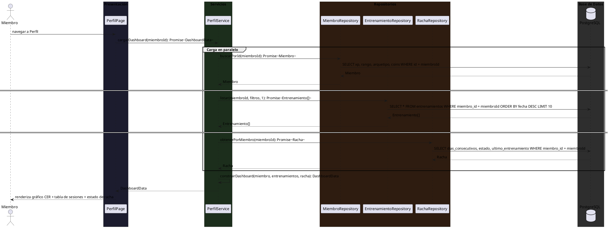
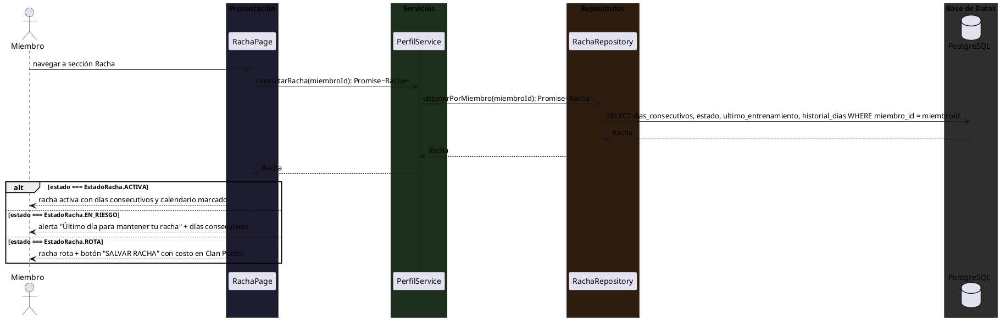
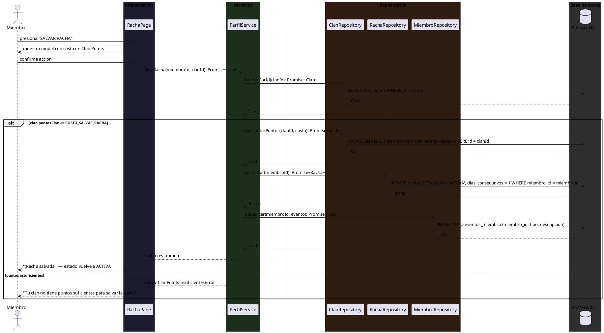
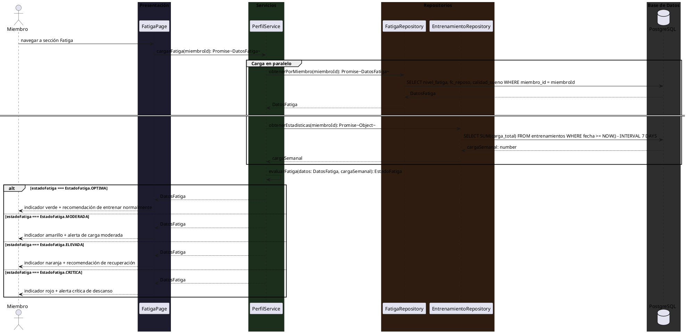
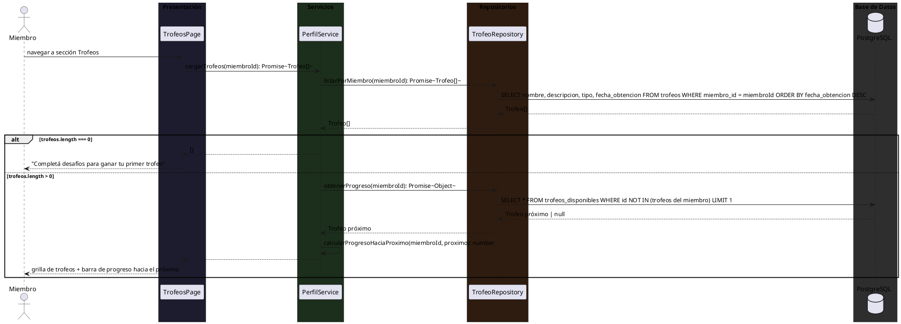
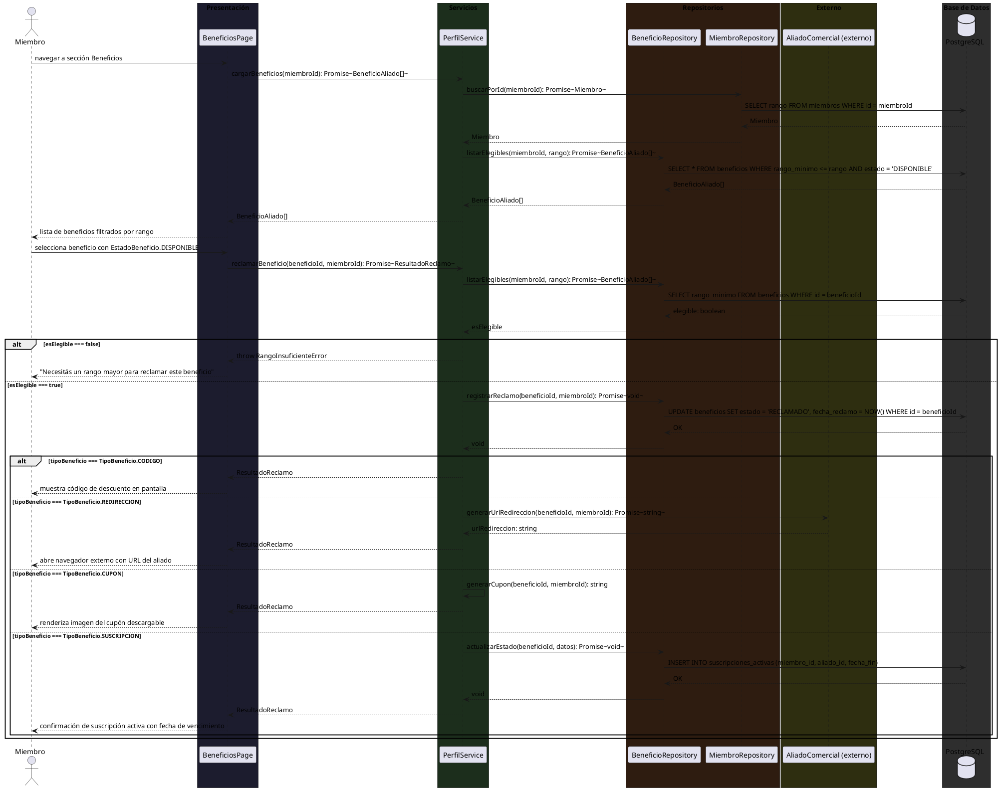

# 10.5.4 — Diagramas de Secuencia: CU-005 PERFIL

**Tipo:** Diagramas de secuencia de diseño (no de sistema)
**Convención:** Page → Service → Repository → PostgreSQL (DB)
**Actor:** Miembro (usuario estándar)

---

## CU-005 — PERFIL

---

### CU-005-001 — Consultar Dashboard de Rendimiento Personal

https://www.sportograf.com/img/thumbnail/25111/search/SGF6272d9e5
---

### CU-005-002 — Consultar Racha de Entrenamiento

---

### CU-005-003 — Salvar Racha con Puntos de Clan

---

### CU-005-004 — Monitorear Estado de Fatiga Biométrica

---

### CU-005-005 — Consultar Vitrina de Trofeos

---

### CU-005-006 — Reclamar Beneficio de un Aliado Comercial

